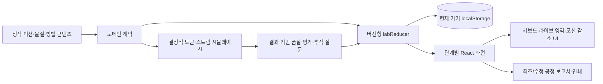

# Mixture Separation Process Lab Implementation Plan

> **For agentic workers:** REQUIRED SUB-SKILL: Use superpowers:subagent-driven-development (recommended) or superpowers:executing-plans to implement this plan task-by-task. Steps use checkbox (`- [ ]`) syntax for tracking.

**Goal:** 초등 5~6학년 학생이 혼합물의 관찰 가능한 성질을 먼저 확인하고, 안전한 정적 가상 모델에서 분리 공정을 구성·실행·수정하며 물질 토큰의 이동과 근거를 설명하는 한국어 웹앱을 구축합니다.

**Architecture:** 앱은 `정적 교육 콘텐츠 → 결정적 순수 시뮬레이션 → 버전이 있는 로컬 상태 → 단계별 React 화면`의 단방향 구조를 사용합니다. 분리 방법의 이름이나 정답 순서를 하드 코딩해 채점하지 않고, 각 단계의 입력·출력 스트림과 토큰 이동, 성질 근거, 최종 회수 스트림을 평가하므로 같은 학습 목표를 만족하는 복수 공정을 인정합니다. 서버 없이 정적 SPA로 동작하며 학생이 입력한 진행 상태와 수정 근거는 현재 기기의 `localStorage`에만 저장합니다.

**Tech Stack:** Vite, React, TypeScript strict mode, CSS Modules 없이 기능별 CSS, Vitest, React Testing Library, `@testing-library/user-event`, `jest-axe`, Playwright Chromium, npm lockfile

**Spec:** `/Volumes/ External Drive 256G/Dev2/codex/mixture-separation-process-lab/2026-08-26-mixture-separation-process-lab-design.md`

## Global Constraints

- 대상은 초등 5~6학년, 교과는 과학, 한 차시 권장 시간은 35~45분입니다.
- 핵심 질문은 “혼합물을 이루는 물질의 성질을 이용하면 어떤 순서로 분리할 수 있을까요?”이며, 모든 화면 문구와 피드백은 이 질문에 답하도록 구성합니다.
- `[6과05-01]`의 알갱이 크기·서로 섞이지 않는 액체, `[6과05-02]`의 용해·증발, `[6과05-03]`의 생활 속 분리 기술·지속가능한 생활을 각각 미션 콘텐츠와 보고서 성찰에 연결합니다.
- 학습 증거는 물질마다 이용할 수 있는 성질 설명, 혼합물에 맞는 방법 선택, 이전 출력과 다음 입력 연결, 목표 물질·순도·회수량을 고려한 수정의 네 수준을 모두 포함해야 합니다.
- `용해 조건 탐사선`처럼 온도·용질별 녹는 양을 비교하지 않고, `실험 리포트 조립소`처럼 관찰·해석 구분에 머물지 않으며, `한 방울의 귀환`처럼 물의 상태 변화와 이동을 중심으로 삼지 않습니다. 이 앱은 여러 성질을 근거로 단계별 분리 순서를 설계하고 남은 물질을 추적하는 경험에 집중합니다.
- 학습 흐름은 `혼합물과 목표 확인 → 물질 성질 조사 → 분리 방법 예측 → 공정 순서 구성 → 단계별 가상 실행 → 남은 물질·손실 확인 → 공정 수정과 설명` 순서를 유지합니다.
- MVP에는 4개 미션과 정확히 4종의 분리 방법 카드가 포함됩니다. `물 넣기`와 `층이 생길 때까지 기다리기`는 분리 방법 수에 포함하지 않는 준비 행동으로 별도 표시합니다.
- 4종 분리 방법은 `체로 분리`, `층 분리`, `거르기`, `가상 증발`이며, 준비 행동은 `물 넣기`, `층 기다리기`입니다.
- 학생이 필요한 성질을 확인하기 전에는 연결된 준비 행동·분리 방법 카드를 활성화하지 않습니다.
- 시뮬레이션은 같은 미션·공정·입력에 항상 같은 결과를 내는 결정적 교육 모델이어야 합니다.
- 모든 입력 토큰은 각 단계에서 출력 스트림 또는 손실 장부까지 이동 경로가 기록되어야 하며, 새로 추가한 물 토큰도 `added-carrier` 출처로 구별해야 합니다.
- 결과는 실제 질량·순도·수율 예측값이 아니라 정수 토큰 수와 `대부분/일부/거의 없음` 범주로만 표현합니다.
- 잘못된 방법도 실행할 수 있으나 위험 행동을 묘사하지 않고 입력을 `unchanged` 스트림으로 보내며 “이 조건에서는 분리 근거가 없음”과 추적 질문을 표시합니다.
- 평가는 정답 배열 일치가 아니라 스트림 연결, 성질 근거, 토큰 회수·혼입·미회수·손실 결과를 사용하므로 결과가 유효한 복수 해법을 모두 인정합니다.
- 피드백은 정답 공정을 먼저 밝히지 않고 “이 단계 뒤에 소금은 어느 쪽에 있나요?”와 같은 물질 추적 질문을 우선합니다.
- 물질은 색만으로 구별하지 않고 이름, 입자 무늬, 모양, 텍스트 수량을 함께 제공합니다.
- 가로 화면의 공정은 좌우, 375px 모바일에서는 위아래로 표시하며 드래그 없이 `방법 선택 → 단계 위치 선택` 버튼만으로 4개 미션을 완료할 수 있어야 합니다.
- 현재 반드시 눌러야 하는 핵심 버튼 하나에만 `gi-pulse` 아우라 애니메이션을 적용합니다.
- `prefers-reduced-motion: reduce`에서는 토큰 이동 애니메이션을 제거하고 전 상태·후 상태 두 장면과 방향 화살표를 보여 줍니다.
- 모든 상태 변화는 시각 장면과 함께 표 형식 텍스트 상태 및 `aria-live="polite"` 알림으로 전달합니다.
- 실행 취소, 단계 교체, 단계 이동, 최초 공정 복원 기능을 키보드로 사용할 수 있어야 합니다.
- 앱은 서버, 로그인, 센서, 카메라, 외부 AI API, 온라인 공유를 사용하지 않으며 학생 이름을 묻거나 저장하지 않습니다.
- 실제 센서·측정 자료 입력, 자유 화학물질 조합, AI 자동 실험 설계 기능을 만들지 않습니다.
- 런타임 네트워크 요청과 외부 폰트·CDN 자산을 금지하고 시스템 글꼴과 로컬 정적 자산만 사용합니다.
- 실행실에는 `가상 실험이며 실제 물질의 양·온도·시간을 측정하지 않습니다`를 항상 표시합니다.
- 실제 가열·혼합은 교사의 안전 지도 아래 별도 절차로 진행해야 한다고 안내하되, 가열 온도·시간·기구 조작 순서를 제공하지 않습니다.
- 먹거나 마시기, 미지 물질 만지기, 가정용 세제 혼합 사례를 콘텐츠·예시·애니메이션에 넣지 않습니다.
- 결과가 실제 순도나 수율을 보장한다는 표현을 사용하지 않습니다.
- `실제 실험 결과는 재료·양·기구에 따라 달라질 수 있습니다.`를 접수·실행·보고서에 반복 표시합니다.
- 단일 `.ts`, `.tsx`, `.css` 소스 파일은 500줄 미만으로 유지하며, 화면·도메인 규칙·상태·스타일을 책임별 파일로 분리합니다.
- 오른쪽 아래에 작은 `업데이트 내역` 버튼을 고정하고 `2026-08-26 설계: 최초 설계 문서 작성`, `2026-08-26 개발: MVP 구현 및 과학·안전 문구 검수`를 표시합니다. 이후 수정 커밋은 실제 수정 날짜와 한 줄 개선 내용을 새 항목으로 추가합니다.
- 구현 중 생성되는 `package-lock.json`은 커밋하고, 모든 향후 설치 검증은 `npm ci`로 재현합니다.
- 아래의 셸 명령과 Git 명령은 구현 단계에서 실행할 항목입니다. 이 계획을 작성하는 단계에서는 실행하지 않습니다.

---

## 요구사항 추적표

| 설계 요구 | 구현 연결 | 합격 증거 |
|---|---|---|
| 학습 목표 `[6과05-01]`, `[6과05-02]`, `[6과05-03]` | Tasks 2, 5, 7~11 | 성질 근거, 출력→입력 연결, 회수·혼입·손실 해석, 수정 이유가 보고서에 남음 |
| 기존 앱과의 차별성 | Tasks 5, 8~11 | 용해량 계산이나 상태 변화 관찰이 아니라 여러 성질을 이용한 공정 그래프와 토큰 장부를 조작함 |
| 7단계 핵심 학습 흐름 | Tasks 6~11, 13 | 학생이 화면을 건너뛰지 않고 목표→성질→예측→설계→실행→검사→수정·설명 순서로 완료함 |
| 4개 미션·4종 방법·2개 준비 행동 | Tasks 2~5, 8 | 콘텐츠 불변식 테스트와 미션별 실행 테스트가 정확한 개수와 규칙을 확인함 |
| 결정적 콘텐츠·판정 모델과 복수 해법 | Tasks 3~5 | 같은 입력의 깊은 동등성, 토큰 보존, 결과 기반 판정, 두 체 간격의 동등한 승인 테스트가 통과함 |
| 정답 비공개 추적 피드백 | Tasks 5, 10 | 첫 피드백이 정답 순서를 포함하지 않고 위치·성질 질문으로 끝남 |
| 접근성·모바일·키보드·스크린 리더 | Tasks 7~9, 12~13 | 375px, 키보드 전용, axe, 라이브 영역, 모션 감소 E2E가 통과함 |
| 개인정보·안전·가상 모델 한계 | Tasks 2, 6, 9, 12~13 | 이름 필드·외부 요청이 없고 안전 문구가 실행 화면에 상시 보이며 금지된 절차 문구가 없음 |
| MVP 범위와 제외 범위 | Tasks 1~13 | 정적 SPA만 빌드되고 센서·자유 물질 조합·AI 설계·공유 기능이 소스와 UI에 없음 |
| 완료 기준 | Tasks 4~5, 10~13 | 전 토큰 추적, 성질-방법 연결, 통합 미션 최초·수정 공정 병렬 표시, 4개 미션 비드래그 완료가 검증됨 |
| 업데이트 내역 | Task 11 | 오른쪽 아래 버튼, 날짜별 두 초기 항목, 키보드 접근 가능한 대화상자 테스트가 통과함 |

## 구성 시각화



## 예상 파일 구조와 책임

```text
mixture-separation-process-lab/
├── 2026-08-26-mixture-separation-process-lab-design.md
├── 2026-08-26-mixture-separation-process-lab-implementation-plan.md
├── .gitignore                         # 빌드·테스트 산출물 제외
├── package.json                       # 실행·테스트·빌드 명령
├── package-lock.json                  # 재현 가능한 의존성 잠금
├── index.html                         # Vite 진입 문서와 한국어 메타데이터
├── tsconfig.json
├── tsconfig.app.json
├── tsconfig.node.json
├── vite.config.ts
├── vitest.config.ts
├── playwright.config.ts
├── README.md                          # 학습 목적, 실행법, 가상 모델·안전 경계
├── docs/
│   └── manual-qa.md                   # 교사 관점 콘텐츠·접근성 점검표
├── e2e/
│   ├── learner-flow.spec.ts           # 4개 미션 전체 학생 흐름
│   ├── mobile-keyboard.spec.ts        # 375px·키보드 전용 완료
│   ├── reduced-motion.spec.ts         # 두 장면 대체 UI
│   └── privacy-safety.spec.ts         # 외부 요청·개인정보·안전 문구
└── src/
    ├── main.tsx                       # React 마운트
    ├── App.tsx                        # 화면 합성만 담당
    ├── App.test.tsx                   # 앱 셸 계약
    ├── domain/
    │   ├── contracts.ts               # 식별자·공정·미션 타입
    │   ├── materials.ts               # 5개 물질의 교육용 속성
    │   ├── properties.ts              # 5개 성질 카드의 이름·질문·근거 문장
    │   ├── actions.ts                 # 4종 방법·2개 준비 행동 카드
    │   ├── missions.ts                # 4개 미션과 목표·필수 성질
    │   └── content.test.ts            # 콘텐츠 개수·과학·안전 불변식
    ├── simulation/
    │   ├── contracts.ts               # 토큰·스트림·이동·결과 타입
    │   ├── tokenFactory.ts            # 안정적인 토큰 ID와 초기 스트림
    │   ├── streamRefs.ts              # 단계 출력 참조 생성·해석
    │   ├── noBasis.ts                 # 근거 없는 실행의 안전한 unchanged 결과
    │   ├── rules/
    │   │   ├── preparation.ts         # 물 넣기·층 기다리기
    │   │   └── separation.ts          # 체·층 분리·거르기·가상 증발
    │   ├── applyProcessStep.ts         # 행동별 규칙 디스패치
    │   ├── runProcess.ts               # 순서형 스트림 그래프 실행
    │   ├── quality.ts                  # 회수·혼입·미회수·손실 범주
    │   ├── feedback.ts                 # 정답을 밝히지 않는 추적 질문
    │   ├── preparation.test.ts
    │   ├── separation.test.ts
    │   └── runProcess.test.ts
    ├── state/
    │   ├── contracts.ts               # LabSession·LabAction
    │   ├── labReducer.ts               # 단계·공정·수정 상태 전이
    │   ├── persistence.ts              # v1 로컬 저장 직렬화·복구
    │   ├── useLabSession.ts            # reducer와 저장 연결
    │   ├── labReducer.test.ts
    │   └── persistence.test.ts
    ├── content/
    │   ├── safety.ts                   # 공통 가상 모델·교사 지도 문구
    │   └── updateHistory.ts            # 날짜별 공개 변경 내역
    ├── components/
    │   ├── AppShell.tsx                # 제목·단계 내비게이션·하단 버튼 영역
    │   ├── PrimaryAction.tsx           # 단일 gi-pulse 정책
    │   ├── MaterialTokenView.tsx       # 색+이름+무늬+모양 토큰
    │   ├── TokenStatusTable.tsx        # 스크린 리더용 전후 상태표
    │   ├── LiveRegion.tsx              # 상태 변화 알림
    │   ├── SafetyNotice.tsx            # 실행실 상시 안전 안내
    │   ├── UpdateHistoryDialog.tsx     # 날짜별 변경 대화상자
    │   └── UpdateHistoryDialog.test.tsx
    ├── hooks/
    │   └── useReducedMotion.ts         # matchMedia 모션 감소 구독
    ├── features/
    │   ├── intake/
    │   │   ├── IntakeScreen.tsx
    │   │   └── IntakeScreen.test.tsx
    │   ├── properties/
    │   │   ├── PropertyLabScreen.tsx
    │   │   └── PropertyLabScreen.test.tsx
    │   ├── process-board/
    │   │   ├── ProcessBoardScreen.tsx
    │   │   ├── ActionCard.tsx
    │   │   ├── ProcessSlot.tsx
    │   │   ├── ProcessPreview.tsx
    │   │   └── ProcessBoard.test.tsx
    │   ├── simulation/
    │   │   ├── SimulationScreen.tsx
    │   │   ├── PredictionPrompt.tsx
    │   │   ├── MovementScene.tsx
    │   │   └── SimulationScreen.test.tsx
    │   ├── quality/
    │   │   ├── QualityScreen.tsx
    │   │   ├── RecoveryClaimPanel.tsx
    │   │   ├── QualityLedger.tsx
    │   │   └── QualityScreen.test.tsx
    │   └── report/
    │       ├── ReportScreen.tsx
    │       ├── ProcessComparison.tsx
    │       └── ReportScreen.test.tsx
    ├── accessibility/
    │   └── App.a11y.test.tsx           # axe·랜드마크·라이브 영역 계약
    ├── test/
    │   ├── setup.ts                    # jest-dom·matchMedia 정리
    │   └── missionBuilders.ts          # 테스트용 유효 공정 생성기
    └── styles/
        ├── tokens.css                  # 색·간격·타이포그래피 변수
        ├── global.css                  # 기본·포커스·본문 스타일
        ├── layout.css                  # 가로/세로 공정 반응형 배치
        ├── components.css              # 카드·토큰·gi-pulse·대화상자
        └── print.css                   # 보고서 인쇄 전용
```

## 고정 도메인 계약

모든 작업은 아래 이름을 그대로 사용합니다. 인터페이스 변경이 필요하면 해당 변경을 먼저 `src/domain/contracts.ts` 또는 `src/simulation/contracts.ts`에 반영하고 소비 파일을 같은 커밋에서 수정합니다.

```ts
export type MissionId =
  | 'size-sort'
  | 'liquid-layers'
  | 'salt-recovery'
  | 'integrated-process';

export type MaterialId = 'gravel' | 'sand' | 'salt' | 'water' | 'oil';
export type PropertyId =
  | 'particle-size'
  | 'immiscibility'
  | 'water-solubility'
  | 'filter-behavior'
  | 'evaporation-residue';
export type SeparationMethodId =
  | 'sieve'
  | 'layer-separation'
  | 'filtration'
  | 'virtual-evaporation';
export type PreparationActionId = 'add-water' | 'wait-for-layers';
export type ProcessActionId = SeparationMethodId | PreparationActionId;
export type SieveGap = 'wide-gap' | 'medium-gap' | 'fine-gap';
export type OutputPortId =
  | 'mixture'
  | 'layered-mixture'
  | 'pass'
  | 'retained'
  | 'upper'
  | 'lower'
  | 'filtrate'
  | 'filter-residue'
  | 'vapor-model'
  | 'solid-residue'
  | 'unchanged';

export type StreamRef =
  | { source: 'initial' }
  | { source: 'step'; stepId: string; port: OutputPortId };

export type ProcessStep =
  | {
      id: string;
      actionId: 'sieve';
      input: StreamRef;
      evidencePropertyId: 'particle-size';
      params: { gap: SieveGap };
    }
  | {
      id: string;
      actionId: 'layer-separation';
      input: StreamRef;
      evidencePropertyId: 'immiscibility';
      params: Record<string, never>;
    }
  | {
      id: string;
      actionId: 'filtration';
      input: StreamRef;
      evidencePropertyId: 'filter-behavior';
      params: Record<string, never>;
    }
  | {
      id: string;
      actionId: 'virtual-evaporation';
      input: StreamRef;
      evidencePropertyId: 'evaporation-residue';
      params: Record<string, never>;
    }
  | {
      id: string;
      actionId: 'add-water';
      input: StreamRef;
      evidencePropertyId: 'water-solubility';
      params: Record<string, never>;
    }
  | {
      id: string;
      actionId: 'wait-for-layers';
      input: StreamRef;
      evidencePropertyId: 'immiscibility';
      params: Record<string, never>;
    };

export interface RecoveryClaim {
  materialId: MaterialId;
  streamId: string;
}
```

---

### Task 1: 정적 SPA와 테스트 하네스 스캐폴드

**Files:**
- Create: `.gitignore`
- Create: `package.json`
- Create: `package-lock.json` through npm
- Create: `index.html`
- Create: `tsconfig.json`
- Create: `tsconfig.app.json`
- Create: `tsconfig.node.json`
- Create: `vite.config.ts`
- Create: `vitest.config.ts`
- Create: `src/test/setup.ts`
- Create: `src/App.test.tsx`
- Create: `src/App.tsx`
- Create: `src/main.tsx`
- Create: `src/styles/tokens.css`
- Create: `src/styles/global.css`

**Interfaces:**
- Consumes: 설계 문서의 정적 SPA, 한국어 서비스명, 안전 경계.
- Produces: `App(): JSX.Element`, `npm run dev`, `npm run test`, `npm run build`, 브라우저 진입점 `#root`.

- [ ] **Step 1: 프로젝트 메타데이터와 테스트 실행기를 정의합니다**

향후 아래 명령을 한 줄씩 실행해 npm 메타데이터와 잠금 파일을 생성합니다.

```bash
npm init -y
npm install react react-dom
npm install -D typescript vite @vitejs/plugin-react vitest jsdom @testing-library/react @testing-library/jest-dom @testing-library/user-event @types/node @types/react @types/react-dom
```

`npm install`이 기록한 `dependencies`와 `devDependencies`는 유지하고, `package.json`의 이름·버전·모듈 타입·스크립트를 아래 값으로 병합합니다.

```json
{
  "name": "mixture-separation-process-lab",
  "private": true,
  "version": "0.1.0",
  "type": "module",
  "scripts": {
    "dev": "vite",
    "build": "tsc -b && vite build",
    "test": "vitest run",
    "test:watch": "vitest",
    "preview": "vite preview"
  }
}
```

Expected: `package-lock.json`이 생성되고 모든 의존성이 로컬 `node_modules`에 설치됩니다.

- [ ] **Step 2: 실패하는 앱 셸 테스트를 작성합니다**

```tsx
// src/App.test.tsx
import { render, screen } from '@testing-library/react';
import { describe, expect, it } from 'vitest';
import { App } from './App';

describe('App', () => {
  it('announces the Korean lab purpose and virtual-model boundary', () => {
    render(<App />);
    expect(
      screen.getByRole('heading', { name: '혼합물 분리 공정 설계소' }),
    ).toBeInTheDocument();
    expect(
      screen.getByText('실제 실험을 대체하지 않는 가상 공정 시뮬레이션입니다.'),
    ).toBeInTheDocument();
  });
});
```

- [ ] **Step 3: 테스트가 예상한 이유로 실패하는지 확인합니다**

Run: `npm run test -- src/App.test.tsx`

Expected: FAIL with `Failed to resolve import "./App"` because `src/App.tsx` does not exist yet.

- [ ] **Step 4: TypeScript·Vite·Vitest 설정을 최소 구성으로 작성합니다**

`tsconfig.app.json`은 `strict`, `exactOptionalPropertyTypes`, `noFallthroughCasesInSwitch`를 `true`로 설정하고 `src`를 포함합니다. `vitest.config.ts`는 `environment: 'jsdom'`, `setupFiles: ['./src/test/setup.ts']`, `css: true`를 사용합니다. `src/test/setup.ts`는 다음 한 줄을 포함합니다.

```json
{
  "files": [],
  "references": [
    { "path": "./tsconfig.app.json" },
    { "path": "./tsconfig.node.json" }
  ]
}
```

```json
{
  "compilerOptions": {
    "target": "ES2022",
    "useDefineForClassFields": true,
    "lib": ["ES2022", "DOM", "DOM.Iterable"],
    "module": "ESNext",
    "moduleResolution": "Bundler",
    "allowImportingTsExtensions": true,
    "isolatedModules": true,
    "moduleDetection": "force",
    "noEmit": true,
    "jsx": "react-jsx",
    "strict": true,
    "exactOptionalPropertyTypes": true,
    "noFallthroughCasesInSwitch": true,
    "noUnusedLocals": true,
    "noUnusedParameters": true,
    "skipLibCheck": true
  },
  "include": ["src"]
}
```

```json
{
  "compilerOptions": {
    "target": "ES2022",
    "lib": ["ES2022"],
    "module": "ESNext",
    "moduleResolution": "Bundler",
    "noEmit": true,
    "strict": true,
    "types": ["node"],
    "skipLibCheck": true
  },
  "include": ["vite.config.ts", "vitest.config.ts", "playwright.config.ts"]
}
```

```ts
// vite.config.ts
import { defineConfig } from 'vite';
import react from '@vitejs/plugin-react';

export default defineConfig({
  base: './',
  plugins: [react()],
});
```

```ts
// vitest.config.ts
import react from '@vitejs/plugin-react';
import { defineConfig } from 'vitest/config';

export default defineConfig({
  plugins: [react()],
  test: {
    environment: 'jsdom',
    setupFiles: ['./src/test/setup.ts'],
    css: true,
  },
});
```

```ts
import '@testing-library/jest-dom/vitest';
```

- [ ] **Step 5: 최소 앱 셸과 브라우저 진입점을 구현합니다**

```tsx
// src/App.tsx
export function App() {
  return (
    <main>
      <h1>혼합물 분리 공정 설계소</h1>
      <p>실제 실험을 대체하지 않는 가상 공정 시뮬레이션입니다.</p>
    </main>
  );
}
```

```tsx
// src/main.tsx
import { StrictMode } from 'react';
import { createRoot } from 'react-dom/client';
import { App } from './App';
import './styles/tokens.css';
import './styles/global.css';

createRoot(document.getElementById('root')!).render(
  <StrictMode>
    <App />
  </StrictMode>,
);
```

`index.html`은 아래 내용으로 작성합니다.

```html
<!doctype html>
<html lang="ko">
  <head>
    <meta charset="UTF-8" />
    <meta name="viewport" content="width=device-width, initial-scale=1.0" />
    <meta
      name="description"
      content="혼합물의 성질을 근거로 분리 공정을 설계하는 초등 과학 가상 학습 도구"
    />
    <title>혼합물 분리 공정 설계소</title>
  </head>
  <body>
    <div id="root"></div>
    <script type="module" src="/src/main.tsx"></script>
  </body>
</html>
```

`.gitignore`에는 `node_modules`, `dist`, `coverage`, `playwright-report`, `test-results`, `.DS_Store`를 한 줄씩 기록합니다.

- [ ] **Step 6: 테스트와 프로덕션 빌드가 통과하는지 확인합니다**

Run: `npm run test -- src/App.test.tsx`

Expected: PASS with 1 test.

Run: `npm run build`

Expected: TypeScript error 없이 `dist/index.html`과 해시가 붙은 로컬 정적 자산이 생성됩니다.

- [ ] **Step 7: 향후 Git 저장소를 만들고 첫 변경을 커밋합니다**

```bash
git init
git branch -M main
git add .gitignore package.json package-lock.json index.html tsconfig.json tsconfig.app.json tsconfig.node.json vite.config.ts vitest.config.ts src/App.tsx src/App.test.tsx src/main.tsx src/test/setup.ts src/styles/tokens.css src/styles/global.css 2026-08-26-mixture-separation-process-lab-design.md 2026-08-26-mixture-separation-process-lab-implementation-plan.md
git commit -m "chore: scaffold mixture separation lab"
```

Expected: 루트 커밋에 재현 가능한 앱 스캐폴드와 설계·구현 계획 문서가 함께 기록됩니다.

---

### Task 2: 물질·미션·방법 카드의 교육 콘텐츠 계약

**Files:**
- Create: `src/domain/contracts.ts`
- Create: `src/domain/materials.ts`
- Create: `src/domain/properties.ts`
- Create: `src/domain/actions.ts`
- Create: `src/domain/missions.ts`
- Create: `src/domain/content.test.ts`
- Create: `src/content/safety.ts`

**Interfaces:**
- Consumes: `MissionId`, `MaterialId`, `PropertyId`, `ProcessActionId`, `SeparationMethodId`, `PreparationActionId`, `ProcessStep` from the fixed domain contract.
- Produces: `MATERIALS: Record<MaterialId, MaterialDefinition>`, `PROPERTIES: Record<PropertyId, PropertyDefinition>`, `ACTIONS: Record<ProcessActionId, ActionDefinition>`, `MISSIONS: Record<MissionId, MissionDefinition>`, `SAFETY_COPY: SafetyCopy`, `getMission(missionId: MissionId): MissionDefinition`.

- [ ] **Step 1: 콘텐츠 불변식을 먼저 테스트로 고정합니다**

```ts
// src/domain/content.test.ts
import { describe, expect, it } from 'vitest';
import { ACTIONS } from './actions';
import { MATERIALS } from './materials';
import { MISSIONS } from './missions';
import { PROPERTIES } from './properties';
import { SAFETY_COPY } from '../content/safety';

describe('learning content contract', () => {
  it('contains four missions, four methods, and two preparation actions', () => {
    expect(Object.keys(MISSIONS)).toHaveLength(4);
    expect(Object.values(ACTIONS).filter((item) => item.kind === 'method')).toHaveLength(4);
    expect(Object.values(ACTIONS).filter((item) => item.kind === 'preparation')).toHaveLength(2);
  });

  it('gives every material non-color cues and educational properties', () => {
    expect(Object.keys(MATERIALS)).toEqual(['gravel', 'sand', 'salt', 'water', 'oil']);
    for (const material of Object.values(MATERIALS)) {
      expect(material.name).not.toBe('');
      expect(material.patternLabel).not.toBe('');
      expect(material.shapeLabel).not.toBe('');
      expect(material.properties).toBeDefined();
    }
  });

  it('defines all five property cards with a question and evidence sentence', () => {
    expect(Object.keys(PROPERTIES)).toEqual([
      'particle-size',
      'immiscibility',
      'water-solubility',
      'filter-behavior',
      'evaporation-residue',
    ]);
    for (const property of Object.values(PROPERTIES)) {
      expect(property.question.endsWith('?')).toBe(true);
      expect(property.evidenceSentence).toContain('때문');
    }
  });

  it('keeps the integrated mission focused on all three recoveries', () => {
    expect(MISSIONS['integrated-process'].goal).toEqual({
      mode: 'all-components',
      selectableTargets: [],
      requiredTargets: ['gravel', 'sand', 'salt'],
    });
  });

  it('states the virtual-model and teacher-safety boundaries without procedure values', () => {
    expect(SAFETY_COPY.measurementBoundary).toBe(
      '가상 실험이며 실제 물질의 양·온도·시간을 측정하지 않습니다',
    );
    expect(SAFETY_COPY.teacherGuidance).toContain('교사의 안전 지도');
    expect(Object.values(SAFETY_COPY).join(' ')).not.toMatch(/\d+\s*(분|초|℃|°C|mL|g)\b/);
  });
});
```

- [ ] **Step 2: 콘텐츠 테스트의 초기 실패를 확인합니다**

Run: `npm run test -- src/domain/content.test.ts`

Expected: FAIL with module resolution errors for `./actions`, `./materials`, `./missions`, and `../content/safety`.

- [ ] **Step 3: 정확한 도메인 타입을 작성합니다**

`src/domain/contracts.ts`에 고정 도메인 계약의 모든 타입과 아래 인터페이스를 추가합니다.

```ts
export interface MaterialDefinition {
  id: MaterialId;
  name: string;
  colorToken: string;
  patternLabel: string;
  shapeLabel: string;
  properties: {
    state: 'solid' | 'liquid';
    particleSize: 'large' | 'fine' | 'not-applicable';
    waterRelationship: 'is-water' | 'mixes' | 'does-not-mix' | 'not-applicable';
    waterSolubility: 'dissolves' | 'does-not-dissolve' | 'not-applicable';
    afterVirtualEvaporation: 'solid-remains' | 'carrier-removed' | 'not-modelled';
  };
}

export interface PropertyDefinition {
  id: PropertyId;
  name: string;
  question: string;
  evidenceSentence: string;
}

export interface ActionDefinition {
  id: ProcessActionId;
  kind: 'method' | 'preparation';
  name: string;
  requiredPropertyIds: readonly PropertyId[];
  applicableWhen: string;
  outputLabels: readonly string[];
  recoveredAndRemaining: string;
  modelLimit: string;
  safetyNote: string;
}

export interface MissionDefinition {
  id: MissionId;
  order: 1 | 2 | 3 | 4;
  title: string;
  mixtureLabel: string;
  initialMaterials: readonly MaterialId[];
  tokensPerMaterial: 10;
  goal:
    | {
        mode: 'single-choice';
        selectableTargets: readonly MaterialId[];
        requiredTargets: readonly [];
      }
    | {
        mode: 'all-components';
        selectableTargets: readonly [];
        requiredTargets: readonly MaterialId[];
      };
  requiredPropertyIds: readonly PropertyId[];
  allowedActionIds: readonly ProcessActionId[];
  challenge: string;
}
```

- [ ] **Step 4: 5개 물질의 교육용 속성을 채웁니다**

`MATERIALS`의 값은 다음 표를 그대로 사용합니다.

| id | 이름 | 상태 | 크기 | 물과의 관계 | 물에 녹음 | 가상 증발 후 | 무늬 | 모양 |
|---|---|---|---|---|---|---|---|---|
| `gravel` | 큰 자갈 | solid | large | not-applicable | does-not-dissolve | not-modelled | 큰 점박이 | 둥근 다각형 |
| `sand` | 고운 모래 | solid | fine | not-applicable | does-not-dissolve | not-modelled | 잔점 | 작은 원 |
| `salt` | 소금 | solid | fine | not-applicable | dissolves | solid-remains | 사선 | 작은 정육면체 |
| `water` | 물 | liquid | not-applicable | is-water | not-applicable | carrier-removed | 물결 | 물방울 |
| `oil` | 식용유 모형 | liquid | not-applicable | does-not-mix | not-applicable | not-modelled | 넓은 물결 | 타원 방울 |

색 토큰은 각각 `--material-gravel`, `--material-sand`, `--material-salt`, `--material-water`, `--material-oil`을 사용하되 테스트와 접근성 이름은 색 값을 참조하지 않습니다.

`src/domain/properties.ts`에는 아래 다섯 카드를 정확한 순서로 작성합니다.

| id | 이름 | 질문 | 근거 문장 |
|---|---|---|---|
| `particle-size` | 알갱이 크기 | `두 물질의 알갱이 크기는 어떻게 다른가요?` | `알갱이 크기가 다르기 때문에 체로 나눌 수 있습니다.` |
| `immiscibility` | 서로 섞이지 않음과 층 | `두 액체 모형은 섞인 뒤 어떻게 보이나요?` | `서로 섞이지 않아 층이 생기기 때문에 나눌 수 있습니다.` |
| `water-solubility` | 물에 녹는 성질 | `물에 넣었을 때 어느 고체의 상태가 달라지나요?` | `소금은 물에 녹고 모래는 녹지 않기 때문에 상태를 다르게 만들 수 있습니다.` |
| `filter-behavior` | 거름 행동 | `거를 때 어느 물질이 통과하고 어느 물질이 남나요?` | `용해된 물질과 불용성 고체의 상태가 다르기 때문에 거를 수 있습니다.` |
| `evaporation-residue` | 가상 증발 후 남는 물질 | `화면 속 물 운반 토큰이 이동한 뒤 무엇이 남나요?` | `물 운반 토큰은 이동하고 소금 고체 토큰은 남기 때문에 회수할 수 있습니다.` |

- [ ] **Step 5: 4종 방법과 2개 준비 행동 카드를 작성합니다**

`ACTIONS`는 아래 연결을 정확히 사용합니다.

| id | 표시 이름 | kind | 필수 성질 | 출력 | 모델 경계 |
|---|---|---|---|---|---|
| `sieve` | 체로 분리 | method | `particle-size` | 통과/잔류 | 체 간격은 넓음·중간·고움 범주이며 실제 규격이 아님 |
| `layer-separation` | 층 분리 | method | `immiscibility` | 위층/아래층 | 층 위치는 물·식용유 모형에만 적용 |
| `filtration` | 거르기 | method | `water-solubility`, `filter-behavior` | 거른 액체/거름 찌꺼기 | 실제 여과 속도·기구를 지시하지 않음 |
| `virtual-evaporation` | 가상 증발 | method | `evaporation-residue` | 화면 속 수증기 모형/고체 잔류 | 실제 가열 방법·온도·시간을 다루지 않음 |
| `add-water` | 물 넣기 | preparation | `water-solubility` | 섞인 물질함 | 정해진 물 토큰 10개를 가상으로 추가 |
| `wait-for-layers` | 층 기다리기 | preparation | `immiscibility` | 층이 생긴 물질함 | 실제 대기 시간을 제시하지 않음 |

각 `ActionDefinition`에는 표의 출력 설명 외에 회수 대상과 남은 혼합물, “교육용 단순화이며 실제 결과를 보장하지 않음”, 교사 안전 지도 문장을 한국어 완전 문장으로 넣습니다.

`src/content/safety.ts`는 다음 문자열 전용 계약으로 작성합니다.

```ts
export interface SafetyCopy {
  measurementBoundary: string;
  teacherGuidance: string;
  modelLimit: string;
  variationBoundary: string;
  classroomBoundary: string;
}

export const SAFETY_COPY: SafetyCopy = {
  measurementBoundary: '가상 실험이며 실제 물질의 양·온도·시간을 측정하지 않습니다',
  teacherGuidance: '실제 가열·혼합 실험은 반드시 교사의 안전 지도 아래 별도 절차로 진행합니다.',
  modelLimit: '화면 결과는 교육용 토큰이며 실제 순도나 수율을 보장하지 않습니다.',
  variationBoundary: '실제 실험 결과는 재료·양·기구에 따라 달라질 수 있습니다.',
  classroomBoundary: '이 활동에서는 화면에 제시된 가상 재료와 토큰만 살펴봅니다.',
};
```

- [ ] **Step 6: 네 미션의 목표와 허용 행동을 작성합니다**

```ts
export const MISSION_IDS = [
  'size-sort',
  'liquid-layers',
  'salt-recovery',
  'integrated-process',
] as const;
```

미션별 고정 값은 다음과 같습니다.

| id | 제목 | 초기 물질 | 목표 | 필수 성질 | 허용 행동 |
|---|---|---|---|---|---|
| `size-sort` | 크기 선별선 | gravel, sand | 둘 중 하나 선택 | particle-size | sieve |
| `liquid-layers` | 두 액체 관찰조 | water, oil | 둘 중 하나 선택 | immiscibility | wait-for-layers, layer-separation |
| `salt-recovery` | 소금 회수선 | salt, sand | 둘 중 하나 선택 | water-solubility, filter-behavior, evaporation-residue | add-water, filtration, virtual-evaporation |
| `integrated-process` | 통합 공정 | gravel, sand, salt | 세 물질 모두 | particle-size, water-solubility, filter-behavior, evaporation-residue | sieve, add-water, filtration, virtual-evaporation |

각 초기 물질은 10개 토큰으로 시작합니다. 미션 4는 목표 선택 UI 대신 “자갈·모래·소금을 각각 회수”라는 고정 목표를 표시합니다.

- [ ] **Step 7: 콘텐츠 테스트를 통과시키고 타입 검사를 확인합니다**

Run: `npm run test -- src/domain/content.test.ts`

Expected: PASS with 5 content-contract tests.

Run: `npm run build`

Expected: strict TypeScript 오류 없이 콘텐츠 모듈이 번들에 포함됩니다.

- [ ] **Step 8: 콘텐츠 계약을 커밋합니다**

```bash
git add src/domain/contracts.ts src/domain/materials.ts src/domain/properties.ts src/domain/actions.ts src/domain/missions.ts src/domain/content.test.ts src/content/safety.ts
git commit -m "feat: define mixture separation learning content"
```

---

### Task 3: 초기 토큰·스트림과 준비 행동 규칙

**Files:**
- Create: `src/simulation/contracts.ts`
- Create: `src/simulation/tokenFactory.ts`
- Create: `src/simulation/streamRefs.ts`
- Create: `src/simulation/noBasis.ts`
- Create: `src/simulation/rules/preparation.ts`
- Create: `src/simulation/preparation.test.ts`

**Interfaces:**
- Consumes: `MissionDefinition`, `MaterialId`, `PreparationActionId`, `ProcessStep`, `OutputPortId` from Task 2.
- Produces: `createInitialSimulation(mission: MissionDefinition): SimulationState`, `outputStreamId(stepId: string, port: OutputPortId): string`, `resolveStreamRef(state: SimulationState, ref: StreamRef): MaterialStream | null`, `applyPreparationAction(context: RuleContext): ProcessOutcome`, `createNoBasisOutcome(context: RuleContext, reasonCode: NoBasisReason): ProcessOutcome`.

- [ ] **Step 1: 토큰 생성과 준비 행동의 실패 테스트를 작성합니다**

```ts
// src/simulation/preparation.test.ts
import { describe, expect, it } from 'vitest';
import { MISSIONS } from '../domain/missions';
import { createInitialSimulation } from './tokenFactory';
import { applyPreparationAction } from './rules/preparation';

describe('deterministic preparation actions', () => {
  it('creates stable token ids for every initial material', () => {
    const first = createInitialSimulation(MISSIONS['salt-recovery']);
    const second = createInitialSimulation(MISSIONS['salt-recovery']);
    expect(first).toEqual(second);
    expect(Object.keys(first.tokens)).toHaveLength(20);
    expect(first.streams.initial.tokenIds[0]).toBe('salt-recovery:salt:01');
  });

  it('adds ten traceable carrier-water tokens and dissolves salt', () => {
    const state = createInitialSimulation(MISSIONS['salt-recovery']);
    const result = applyPreparationAction({
      missionId: 'salt-recovery',
      step: {
        id: 'step-1',
        actionId: 'add-water',
        input: { source: 'initial' },
        evidencePropertyId: 'water-solubility',
        params: {},
      },
      input: state.streams.initial,
      tokens: state.tokens,
    });
    expect(result.status).toBe('applied');
    expect(result.outputs[0].port).toBe('mixture');
    expect(result.addedTokenIds).toHaveLength(10);
    expect(result.tokens['salt-recovery:carrier-water:01'].origin).toBe('added-carrier');
    expect(result.tokens['salt-recovery:salt:01'].phase).toBe('dissolved');
  });

  it('waits for water and oil layers without inventing elapsed time', () => {
    const state = createInitialSimulation(MISSIONS['liquid-layers']);
    const result = applyPreparationAction({
      missionId: 'liquid-layers',
      step: {
        id: 'step-1',
        actionId: 'wait-for-layers',
        input: { source: 'initial' },
        evidencePropertyId: 'immiscibility',
        params: {},
      },
      input: state.streams.initial,
      tokens: state.tokens,
    });
    expect(result.outputs[0].condition.layersSettled).toBe(true);
    expect(result.explanation).not.toMatch(/\d+\s*(분|초)/);
  });
});
```

- [ ] **Step 2: 준비 행동 테스트가 모듈 부재로 실패하는지 확인합니다**

Run: `npm run test -- src/simulation/preparation.test.ts`

Expected: FAIL with unresolved imports for `tokenFactory` and `rules/preparation`.

- [ ] **Step 3: 토큰·스트림·이동 결과 타입을 구현합니다**

```ts
// src/simulation/contracts.ts
import type {
  MaterialId,
  MissionId,
  OutputPortId,
  ProcessStep,
} from '../domain/contracts';

export type TokenPhase = 'solid' | 'liquid' | 'dissolved';
export type TokenOrigin = 'initial' | 'added-carrier';
export type ProcessStatus = 'applied' | 'no-basis';
export type NoBasisReason =
  | 'missing-water'
  | 'layers-not-settled'
  | 'no-size-contrast'
  | 'no-filter-contrast'
  | 'no-dissolved-solid'
  | 'unsupported-mixture';

export interface MaterialToken {
  id: string;
  materialId: MaterialId;
  origin: TokenOrigin;
  phase: TokenPhase;
}

export interface StreamCondition {
  waterAdded: boolean;
  layersSettled: boolean;
}

export interface MaterialStream {
  id: string;
  tokenIds: readonly string[];
  condition: StreamCondition;
  consumedByStepId: string | null;
}

export interface TokenMovement {
  tokenId: string;
  stepId: string;
  fromStreamId: string;
  toStreamId: string | 'loss';
  reason: string;
}

export interface ProcessOutput {
  port: OutputPortId;
  stream: MaterialStream;
}

export interface ProcessOutcome {
  stepId: string;
  actionId: ProcessStep['actionId'];
  status: ProcessStatus;
  reasonCode: NoBasisReason | null;
  explanation: string;
  tokens: Readonly<Record<string, MaterialToken>>;
  outputs: readonly ProcessOutput[];
  movements: readonly TokenMovement[];
  addedTokenIds: readonly string[];
  lostTokenIds: readonly string[];
}

export interface SimulationState {
  missionId: MissionId;
  tokens: Readonly<Record<string, MaterialToken>>;
  streams: Readonly<Record<string, MaterialStream>>;
  outcomes: readonly ProcessOutcome[];
  movements: readonly TokenMovement[];
  lostTokenIds: readonly string[];
}

export interface RuleContext {
  missionId: MissionId;
  step: ProcessStep;
  input: MaterialStream;
  tokens: Readonly<Record<string, MaterialToken>>;
}
```

- [ ] **Step 4: 안정적인 초기 토큰과 스트림 참조를 구현합니다**

`createInitialSimulation`은 미션의 `initialMaterials` 순서대로 각 10개 토큰을 만들고, 두 자리 순번으로 `${missionId}:${materialId}:01`부터 이름을 붙입니다. 고체는 `solid`, 액체는 `liquid`, 출처는 `initial`입니다. 초기 스트림 ID는 `initial`, 조건은 `{ waterAdded: false, layersSettled: false }`입니다.

```ts
export function outputStreamId(stepId: string, port: OutputPortId): string {
  return `${stepId}:${port}`;
}
```

`resolveStreamRef`는 `{ source: 'initial' }`이면 `streams.initial`, 단계 참조이면 `streams[outputStreamId(ref.stepId, ref.port)]`, 찾지 못하면 `null`을 반환합니다.

- [ ] **Step 5: 근거 없는 실행과 두 준비 행동을 최소 구현합니다**

`createNoBasisOutcome`은 입력 토큰을 `${step.id}:unchanged`로 모두 옮기고 각 토큰에 이동 기록 하나를 남깁니다. 상태는 `no-basis`, 설명은 정확히 `이 조건에서는 분리 근거가 없음`으로 시작하며 위험 절차를 묘사하지 않습니다.

`add-water`의 성공 조건은 입력에 소금 토큰이 있고 물 토큰이 없는 경우입니다. 성공하면 `carrier-water:01`~`10`을 추가하고 소금 토큰의 phase를 `dissolved`로 바꾸며 `mixture` 한 스트림을 출력합니다. 조건은 `{ waterAdded: true, layersSettled: false }`입니다.

`wait-for-layers`의 성공 조건은 입력에 물과 식용유 모형 토큰이 모두 있는 경우입니다. 토큰 phase는 바꾸지 않고 `layered-mixture` 한 스트림을 출력하며 `layersSettled: true`로 바꿉니다. 설명에는 구체적인 시간이 들어가지 않습니다.

- [ ] **Step 6: 준비 행동 테스트와 타입 검사를 통과시킵니다**

Run: `npm run test -- src/simulation/preparation.test.ts`

Expected: PASS with 3 tests and stable deep equality.

Run: `npm run build`

Expected: `ProcessStep` 판별 유니온이 빠짐없이 좁혀지고 strict TypeScript 오류가 없습니다.

- [ ] **Step 7: 토큰 기반 준비 규칙을 커밋합니다**

```bash
git add src/simulation/contracts.ts src/simulation/tokenFactory.ts src/simulation/streamRefs.ts src/simulation/noBasis.ts src/simulation/rules/preparation.ts src/simulation/preparation.test.ts
git commit -m "feat: add deterministic preparation rules"
```

---

### Task 4: 네 분리 방법과 전 토큰 이동 추적

**Files:**
- Create: `src/simulation/rules/separation.ts`
- Create: `src/simulation/applyProcessStep.ts`
- Create: `src/simulation/separation.test.ts`

**Interfaces:**
- Consumes: `RuleContext`, `ProcessOutcome`, `createNoBasisOutcome`, `applyPreparationAction`, `outputStreamId` from Task 3.
- Produces: `applySeparationAction(context: RuleContext): ProcessOutcome`, `applyProcessStep(context: RuleContext): ProcessOutcome`.

- [ ] **Step 1: 네 분리 규칙과 토큰 보존을 실패 테스트로 정의합니다**

```ts
// src/simulation/separation.test.ts
import { describe, expect, it } from 'vitest';
import { MISSIONS } from '../domain/missions';
import { applyProcessStep } from './applyProcessStep';
import { createInitialSimulation } from './tokenFactory';

describe('separation rules', () => {
  it.each(['wide-gap', 'medium-gap'] as const)(
    'separates gravel and sand with %s and keeps one sand token as visible carryover',
    (gap) => {
      const state = createInitialSimulation(MISSIONS['size-sort']);
      const result = applyProcessStep({
        missionId: 'size-sort',
        step: {
          id: 'step-1',
          actionId: 'sieve',
          input: { source: 'initial' },
          evidencePropertyId: 'particle-size',
          params: { gap },
        },
        input: state.streams.initial,
        tokens: state.tokens,
      });
      expect(result.status).toBe('applied');
      expect(result.outputs.map((item) => item.port)).toEqual(['pass', 'retained']);
      expect(result.movements).toHaveLength(20);
    },
  );

  it('returns unchanged when the fine gap retains both solids', () => {
    const state = createInitialSimulation(MISSIONS['size-sort']);
    const result = applyProcessStep({
      missionId: 'size-sort',
      step: {
        id: 'step-1',
        actionId: 'sieve',
        input: { source: 'initial' },
        evidencePropertyId: 'particle-size',
        params: { gap: 'fine-gap' },
      },
      input: state.streams.initial,
      tokens: state.tokens,
    });
    expect(result.status).toBe('no-basis');
    expect(result.reasonCode).toBe('no-size-contrast');
    expect(result.outputs[0].port).toBe('unchanged');
  });

  it('separates settled oil and water into two imperfect educational streams', () => {
    const state = createInitialSimulation(MISSIONS['liquid-layers']);
    const waited = applyProcessStep({
      missionId: 'liquid-layers',
      step: {
        id: 'step-1',
        actionId: 'wait-for-layers',
        input: { source: 'initial' },
        evidencePropertyId: 'immiscibility',
        params: {},
      },
      input: state.streams.initial,
      tokens: state.tokens,
    });
    const separated = applyProcessStep({
      missionId: 'liquid-layers',
      step: {
        id: 'step-2',
        actionId: 'layer-separation',
        input: { source: 'step', stepId: 'step-1', port: 'layered-mixture' },
        evidencePropertyId: 'immiscibility',
        params: {},
      },
      input: waited.outputs[0].stream,
      tokens: waited.tokens,
    });
    expect(separated.outputs.map((item) => item.port)).toEqual(['upper', 'lower']);
    expect(separated.explanation).toContain('토큰 1개');
  });

  it('filters dissolved salt from sand and leaves one salt token with residue', () => {
    const state = createInitialSimulation(MISSIONS['salt-recovery']);
    const mixed = applyProcessStep({
      missionId: 'salt-recovery',
      step: {
        id: 'step-1',
        actionId: 'add-water',
        input: { source: 'initial' },
        evidencePropertyId: 'water-solubility',
        params: {},
      },
      input: state.streams.initial,
      tokens: state.tokens,
    });
    const filtered = applyProcessStep({
      missionId: 'salt-recovery',
      step: {
        id: 'step-2',
        actionId: 'filtration',
        input: { source: 'step', stepId: 'step-1', port: 'mixture' },
        evidencePropertyId: 'filter-behavior',
        params: {},
      },
      input: mixed.outputs[0].stream,
      tokens: mixed.tokens,
    });
    expect(filtered.outputs.map((item) => item.port)).toEqual(['filtrate', 'filter-residue']);
    const residueIds = filtered.outputs[1].stream.tokenIds;
    expect(residueIds.filter((id) => filtered.tokens[id].materialId === 'salt')).toHaveLength(1);
  });

  it('uses a virtual evaporation output and records one salt token as loss', () => {
    const state = createInitialSimulation(MISSIONS['salt-recovery']);
    const mixed = applyProcessStep({
      missionId: 'salt-recovery',
      step: {
        id: 'step-1',
        actionId: 'add-water',
        input: { source: 'initial' },
        evidencePropertyId: 'water-solubility',
        params: {},
      },
      input: state.streams.initial,
      tokens: state.tokens,
    });
    const filtered = applyProcessStep({
      missionId: 'salt-recovery',
      step: {
        id: 'step-2',
        actionId: 'filtration',
        input: { source: 'step', stepId: 'step-1', port: 'mixture' },
        evidencePropertyId: 'filter-behavior',
        params: {},
      },
      input: mixed.outputs[0].stream,
      tokens: mixed.tokens,
    });
    const result = applyProcessStep({
      missionId: 'salt-recovery',
      step: {
        id: 'step-3',
        actionId: 'virtual-evaporation',
        input: { source: 'step', stepId: 'step-2', port: 'filtrate' },
        evidencePropertyId: 'evaporation-residue',
        params: {},
      },
      input: filtered.outputs[0].stream,
      tokens: filtered.tokens,
    });
    expect(result.outputs.map((item) => item.port)).toEqual(['vapor-model', 'solid-residue']);
    expect(result.lostTokenIds).toHaveLength(1);
    expect(result.explanation).toContain('실제 수율을 뜻하지 않습니다');
  });
});
```

- [ ] **Step 2: 분리 규칙 테스트가 구현 부재로 실패하는지 확인합니다**

Run: `npm run test -- src/simulation/separation.test.ts`

Expected: FAIL with unresolved import for `./applyProcessStep`.

- [ ] **Step 3: 체와 층 분리의 결정적 규칙을 구현합니다**

토큰 선택은 항상 `token.id.localeCompare` 오름차순을 사용합니다.

- `wide-gap`과 `medium-gap`: 자갈은 `retained`, 모래는 `pass`로 보내되 가장 작은 모래 ID 한 개를 `retained`에 남겨 단순화된 혼입을 보여 줍니다.
- `fine-gap`: 자갈과 모래가 모두 남으므로 `no-size-contrast`의 `unchanged` 결과를 냅니다.
- `layer-separation`: `layersSettled`가 `true`가 아니면 `layers-not-settled`입니다. 성공 시 식용유 모형은 `upper`, 물은 `lower`로 보내되 가장 작은 물 ID 한 개는 위층, 가장 작은 식용유 ID 한 개는 아래층에 남깁니다.
- 각 입력 토큰은 정확히 한 출력 스트림을 가지며 이 단계에서는 손실 토큰이 없습니다.

- [ ] **Step 4: 거르기와 가상 증발의 결정적 규칙을 구현합니다**

- `filtration`: 입력 조건의 `waterAdded`가 `true`이고 용해 토큰과 고체 토큰이 모두 있어야 합니다. 물과 용해된 소금은 `filtrate`, 불용성 고체는 `filter-residue`로 보내되 가장 작은 용해 소금 ID 한 개는 잔류 스트림에 남깁니다.
- `virtual-evaporation`: 용해된 소금과 물이 함께 있어야 합니다. 물은 `vapor-model`, 소금은 `solid-residue`로 보내고 가장 작은 소금 ID 한 개를 `loss` 장부로 옮깁니다. 소금 phase는 `solid`로 바꿉니다.
- 설명은 “화면 속 가상 변화”, “교육용 손실 토큰”, “실제 수율을 뜻하지 않습니다”를 포함하며 온도·시간·기구 순서를 포함하지 않습니다.
- 성공 조건이 없으면 각각 `no-filter-contrast` 또는 `no-dissolved-solid`의 `unchanged` 결과를 냅니다.

- [ ] **Step 5: 준비 행동과 분리 방법 디스패치를 구현합니다**

```ts
export function applyProcessStep(context: RuleContext): ProcessOutcome {
  switch (context.step.actionId) {
    case 'add-water':
    case 'wait-for-layers':
      return applyPreparationAction(context);
    case 'sieve':
    case 'layer-separation':
    case 'filtration':
    case 'virtual-evaporation':
      return applySeparationAction(context);
  }
}
```

- [ ] **Step 6: 분리·보존·안전 테스트를 통과시킵니다**

Run: `npm run test -- src/simulation/separation.test.ts`

Expected: PASS with 6 parameterized/test cases; 모든 입력 토큰의 목적지가 하나이며 가상 증발 외에는 손실이 없습니다.

Run: `npm run test -- src/simulation/preparation.test.ts src/simulation/separation.test.ts`

Expected: PASS with deterministic results in both suites.

- [ ] **Step 7: 분리 규칙을 커밋합니다**

```bash
git add src/simulation/rules/separation.ts src/simulation/applyProcessStep.ts src/simulation/separation.test.ts
git commit -m "feat: trace tokens through separation methods"
```

---

### Task 5: 공정 그래프 실행·품질 판정·추적 피드백

**Files:**
- Create: `src/simulation/runProcess.ts`
- Create: `src/simulation/quality.ts`
- Create: `src/simulation/feedback.ts`
- Create: `src/simulation/runProcess.test.ts`
- Create: `src/test/missionBuilders.ts`

**Interfaces:**
- Consumes: `MissionDefinition`, `ProcessStep`, `RecoveryClaim`, `SimulationState`, `ProcessOutcome`, `applyProcessStep`, `resolveStreamRef` from Tasks 2~4.
- Produces: `validatePlan(mission: MissionDefinition, plan: readonly ProcessStep[], confirmedPropertyIds: readonly PropertyId[]): readonly PlanIssue[]`, `runProcess(mission: MissionDefinition, plan: readonly ProcessStep[]): SimulationRun`, `computeQuality(run: SimulationRun, claims: readonly RecoveryClaim[], targetIds: readonly MaterialId[]): QualitySummary`, `evaluateRun(run: SimulationRun, quality: QualitySummary, confirmedPropertyIds: readonly PropertyId[]): RunEvaluation`, `getGuidingQuestion(evaluation: RunEvaluation, run: SimulationRun): string`, `buildIntegratedPlan(gap?: 'wide-gap' | 'medium-gap'): readonly ProcessStep[]`.

- [ ] **Step 1: 결과 기반 승인과 추적 질문을 실패 테스트로 작성합니다**

```ts
// src/simulation/runProcess.test.ts
import { describe, expect, it } from 'vitest';
import { MISSIONS } from '../domain/missions';
import { buildIntegratedPlan } from '../test/missionBuilders';
import { getGuidingQuestion } from './feedback';
import { computeQuality, evaluateRun } from './quality';
import { runProcess } from './runProcess';

const integratedClaims = [
  { materialId: 'gravel', streamId: 'step-1:retained' },
  { materialId: 'sand', streamId: 'step-3:filter-residue' },
  { materialId: 'salt', streamId: 'step-4:solid-residue' },
] as const;

describe('process execution and outcome-based evaluation', () => {
  it('runs the same plan to a deeply equal state every time', () => {
    const mission = MISSIONS['integrated-process'];
    const plan = buildIntegratedPlan('wide-gap');
    expect(runProcess(mission, plan)).toEqual(runProcess(mission, plan));
  });

  it.each(['wide-gap', 'medium-gap'] as const)(
    'accepts %s as an equivalent sieve solution when evidence and outputs are valid',
    (gap) => {
      const mission = MISSIONS['integrated-process'];
      const run = runProcess(mission, buildIntegratedPlan(gap));
      const quality = computeQuality(run, integratedClaims, mission.goal.requiredTargets);
      const evaluation = evaluateRun(run, quality, mission.requiredPropertyIds);
      expect(evaluation.accepted).toBe(true);
      expect(quality.byTarget.salt?.recoveredBand).toBe('mostly');
      expect(quality.byTarget.salt?.lostCount).toBe(1);
    },
  );

  it('preserves a complete path for every initial token', () => {
    const mission = MISSIONS['integrated-process'];
    const run = runProcess(mission, buildIntegratedPlan());
    for (const tokenId of run.initialTokenIds) {
      expect(run.movements.some((movement) => movement.tokenId === tokenId)).toBe(true);
      expect(run.finalLocationByTokenId[tokenId]).toBeDefined();
    }
  });

  it('asks a location question before revealing a process order', () => {
    const mission = MISSIONS['salt-recovery'];
    const run = runProcess(mission, []);
    const quality = computeQuality(run, [], ['salt']);
    const evaluation = evaluateRun(run, quality, []);
    const question = getGuidingQuestion(evaluation, run);
    expect(question).toMatch(/어느 쪽|어떤 성질|무엇이 남/);
    expect(question).not.toContain('정답 순서');
    expect(question.endsWith('?')).toBe(true);
  });
});
```

- [ ] **Step 2: 실행·평가 모듈이 없어서 테스트가 실패하는지 확인합니다**

Run: `npm run test -- src/simulation/runProcess.test.ts`

Expected: FAIL with unresolved imports for `runProcess`, `quality`, `feedback`, and `missionBuilders`.

- [ ] **Step 3: 실행·평가 타입을 추가합니다**

`src/simulation/contracts.ts`에 아래 타입을 추가합니다.

```ts
export type PlanIssueCode =
  | 'duplicate-step-id'
  | 'action-not-allowed'
  | 'property-not-confirmed'
  | 'invalid-evidence'
  | 'input-not-found'
  | 'input-already-consumed'
  | 'future-input-reference';

export interface PlanIssue {
  code: PlanIssueCode;
  stepId: string;
  message: string;
}

export interface SimulationRun extends SimulationState {
  initialTokenIds: readonly string[];
  activeLeafStreamIds: readonly string[];
  finalLocationByTokenId: Readonly<Record<string, string | 'loss'>>;
  planIssues: readonly PlanIssue[];
}

export type QuantityBand = 'mostly' | 'some' | 'almost-none';

export interface TargetQuality {
  materialId: MaterialId;
  initialCount: number;
  recoveredCount: number;
  recoveredBand: QuantityBand;
  mixedInCount: number;
  unrecoveredCount: number;
  lostCount: number;
  claimedStreamId: string | null;
}

export interface QualitySummary {
  byTarget: Readonly<Partial<Record<MaterialId, TargetQuality>>>;
  totalMixedInCount: number;
  totalLostCount: number;
}

export interface RunEvaluation {
  accepted: boolean;
  issueCodes: readonly (
    | PlanIssueCode
    | 'missing-claim'
    | 'almost-no-recovery'
    | 'too-much-contamination'
    | 'no-basis-step'
    | 'missing-required-property'
  )[];
  firstProblemStepId: string | null;
}
```

- [ ] **Step 4: 스트림 그래프 검증과 순차 실행을 구현합니다**

`validatePlan`은 다음 순서로 검사합니다.

1. 단계 ID가 중복되지 않습니다.
2. 행동이 현재 미션의 `allowedActionIds`에 포함됩니다.
3. 단계의 `evidencePropertyId`가 행동의 `requiredPropertyIds` 중 하나이며 학생이 확인한 성질입니다.
4. 단계 입력은 `initial`이거나 앞선 단계가 만든 실제 출력 포트입니다.
5. 한 입력 스트림을 두 단계에서 다시 소비해 토큰이 복제되지 않습니다.

`runProcess`는 초기 상태에서 계획 순서대로 `applyProcessStep`을 호출하고, 소비된 입력 스트림에 `consumedByStepId`를 기록하며 출력 스트림을 합칩니다. 각 실행 뒤 `tokens`, `outcomes`, `movements`, `lostTokenIds`를 새 불변 객체로 교체합니다. 끝난 뒤 소비되지 않은 출력과 아직 소비되지 않은 초기 스트림을 `activeLeafStreamIds`로 계산하고, 각 토큰의 마지막 목적지를 `finalLocationByTokenId`에 기록합니다.

`runProcess` 자체는 학생이 아직 확인한 성질 목록을 알지 않으므로 구조 오류만 `planIssues`에 저장합니다. 성질 확인 여부는 `validatePlan`과 `evaluateRun`이 별도 평가합니다.

- [ ] **Step 5: 통합 미션 공정 생성기를 정확한 스트림 참조로 작성합니다**

```ts
// src/test/missionBuilders.ts
import type { ProcessStep, SieveGap } from '../domain/contracts';

export function buildIntegratedPlan(
  gap: Exclude<SieveGap, 'fine-gap'> = 'wide-gap',
): readonly ProcessStep[] {
  return [
    {
      id: 'step-1',
      actionId: 'sieve',
      input: { source: 'initial' },
      evidencePropertyId: 'particle-size',
      params: { gap },
    },
    {
      id: 'step-2',
      actionId: 'add-water',
      input: { source: 'step', stepId: 'step-1', port: 'pass' },
      evidencePropertyId: 'water-solubility',
      params: {},
    },
    {
      id: 'step-3',
      actionId: 'filtration',
      input: { source: 'step', stepId: 'step-2', port: 'mixture' },
      evidencePropertyId: 'filter-behavior',
      params: {},
    },
    {
      id: 'step-4',
      actionId: 'virtual-evaporation',
      input: { source: 'step', stepId: 'step-3', port: 'filtrate' },
      evidencePropertyId: 'evaporation-residue',
      params: {},
    },
  ];
}
```

- [ ] **Step 6: 토큰 범주와 결과 기반 승인 규칙을 구현합니다**

`computeQuality`은 목표별 초기 토큰 수를 분모로 사용합니다.

- `recoveredCount`: 해당 목표의 `RecoveryClaim.streamId`에 있는 목표 토큰 수.
- `mixedInCount`: 같은 주장 스트림에 있는 다른 물질 토큰 수. `added-carrier` 물도 혼입에 포함합니다.
- `unrecoveredCount`: 주장 스트림과 손실 장부 밖의 활성 잎 스트림에 남은 목표 토큰 수.
- `lostCount`: `loss`에 있는 목표 토큰 수.
- `mostly`: `recoveredCount >= Math.ceil(initialCount * 0.8)`.
- `some`: 1개 이상이지만 `mostly` 기준보다 적음.
- `almost-none`: 0개.

`evaluateRun`의 `accepted`는 다음 조건이 모두 참일 때만 `true`입니다.

1. 모든 목표 물질에 회수 주장이 있습니다.
2. 모든 목표의 `recoveredBand`가 `mostly`입니다.
3. 각 주장 스트림의 `mixedInCount`가 1 이하입니다.
4. 실행 중 `no-basis` 단계가 없습니다.
5. 구조 오류가 없습니다.
6. 미션의 모든 `requiredPropertyIds`를 학생이 확인했습니다.

이 규칙은 단계 배열을 모범 답안과 비교하지 않습니다. 따라서 `wide-gap`과 `medium-gap`, 그리고 목표 물질에 따라 위층·아래층 중 다른 회수 스트림을 택하는 유효 해법을 동일하게 인정합니다.

- [ ] **Step 7: 문제 우선순위별 추적 질문을 구현합니다**

`getGuidingQuestion`은 첫 문제를 다음 우선순위로 매핑합니다.

| 문제 | 반환 질문 |
|---|---|
| 성질 미확인·근거 불일치 | `이 방법은 어떤 물질 성질을 이용하나요?` |
| 입력 참조 오류 | `바로 앞 단계의 물질함에는 무엇이 남아 있나요?` |
| `no-basis` | `이 단계의 두 물질 사이에는 이용할 수 있는 성질 차이가 있나요?` |
| 소금 미회수·손실 | `이 단계 뒤에 소금은 어느 쪽에 있나요?` |
| 혼입 초과 | `회수한 물질함에 다른 물질 토큰이 몇 개 섞여 있나요?` |
| 목표 주장 없음 | `목표 물질이 남아 있는 마지막 물질함은 어디인가요?` |
| 승인 | `어떤 성질을 이용해 이 공정 순서를 설명할 수 있나요?` |

질문 문자열에는 행동 순서, 정답 포트, “정답”이라는 단어를 넣지 않습니다.

- [ ] **Step 8: 실행·판정·피드백 테스트를 통과시킵니다**

Run: `npm run test -- src/simulation/runProcess.test.ts`

Expected: PASS with 5 parameterized/test cases; 두 체 간격이 모두 승인되고 모든 초기 토큰의 최종 위치가 존재합니다.

Run: `npm run test -- src/simulation`

Expected: PASS for preparation, separation, and full-run suites.

- [ ] **Step 9: 실행·판정 계층을 커밋합니다**

```bash
git add src/simulation/runProcess.ts src/simulation/quality.ts src/simulation/feedback.ts src/simulation/runProcess.test.ts src/simulation/contracts.ts src/test/missionBuilders.ts
git commit -m "feat: evaluate separation outcomes and evidence"
```

---

### Task 6: 단계 전이·수정 이력·기기 내 저장

**Files:**
- Create: `src/state/contracts.ts`
- Create: `src/state/labReducer.ts`
- Create: `src/state/persistence.ts`
- Create: `src/state/useLabSession.ts`
- Create: `src/state/labReducer.test.ts`
- Create: `src/state/persistence.test.ts`

**Interfaces:**
- Consumes: `MissionId`, `MaterialId`, `PropertyId`, `ProcessStep`, `OutputPortId`, `RecoveryClaim`, `SimulationRun`.
- Produces: `createInitialSession(): LabSession`, `labReducer(state: LabSession, action: LabAction): LabSession`, `getAttentionActionId(state: LabSession): AttentionActionId | null`, `serializeSession(state: LabSession): string`, `loadSession(storage: Pick<Storage, 'getItem'>): LabSession`, `saveSession(storage: Pick<Storage, 'setItem'>, state: LabSession): void`, `useLabSession(): { state: LabSession; dispatch: Dispatch<LabAction> }`.

- [ ] **Step 1: 화면 순서·실행 취소·최초 공정 복원 테스트를 작성합니다**

```ts
// src/state/labReducer.test.ts
import { describe, expect, it } from 'vitest';
import { buildIntegratedPlan } from '../test/missionBuilders';
import { createInitialSession, getAttentionActionId, labReducer } from './labReducer';

describe('labReducer', () => {
  it('enforces mission then target then properties before design', () => {
    let state = createInitialSession();
    expect(state.stage).toBe('intake');
    state = labReducer(state, { type: 'select-mission', missionId: 'size-sort' });
    state = labReducer(state, { type: 'set-targets', materialIds: ['sand'] });
    state = labReducer(state, { type: 'advance' });
    expect(state.stage).toBe('properties');
    expect(getAttentionActionId(state)).toBe('confirm-properties');
  });

  it('keeps undo, replacement, movement, and initial restoration deterministic', () => {
    const plan = buildIntegratedPlan();
    let state = {
      ...createInitialSession(),
      missionId: 'integrated-process' as const,
      selectedTargetIds: ['gravel', 'sand', 'salt'] as const,
      stage: 'design' as const,
    };
    for (const step of plan) {
      state = labReducer(state, { type: 'add-step', step });
    }
    state = labReducer(state, { type: 'start-simulation' });
    expect(state.initialPlan).toEqual(plan);
    state = labReducer(state, { type: 'begin-revision' });
    state = labReducer(state, { type: 'remove-step', stepId: 'step-4' });
    state = labReducer(state, { type: 'undo-plan' });
    expect(state.draftPlan).toEqual(plan);
    state = labReducer(state, { type: 'remove-step', stepId: 'step-4' });
    state = labReducer(state, { type: 'restore-initial-plan' });
    expect(state.draftPlan).toEqual(plan);
  });

  it('allows only one attention action at a time', () => {
    const state = createInitialSession();
    expect(getAttentionActionId(state)).toBe('select-mission');
  });
});
```

- [ ] **Step 2: 로컬 저장의 개인정보·복구 계약 테스트를 작성합니다**

```ts
// src/state/persistence.test.ts
import { describe, expect, it, vi } from 'vitest';
import { createInitialSession } from './labReducer';
import { loadSession, saveSession, STORAGE_KEY } from './persistence';

describe('local-only persistence', () => {
  it('saves only the versioned learning session and no student identity field', () => {
    const setItem = vi.fn();
    saveSession({ setItem }, createInitialSession());
    expect(setItem).toHaveBeenCalledOnce();
    const saved = setItem.mock.calls[0][1] as string;
    expect(saved).toContain('"schemaVersion":1');
    expect(saved).not.toMatch(/studentName|realName|email/);
  });

  it('recovers a valid session and resets malformed or unknown versions', () => {
    const valid = JSON.stringify(createInitialSession());
    expect(loadSession({ getItem: () => valid }).schemaVersion).toBe(1);
    expect(loadSession({ getItem: () => '{bad json' })).toEqual(createInitialSession());
    expect(
      loadSession({ getItem: () => JSON.stringify({ schemaVersion: 99 }) }),
    ).toEqual(createInitialSession());
    expect(STORAGE_KEY).toBe('mixture-separation-process-lab:v1');
  });
});
```

- [ ] **Step 3: 상태·저장 테스트의 초기 실패를 확인합니다**

Run: `npm run test -- src/state/labReducer.test.ts src/state/persistence.test.ts`

Expected: FAIL with unresolved imports for `labReducer` and `persistence`.

- [ ] **Step 4: 상태와 액션 판별 유니온을 구현합니다**

```ts
// src/state/contracts.ts
export type LabStage =
  | 'intake'
  | 'properties'
  | 'design'
  | 'simulation'
  | 'quality'
  | 'revision'
  | 'report';

export type AttentionActionId =
  | 'select-mission'
  | 'select-target'
  | 'confirm-properties'
  | 'prepare-simulation'
  | 'predict-next-step'
  | 'inspect-quality'
  | 'revise-process'
  | 'complete-report';

export interface LabSession {
  schemaVersion: 1;
  stage: LabStage;
  attempt: 'initial' | 'revised';
  missionId: MissionId | null;
  selectedTargetIds: readonly MaterialId[];
  confirmedPropertyIds: readonly PropertyId[];
  draftPlan: readonly ProcessStep[];
  planHistory: readonly (readonly ProcessStep[])[];
  initialPlan: readonly ProcessStep[] | null;
  revisedPlan: readonly ProcessStep[] | null;
  predictions: Readonly<Record<string, OutputPortId>>;
  completedStepIds: readonly string[];
  currentRun: SimulationRun | null;
  recoveryClaims: readonly RecoveryClaim[];
  revisionReason: string;
  sustainabilityReflection: string;
}

export type LabAction =
  | { type: 'select-mission'; missionId: MissionId }
  | { type: 'set-targets'; materialIds: readonly MaterialId[] }
  | { type: 'toggle-property'; propertyId: PropertyId }
  | { type: 'add-step'; step: ProcessStep }
  | { type: 'replace-step'; stepId: string; replacement: ProcessStep }
  | { type: 'move-step'; stepId: string; direction: 'up' | 'down' }
  | { type: 'remove-step'; stepId: string }
  | { type: 'undo-plan' }
  | { type: 'restore-initial-plan' }
  | { type: 'start-simulation' }
  | { type: 'record-prediction'; stepId: string; port: OutputPortId }
  | { type: 'record-step-complete'; stepId: string }
  | { type: 'set-run'; run: SimulationRun }
  | { type: 'set-recovery-claim'; claim: RecoveryClaim }
  | { type: 'begin-revision' }
  | { type: 'set-revision-reason'; reason: string }
  | { type: 'set-sustainability-reflection'; reflection: string }
  | { type: 'finish-revision' }
  | { type: 'advance' }
  | { type: 'reset-mission' };
```

- [ ] **Step 5: reducer의 상태 전이와 계획 이력을 구현합니다**

`createInitialSession`은 이름이나 사용자 식별자를 포함하지 않는 정확한 v1 기본 상태와 `attempt: 'initial'`을 반환합니다. 모든 계획 변경 액션은 변경 전 `draftPlan`을 `planHistory` 끝에 넣고 새 배열을 만듭니다. `undo-plan`은 마지막 이력을 복원합니다. initial attempt의 `start-simulation`은 `initialPlan`이 `null`일 때만 현재 계획을 복사하고 stage를 `simulation`으로 바꿉니다. `begin-revision`은 `attempt: 'revised'`, `stage: 'revision'`으로 바꾸고 최초 공정을 보존하면서 이전 실행·예측·주장을 비웁니다. revised attempt의 `start-simulation`은 최초 공정을 덮어쓰지 않고 수정 draft를 실행합니다. `finish-revision`은 revised quality에서 두 번째 실행이 끝났고, 수정 이유를 앞뒤 공백 제거 후 10자 이상 입력했으며, `draftPlan`이 `initialPlan`과 다를 때만 `revisedPlan`을 저장하고 `report`로 이동합니다.

`advance`는 다음 가드를 만족할 때만 진행합니다.

| 현재 stage | 필수 조건 | 다음 stage |
|---|---|---|
| intake | 미션 선택 및 단일 목표 선택 또는 통합 목표 자동 설정 | properties |
| properties | 현재 미션의 모든 필수 성질 확인 | design |
| design | `validatePlan` 구조 오류 없음 | simulation |
| simulation | 모든 계획 단계 실행 및 `currentRun` 존재 | quality |
| quality, initial attempt | 모든 목표에 회수 주장 존재; 통합 미션은 수정 필수 | 통합은 revision, 다른 미션의 승인 결과는 report |
| revision | 최초 공정과 다른 수정 계획 및 10자 이상 이유 | simulation |
| quality, revised attempt | 두 번째 실행 완료와 모든 목표 회수 주장 | report via `finish-revision` |

`getAttentionActionId`는 현재 stage와 미충족 조건을 순서대로 평가해 하나의 문자열 또는 `null`만 반환합니다.

- [ ] **Step 6: v1 저장 경계와 React 훅을 구현합니다**

```ts
export const STORAGE_KEY = 'mixture-separation-process-lab:v1';
```

`serializeSession`은 `LabSession`의 명시된 필드만 새 객체로 복사한 뒤 JSON으로 만듭니다. 수정 근거와 지속가능한 생활 성찰 문자열은 같은 기기에만 저장합니다. `loadSession`은 예외를 잡고 `schemaVersion === 1`, stage 문자열, 미션 ID, 배열 필드의 기본 형태를 확인하지 못하면 `createInitialSession()`을 반환합니다. `saveSession`은 이 문자열을 한 키에만 기록합니다.

`useLabSession`은 초기화 함수에서 `loadSession(window.localStorage)`를 호출하고, state가 바뀔 때 `saveSession(window.localStorage, state)`를 호출합니다. `fetch`, `XMLHttpRequest`, `sendBeacon`을 호출하지 않습니다.

- [ ] **Step 7: reducer·저장 테스트를 통과시킵니다**

Run: `npm run test -- src/state/labReducer.test.ts src/state/persistence.test.ts`

Expected: PASS with 5 tests; 계획 복원과 잘못된 저장 데이터 초기화가 확인됩니다.

Run: `npm run build`

Expected: `LabAction` switch가 누락 없이 컴파일되고 저장 데이터가 직렬화 가능한 타입으로 제한됩니다.

- [ ] **Step 8: 상태와 로컬 저장을 커밋합니다**

```bash
git add src/state/contracts.ts src/state/labReducer.ts src/state/persistence.ts src/state/useLabSession.ts src/state/labReducer.test.ts src/state/persistence.test.ts
git commit -m "feat: persist versioned local lab sessions"
```

---

### Task 7: 앱 셸·미션 접수·성질 분석과 단일 강조 행동

**Files:**
- Modify: `src/App.tsx`
- Create: `src/components/AppShell.tsx`
- Create: `src/components/PrimaryAction.tsx`
- Create: `src/components/MaterialTokenView.tsx`
- Create: `src/components/SafetyNotice.tsx`
- Create: `src/features/intake/IntakeScreen.tsx`
- Create: `src/features/intake/IntakeScreen.test.tsx`
- Create: `src/features/properties/PropertyLabScreen.tsx`
- Create: `src/features/properties/PropertyLabScreen.test.tsx`
- Create: `src/styles/components.css`
- Modify: `src/styles/global.css`
- Modify: `src/styles/tokens.css`

**Interfaces:**
- Consumes: `LabSession`, `LabAction`, `AttentionActionId`, `MISSION_IDS`, `MISSIONS`, `MATERIALS`, `PROPERTIES`, `ACTIONS`, `SAFETY_COPY`, `useLabSession`.
- Produces: `AppShell(props: AppShellProps): JSX.Element`, `PrimaryAction(props: PrimaryActionProps): JSX.Element`, `MaterialTokenView(props: MaterialTokenViewProps): JSX.Element`, `IntakeScreen(props: IntakeScreenProps): JSX.Element`, `PropertyLabScreen(props: PropertyLabScreenProps): JSX.Element`.

- [ ] **Step 1: 접수 화면의 목표·안전·비색상 단서 테스트를 작성합니다**

```tsx
// src/features/intake/IntakeScreen.test.tsx
import { render, screen } from '@testing-library/react';
import userEvent from '@testing-library/user-event';
import { describe, expect, it, vi } from 'vitest';
import { IntakeScreen } from './IntakeScreen';

describe('IntakeScreen', () => {
  it('offers four missions and a target without asking for a name', async () => {
    const user = userEvent.setup();
    const dispatch = vi.fn();
    render(
      <IntakeScreen
        missionId={null}
        selectedTargetIds={[]}
        attentionActionId="select-mission"
        dispatch={dispatch}
      />,
    );
    expect(screen.getAllByRole('radio', { name: /선|관찰조|회수선|통합 공정/ })).toHaveLength(4);
    expect(screen.queryByLabelText(/이름/)).not.toBeInTheDocument();
    await user.click(screen.getByRole('radio', { name: /크기 선별선/ }));
    expect(dispatch).toHaveBeenCalledWith({ type: 'select-mission', missionId: 'size-sort' });
  });

  it('describes each material with name, pattern, and shape', () => {
    render(
      <IntakeScreen
        missionId="size-sort"
        selectedTargetIds={['sand']}
        attentionActionId={null}
        dispatch={vi.fn()}
      />,
    );
    expect(screen.getByLabelText('큰 자갈, 큰 점박이 무늬, 둥근 다각형 모양')).toBeInTheDocument();
    expect(screen.getByLabelText('고운 모래, 잔점 무늬, 작은 원 모양')).toBeInTheDocument();
  });
});
```

- [ ] **Step 2: 성질 확인 전 방법 비활성화와 한 개 강조 테스트를 작성합니다**

```tsx
// src/features/properties/PropertyLabScreen.test.tsx
import { render, screen } from '@testing-library/react';
import userEvent from '@testing-library/user-event';
import { describe, expect, it, vi } from 'vitest';
import { PropertyLabScreen } from './PropertyLabScreen';

describe('PropertyLabScreen', () => {
  it('keeps the related method disabled until the property is confirmed', async () => {
    const user = userEvent.setup();
    const dispatch = vi.fn();
    const { rerender } = render(
      <PropertyLabScreen
        missionId="size-sort"
        confirmedPropertyIds={[]}
        attentionActionId="confirm-properties"
        dispatch={dispatch}
      />,
    );
    expect(screen.getByRole('button', { name: '체로 분리' })).toBeDisabled();
    await user.click(screen.getByRole('checkbox', { name: /알갱이 크기/ }));
    expect(dispatch).toHaveBeenCalledWith({ type: 'toggle-property', propertyId: 'particle-size' });
    rerender(
      <PropertyLabScreen
        missionId="size-sort"
        confirmedPropertyIds={['particle-size']}
        attentionActionId="confirm-properties"
        dispatch={dispatch}
      />,
    );
    expect(screen.getByRole('button', { name: '체로 분리' })).toBeEnabled();
    expect(document.querySelectorAll('[data-attention="true"]')).toHaveLength(1);
  });
});
```

- [ ] **Step 3: 화면 테스트가 컴포넌트 부재로 실패하는지 확인합니다**

Run: `npm run test -- src/features/intake/IntakeScreen.test.tsx src/features/properties/PropertyLabScreen.test.tsx`

Expected: FAIL with unresolved component imports.

- [ ] **Step 4: 공통 셸·토큰·핵심 행동 인터페이스를 구현합니다**

```ts
export interface AppShellProps {
  stage: LabStage;
  children: ReactNode;
  updateHistoryButton: ReactNode;
}

export interface PrimaryActionProps extends ButtonHTMLAttributes<HTMLButtonElement> {
  attention: boolean;
}

export interface MaterialTokenViewProps {
  materialId: MaterialId;
  count?: number;
}
```

`AppShell`은 `<header>`, 현재 단계가 표시된 `<nav aria-label="학습 단계">`, `<main id="main-content">`, 업데이트 버튼 영역을 갖습니다. 완료되지 않은 뒤 단계는 링크가 아닌 텍스트로 표시해 화면 건너뛰기를 막습니다.

`MaterialTokenView`는 `aria-label="${name}, ${patternLabel} 무늬, ${shapeLabel} 모양${count가 있으면 `, ${count}개`}"`을 사용하고, 보이는 이름과 무늬 아이콘을 함께 렌더링합니다.

`PrimaryAction`은 `attention`이 참일 때만 `data-attention="true"`와 `gi-pulse` 클래스를 붙입니다.

- [ ] **Step 5: 접수 화면을 구현합니다**

`IntakeScreenProps`는 `missionId`, `selectedTargetIds`, `attentionActionId`, `dispatch`를 받습니다. 미션 선택은 `<fieldset><legend>미션을 선택하세요</legend>` 안의 네 radio입니다. 단일 목표 미션은 목표 물질 radio를 표시하고, 통합 공정은 읽기 전용으로 세 목표를 표시합니다. 목표를 충족한 뒤 나타나는 `성질 분석실로` 버튼만 현재 핵심 행동이면 pulse 됩니다.

화면 첫 영역에 다음 두 문장을 표시합니다.

- `실제 실험을 대체하지 않는 가상 공정 시뮬레이션입니다.`
- `화면 결과는 교육용 토큰이며 실제 순도나 수율을 보장하지 않습니다.`
- `실제 실험 결과는 재료·양·기구에 따라 달라질 수 있습니다.`

- [ ] **Step 6: 성질 분석실을 구현합니다**

`PropertyLabScreenProps`는 `missionId`, `confirmedPropertyIds`, `attentionActionId`, `dispatch`를 받습니다. 물질별 성질표는 실제 `<table>`로 만들고 caption을 `미션 물질 성질표`로 지정합니다. 필수 성질 checkbox를 선택하면 연결된 카드의 disabled 상태를 다시 계산합니다. 각 카드에는 이름, 이용 성질, 적용 조건, 두 출력, 회수·잔류 설명, 모델 한계, 안전 주의를 모두 표시합니다.

한 행동이 두 성질을 요구하는 `filtration`은 `water-solubility`와 `filter-behavior`를 모두 확인해야 활성화합니다. 모든 필수 성질을 확인한 뒤 `공정 설계판으로` 버튼 하나만 pulse 됩니다.

- [ ] **Step 7: 시각 토큰과 gi-pulse 스타일을 구현합니다**

```css
.gi-pulse {
  animation: gi-pulse 1.6s ease-in-out infinite;
  box-shadow: 0 0 0 0 color-mix(in srgb, var(--accent) 42%, transparent);
}

@keyframes gi-pulse {
  50% {
    box-shadow: 0 0 0 0.55rem transparent;
    transform: translateY(-1px);
  }
}

@media (prefers-reduced-motion: reduce) {
  .gi-pulse {
    animation: none;
    box-shadow: 0 0 0 0.2rem var(--accent-soft);
  }
}
```

포커스 표시는 `outline: 3px solid var(--focus)`와 `outline-offset: 3px`로 색 대비를 확보합니다. 각 물질 클래스는 색 외에 `repeating-linear-gradient`, 점, 사선, 물결 중 하나를 사용합니다.

- [ ] **Step 8: App을 reducer 기반 단계 합성기로 교체합니다**

`App`은 `useLabSession()`에서 상태와 dispatch를 받고 stage switch로 `IntakeScreen`, `PropertyLabScreen`, 이후 작업에서 추가할 화면을 렌더링합니다. 아직 만들지 않은 stage에는 화면 이름과 현재 단계로 돌아가는 설명만 보이는 비상 텍스트를 두며, 다음 작업이 해당 분기를 즉시 교체합니다. `App` 안에 미션 규칙이나 시뮬레이션 계산을 넣지 않습니다.

- [ ] **Step 9: 접수·성질 화면 테스트와 앱 셸 테스트를 통과시킵니다**

Run: `npm run test -- src/App.test.tsx src/features/intake/IntakeScreen.test.tsx src/features/properties/PropertyLabScreen.test.tsx`

Expected: PASS with 4 tests; 이름 입력이 없고 한 개 핵심 행동만 강조됩니다.

- [ ] **Step 10: 첫 학습 화면을 커밋합니다**

```bash
git add src/App.tsx src/components/AppShell.tsx src/components/PrimaryAction.tsx src/components/MaterialTokenView.tsx src/components/SafetyNotice.tsx src/features/intake src/features/properties src/styles/components.css src/styles/global.css src/styles/tokens.css
git commit -m "feat: add mission intake and property analysis"
```

---

### Task 8: 버튼 방식 공정 설계판과 공정 편집

**Files:**
- Create: `src/features/process-board/ProcessBoardScreen.tsx`
- Create: `src/features/process-board/ActionCard.tsx`
- Create: `src/features/process-board/ProcessSlot.tsx`
- Create: `src/features/process-board/ProcessPreview.tsx`
- Create: `src/features/process-board/ProcessBoard.test.tsx`
- Modify: `src/App.tsx`
- Modify: `src/styles/layout.css`
- Modify: `src/styles/components.css`

**Interfaces:**
- Consumes: `MissionId`, `ProcessActionId`, `ProcessStep`, `StreamRef`, `ACTIONS`, `MISSIONS`, `LabAction`, `AttentionActionId`, `validatePlan`.
- Produces: `ProcessBoardScreen(props: ProcessBoardScreenProps): JSX.Element`, `ActionCard(props: ActionCardProps): JSX.Element`, `ProcessSlot(props: ProcessSlotProps): JSX.Element`, `ProcessPreview(props: ProcessPreviewProps): JSX.Element`, `getExpectedPorts(actionId: ProcessActionId): readonly OutputPortId[]`.

- [ ] **Step 1: 드래그 없는 선택→위치 지정 흐름을 실패 테스트로 작성합니다**

```tsx
// src/features/process-board/ProcessBoard.test.tsx
import { render, screen } from '@testing-library/react';
import userEvent from '@testing-library/user-event';
import { describe, expect, it, vi } from 'vitest';
import { ProcessBoardScreen } from './ProcessBoardScreen';

const baseProps = {
  missionId: 'size-sort' as const,
  confirmedPropertyIds: ['particle-size'] as const,
  plan: [],
  initialPlan: null,
  planHistoryDepth: 0,
  attentionActionId: 'prepare-simulation' as const,
  dispatch: vi.fn(),
};

describe('ProcessBoardScreen', () => {
  it('adds a configured method through buttons only', async () => {
    const user = userEvent.setup();
    const dispatch = vi.fn();
    render(<ProcessBoardScreen {...baseProps} dispatch={dispatch} />);
    await user.click(screen.getByRole('button', { name: '방법 선택: 체로 분리' }));
    await user.click(screen.getByRole('radio', { name: '중간 간격' }));
    await user.click(screen.getByRole('button', { name: '1단계에 넣기' }));
    expect(dispatch).toHaveBeenCalledWith({
      type: 'add-step',
      step: {
        id: 'step-1',
        actionId: 'sieve',
        input: { source: 'initial' },
        evidencePropertyId: 'particle-size',
        params: { gap: 'medium-gap' },
      },
    });
    expect(document.querySelector('[draggable="true"]')).not.toBeInTheDocument();
  });

  it('disables actions whose property evidence is not confirmed', () => {
    render(
      <ProcessBoardScreen
        {...baseProps}
        missionId="integrated-process"
        confirmedPropertyIds={['particle-size']}
      />,
    );
    expect(screen.getByRole('button', { name: '방법 선택: 체로 분리' })).toBeEnabled();
    expect(screen.getByRole('button', { name: '준비 행동 선택: 물 넣기' })).toBeDisabled();
    expect(screen.getByText(/물과 섞이는 성질을 먼저 확인/)).toBeInTheDocument();
  });

  it('exposes keyboard buttons for replacement, order, undo, and restoration', () => {
    const plan = [
      {
        id: 'step-1',
        actionId: 'sieve' as const,
        input: { source: 'initial' as const },
        evidencePropertyId: 'particle-size' as const,
        params: { gap: 'wide-gap' as const },
      },
    ];
    render(
      <ProcessBoardScreen
        {...baseProps}
        plan={plan}
        initialPlan={plan}
        planHistoryDepth={2}
      />,
    );
    expect(screen.getByRole('button', { name: '1단계 교체' })).toBeEnabled();
    expect(screen.getByRole('button', { name: '실행 취소' })).toBeEnabled();
    expect(screen.getByRole('button', { name: '처음 공정으로 복원' })).toBeEnabled();
  });
});
```

- [ ] **Step 2: 공정 설계판 테스트가 컴포넌트 부재로 실패하는지 확인합니다**

Run: `npm run test -- src/features/process-board/ProcessBoard.test.tsx`

Expected: FAIL with unresolved import for `ProcessBoardScreen`.

- [ ] **Step 3: 행동 카드와 예상 출력 계약을 구현합니다**

```ts
export const EXPECTED_PORTS: Readonly<Record<ProcessActionId, readonly OutputPortId[]>> = {
  sieve: ['pass', 'retained'],
  'layer-separation': ['upper', 'lower'],
  filtration: ['filtrate', 'filter-residue'],
  'virtual-evaporation': ['vapor-model', 'solid-residue'],
  'add-water': ['mixture'],
  'wait-for-layers': ['layered-mixture'],
};

export function getExpectedPorts(actionId: ProcessActionId): readonly OutputPortId[] {
  return EXPECTED_PORTS[actionId];
}
```

`ActionCard`는 행동 종류에 따라 접근 가능한 이름을 `방법 선택: ${name}` 또는 `준비 행동 선택: ${name}`으로 만들고, 필수 성질이 모두 확인되지 않으면 disabled와 구체적인 성질 안내 문장을 함께 표시합니다. 카드 안에는 Task 2의 적용 조건·출력·남는 혼합물·한계·안전 문구를 생략 없이 표시합니다.

- [ ] **Step 4: 단계 입력과 위치를 버튼·radio로 구성합니다**

`ProcessBoardScreenProps`를 다음과 같이 고정합니다.

```ts
export interface ProcessBoardScreenProps {
  missionId: MissionId;
  confirmedPropertyIds: readonly PropertyId[];
  plan: readonly ProcessStep[];
  initialPlan: readonly ProcessStep[] | null;
  planHistoryDepth: number;
  attentionActionId: AttentionActionId | null;
  dispatch: Dispatch<LabAction>;
}
```

선택한 행동은 로컬 UI 상태에만 보관합니다. 첫 단계의 입력은 자동으로 `{ source: 'initial' }`입니다. 이후 단계는 앞선 단계가 만드는 출력 포트를 radio 목록으로 제시하고 학생이 하나를 선택해야 `N단계에 넣기` 버튼이 활성화됩니다. 출력 선택지는 `getExpectedPorts`로 계산하고 레이블을 `2단계 입력: 1단계의 통과 물질`처럼 표시합니다.

체 행동을 고르면 `넓은 간격`, `중간 간격`, `고운 간격` radio가 나타납니다. 세 값은 각각 `wide-gap`, `medium-gap`, `fine-gap`에 매핑합니다. 크기를 실제 길이 단위로 표현하지 않습니다.

새 ID는 기존 숫자의 최댓값에 1을 더한 `step-${number}`로 만들며, 배열 순서를 바꿔도 ID를 다시 쓰지 않아 스트림 참조가 안정적으로 유지됩니다.

- [ ] **Step 5: 각 단계의 교체·위아래 이동·삭제를 구현합니다**

`ProcessSlot`은 `<li>` 안에 단계 번호, 행동명, 근거 성질, 입력 스트림, 예상 출력, 다음 버튼을 제공합니다.

- `${번호}단계 교체`: 같은 ID와 입력 참조를 보존하고 새 행동·근거·파라미터를 선택한 뒤 `replace-step`을 보냅니다.
- `${번호}단계 위로`, `${번호}단계 아래로`: 경계에서는 disabled이며 `move-step`을 보냅니다.
- `${번호}단계 삭제`: `remove-step`을 보냅니다.
- `실행 취소`: 이력 깊이가 0이면 disabled, 아니면 `undo-plan`을 보냅니다.
- `처음 공정으로 복원`: `initialPlan`이 있을 때만 활성화하고 `restore-initial-plan`을 보냅니다.

이동·삭제로 뒤 단계의 `StreamRef`가 존재하지 않게 되면 해당 단계를 숨기지 않고 붉은색 외에 경고 아이콘과 `앞 단계 출력 연결을 다시 선택하세요` 텍스트를 표시합니다.

- [ ] **Step 6: 공정 미리보기와 실행 준비 가드를 구현합니다**

`ProcessPreview`는 각 단계를 세로 또는 가로 화살표로 연결하고, 예상 출력 라벨만 보여 줍니다. 실제 토큰 수나 성공 여부는 실행 전 공개하지 않습니다. `validatePlan`의 구조 오류 또는 필수 성질 미확인이 있으면 `가상 실행 준비`를 disabled하고 첫 오류 메시지를 포커스 가능한 `role="alert"`로 표시합니다.

유효한 계획에서 `가상 실행 준비` 버튼만 `attentionActionId === 'prepare-simulation'`일 때 pulse 되며 클릭 시 `start-simulation`을 보냅니다.

- [ ] **Step 7: 설계 화면을 App의 design·revision stage에 연결합니다**

`design`과 `revision`은 같은 `ProcessBoardScreen`을 사용합니다. `revision`에서는 상단에 최초 공정 요약과 `어느 단계를 바꾸면 결과가 달라질까요?` 질문을 추가합니다. `App.tsx`의 임시 design/revision 분기를 제거합니다.

- [ ] **Step 8: 설계판 테스트와 reducer 회귀 테스트를 통과시킵니다**

Run: `npm run test -- src/features/process-board/ProcessBoard.test.tsx src/state/labReducer.test.ts`

Expected: PASS with button-only construction, property gating, edit controls, stable state history.

Run: `npm run build`

Expected: 모든 `ProcessStep` 변형이 올바른 params와 evidence 타입으로 컴파일됩니다.

- [ ] **Step 9: 공정 설계판을 커밋합니다**

```bash
git add src/App.tsx src/features/process-board src/styles/layout.css src/styles/components.css
git commit -m "feat: add keyboard process design board"
```

---

### Task 9: 예측 우선 단계별 가상 실행과 모션 감소 대체

**Files:**
- Create: `src/components/TokenStatusTable.tsx`
- Create: `src/components/LiveRegion.tsx`
- Create: `src/hooks/useReducedMotion.ts`
- Create: `src/features/simulation/PredictionPrompt.tsx`
- Create: `src/features/simulation/MovementScene.tsx`
- Create: `src/features/simulation/SimulationScreen.tsx`
- Create: `src/features/simulation/SimulationScreen.test.tsx`
- Modify: `src/components/SafetyNotice.tsx`
- Modify: `src/App.tsx`
- Modify: `src/styles/components.css`
- Modify: `src/styles/layout.css`

**Interfaces:**
- Consumes: `ProcessStep`, `ProcessOutcome`, `SimulationRun`, `LabAction`, `AttentionActionId`, `runProcess`, `SAFETY_COPY`.
- Produces: `useReducedMotion(): boolean`, `PredictionPrompt(props: PredictionPromptProps): JSX.Element`, `MovementScene(props: MovementSceneProps): JSX.Element`, `TokenStatusTable(props: TokenStatusTableProps): JSX.Element`, `SimulationScreen(props: SimulationScreenProps): JSX.Element`, `formatMovementAnnouncement(outcome: ProcessOutcome): string`.

- [ ] **Step 1: 예측 전 실행 금지와 텍스트 상태표 테스트를 작성합니다**

```tsx
// src/features/simulation/SimulationScreen.test.tsx
import { render, screen } from '@testing-library/react';
import userEvent from '@testing-library/user-event';
import { describe, expect, it, vi } from 'vitest';
import type { OutputPortId } from '../../domain/contracts';
import { MISSIONS } from '../../domain/missions';
import { runProcess } from '../../simulation/runProcess';
import { buildIntegratedPlan } from '../../test/missionBuilders';
import { SimulationScreen } from './SimulationScreen';

function renderScreen(
  reducedMotion = false,
  completedStepIds: readonly string[] = [],
  predictions: Readonly<Record<string, OutputPortId>> = {},
) {
  const plan = buildIntegratedPlan();
  return render(
    <SimulationScreen
      mission={MISSIONS['integrated-process']}
      plan={plan}
      fullRun={runProcess(MISSIONS['integrated-process'], plan)}
      completedStepIds={completedStepIds}
      predictions={predictions}
      attentionActionId="predict-next-step"
      reducedMotion={reducedMotion}
      dispatch={vi.fn()}
    />,
  );
}

describe('SimulationScreen', () => {
  it('requires an output prediction before the current step can run', async () => {
    const user = userEvent.setup();
    renderScreen();
    expect(screen.getByRole('button', { name: '1단계 가상 실행' })).toBeDisabled();
    await user.click(screen.getByRole('radio', { name: /자갈은 잔류/ }));
    expect(screen.getByRole('button', { name: '1단계 가상 실행' })).toBeEnabled();
    expect(document.querySelectorAll('[data-attention="true"]')).toHaveLength(1);
  });

  it('shows the exact model boundary and a readable token table', () => {
    renderScreen();
    expect(
      screen.getByText('가상 실험이며 실제 물질의 양·온도·시간을 측정하지 않습니다'),
    ).toBeVisible();
    expect(screen.getByRole('table', { name: '단계별 물질 토큰 상태' })).toBeInTheDocument();
  });

  it('uses two static scenes when reduced motion is requested', () => {
    renderScreen(true, ['step-1'], { 'step-1': 'retained' });
    expect(screen.getByTestId('before-scene')).toBeVisible();
    expect(screen.getByTestId('after-scene')).toBeVisible();
    expect(screen.getByLabelText('전 상태에서 후 상태로')).toBeVisible();
    expect(screen.queryByTestId('moving-token-layer')).not.toBeInTheDocument();
  });
});
```

- [ ] **Step 2: 실행 화면 테스트가 컴포넌트 부재로 실패하는지 확인합니다**

Run: `npm run test -- src/features/simulation/SimulationScreen.test.tsx`

Expected: FAIL with unresolved import for `SimulationScreen`.

- [ ] **Step 3: 모션 감소 훅과 전후 장면을 구현합니다**

```ts
export function useReducedMotion(): boolean {
  const [reduced, setReduced] = useState(
    () => window.matchMedia('(prefers-reduced-motion: reduce)').matches,
  );
  useEffect(() => {
    const query = window.matchMedia('(prefers-reduced-motion: reduce)');
    const update = () => setReduced(query.matches);
    query.addEventListener('change', update);
    return () => query.removeEventListener('change', update);
  }, []);
  return reduced;
}
```

`MovementScene`은 해당 단계가 실행된 뒤에만 마운트해 예측 전에 후 상태가 DOM에 노출되지 않게 합니다. 실행 후 `reducedMotion`이 거짓일 때만 `data-testid="moving-token-layer"`를 렌더링합니다. 참이면 `data-testid="before-scene"`, `aria-label="전 상태에서 후 상태로"`인 화살표, `data-testid="after-scene"` 세 요소를 렌더링합니다. 두 모드 모두 물질 이름·무늬·모양과 토큰 수를 표시합니다.

가상 증발 장면은 불꽃, 가열 기구, 온도계, 타이머를 사용하지 않고 `화면 속 물 운반 토큰이 수증기 모형 칸으로 이동`하는 두 패널로만 표현합니다.

- [ ] **Step 4: 단계 실행 전 예측 질문을 구현합니다**

`PredictionPromptProps`는 `step`, `candidatePorts`, `selectedPort`, `onSelect`를 받습니다. 행동별 질문은 아래 문장을 사용합니다.

| 행동 | 질문 |
|---|---|
| sieve | `큰 자갈과 고운 모래는 통과와 잔류 중 어디에 있을까요?` |
| wait-for-layers | `기다린 뒤 물과 식용유 모형은 어떤 모습일까요?` |
| layer-separation | `식용유 모형과 물은 위층과 아래층 중 어디에 있을까요?` |
| add-water | `물을 넣으면 소금과 모래 중 무엇의 상태가 달라질까요?` |
| filtration | `거른 액체와 거름 찌꺼기에는 무엇이 남을까요?` |
| virtual-evaporation | `화면 속 물 토큰이 이동한 뒤 무엇이 남을까요?` |

radio 선택 전에는 현재 단계 실행 버튼을 disabled합니다. 정답 여부는 선택 직후 공개하지 않고 실행 결과와 함께 비교합니다.

- [ ] **Step 5: 텍스트 상태표와 라이브 알림을 구현합니다**

`TokenStatusTable`은 caption `단계별 물질 토큰 상태`, 열 `물질`, `전 위치`, `후 위치`, `토큰 변화`, `교육용 설명`을 갖습니다. 색이나 애니메이션 없이도 모든 이동을 읽을 수 있어야 합니다.

`LiveRegion`은 화면에 보이는 `<p aria-live="polite" aria-atomic="true">`입니다. `formatMovementAnnouncement`은 outcome별 물질·목적지 수를 집계해 `2단계 실행: 소금 토큰 9개가 거른 액체로 이동했고 1개가 거름 찌꺼기에 남았습니다.` 형식의 한 문장을 반환합니다. 숫자는 토큰 수임을 문장 안에서 밝힙니다.

- [ ] **Step 6: 단계별 실행 화면과 안전한 no-basis 결과를 구현합니다**

`SimulationScreenProps`는 다음 계약을 사용합니다.

```ts
export interface SimulationScreenProps {
  mission: MissionDefinition;
  plan: readonly ProcessStep[];
  fullRun: SimulationRun;
  completedStepIds: readonly string[];
  predictions: Readonly<Record<string, OutputPortId>>;
  attentionActionId: AttentionActionId | null;
  reducedMotion: boolean;
  dispatch: Dispatch<LabAction>;
}
```

화면은 현재 미완료 단계 하나만 실행 가능하게 합니다. 예측 선택 시 `record-prediction`, 실행 시 `record-step-complete`를 보냅니다. 완료된 단계는 접을 수 있는 결과 카드로 남기고 다음 단계 입력이 직전 출력임을 텍스트 화살표로 보여 줍니다. 모든 단계가 끝나면 `set-run` 후 `품질 검사로` 버튼을 활성화합니다.

outcome이 `no-basis`이면 이동 애니메이션을 렌더링하지 않고 입력과 unchanged 출력을 두 장면으로 보여 줍니다. `이 조건에서는 분리 근거가 없음`과 Task 5의 질문을 표시하며 실행 자체를 막지는 않습니다.

`SafetyNotice`는 실행실 상단의 `role="note"`에서 측정 경계, 재료·양·기구에 따른 실제 차이, 교사 지도 문장을 항상 보여 줍니다.

- [ ] **Step 7: App의 simulation stage를 실제 실행 화면에 연결합니다**

`App`은 현재 mission과 `draftPlan`으로 `runProcess`를 `useMemo`하고 `useReducedMotion` 값을 전달합니다. reducer의 `completedStepIds`와 `predictions`가 다시 로드돼도 현재 단계가 복원되어야 합니다. 임시 simulation 분기를 제거합니다.

- [ ] **Step 8: 실행 화면·시뮬레이션 회귀 테스트를 통과시킵니다**

Run: `npm run test -- src/features/simulation/SimulationScreen.test.tsx src/simulation`

Expected: PASS; 예측 전 실행이 막히고, 두 장면 대체와 텍스트 상태표가 존재하며 도메인 결과가 변하지 않습니다.

- [ ] **Step 9: 단계별 실행 UI를 커밋합니다**

```bash
git add src/App.tsx src/components/TokenStatusTable.tsx src/components/LiveRegion.tsx src/components/SafetyNotice.tsx src/hooks/useReducedMotion.ts src/features/simulation src/styles/components.css src/styles/layout.css
git commit -m "feat: add prediction-first virtual execution"
```

---

### Task 10: 품질 검사·회수 주장·공정 수정 근거

**Files:**
- Create: `src/features/quality/RecoveryClaimPanel.tsx`
- Create: `src/features/quality/QualityLedger.tsx`
- Create: `src/features/quality/QualityScreen.tsx`
- Create: `src/features/quality/QualityScreen.test.tsx`
- Modify: `src/features/process-board/ProcessBoardScreen.tsx`
- Modify: `src/App.tsx`
- Modify: `src/state/labReducer.ts`
- Modify: `src/state/labReducer.test.ts`
- Modify: `src/styles/components.css`

**Interfaces:**
- Consumes: `SimulationRun`, `QualitySummary`, `RunEvaluation`, `RecoveryClaim`, `LabAction`, `AttentionActionId`, `computeQuality`, `evaluateRun`, `getGuidingQuestion`.
- Produces: `RecoveryClaimPanel(props: RecoveryClaimPanelProps): JSX.Element`, `QualityLedger(props: QualityLedgerProps): JSX.Element`, `QualityScreen(props: QualityScreenProps): JSX.Element`.

- [ ] **Step 1: 회수·혼입·미회수·손실과 수정 질문 테스트를 작성합니다**

```tsx
// src/features/quality/QualityScreen.test.tsx
import { render, screen } from '@testing-library/react';
import userEvent from '@testing-library/user-event';
import { describe, expect, it, vi } from 'vitest';
import { MISSIONS } from '../../domain/missions';
import { runProcess } from '../../simulation/runProcess';
import { buildIntegratedPlan } from '../../test/missionBuilders';
import { QualityScreen } from './QualityScreen';

describe('QualityScreen', () => {
  it('requires stream claims and labels every value as an educational token count', async () => {
    const user = userEvent.setup();
    const dispatch = vi.fn();
    const mission = MISSIONS['integrated-process'];
    const run = runProcess(mission, buildIntegratedPlan());
    render(
      <QualityScreen
        mission={mission}
        run={run}
        attempt="initial"
        confirmedPropertyIds={mission.requiredPropertyIds}
        claims={[]}
        attentionActionId="inspect-quality"
        dispatch={dispatch}
      />,
    );
    expect(screen.getByText(/실제 질량·순도·수율이 아닌 교육용 토큰/)).toBeVisible();
    await user.selectOptions(screen.getByLabelText('큰 자갈 회수 물질함'), 'step-1:retained');
    expect(dispatch).toHaveBeenCalledWith({
      type: 'set-recovery-claim',
      claim: { materialId: 'gravel', streamId: 'step-1:retained' },
    });
  });

  it('shows all four quality categories and a guiding question', () => {
    const mission = MISSIONS['integrated-process'];
    const run = runProcess(mission, buildIntegratedPlan());
    render(
      <QualityScreen
        mission={mission}
        run={run}
        attempt="initial"
        confirmedPropertyIds={mission.requiredPropertyIds}
        claims={[
          { materialId: 'gravel', streamId: 'step-1:retained' },
          { materialId: 'sand', streamId: 'step-3:filter-residue' },
          { materialId: 'salt', streamId: 'step-4:solid-residue' },
        ]}
        attentionActionId="revise-process"
        dispatch={vi.fn()}
      />,
    );
    expect(screen.getByRole('columnheader', { name: '회수' })).toBeInTheDocument();
    expect(screen.getByRole('columnheader', { name: '섞여 남음' })).toBeInTheDocument();
    expect(screen.getByRole('columnheader', { name: '미회수' })).toBeInTheDocument();
    expect(screen.getByRole('columnheader', { name: '손실' })).toBeInTheDocument();
    expect(screen.getByText(/\?$/)).toBeVisible();
  });

  it('starts revision without displaying an answer sequence', async () => {
    const user = userEvent.setup();
    const dispatch = vi.fn();
    const mission = MISSIONS['salt-recovery'];
    const run = runProcess(mission, []);
    render(
      <QualityScreen
        mission={mission}
        run={run}
        attempt="initial"
        confirmedPropertyIds={[]}
        claims={[]}
        attentionActionId="revise-process"
        dispatch={dispatch}
      />,
    );
    expect(screen.queryByText(/정답 공정|정답 순서/)).not.toBeInTheDocument();
    await user.click(screen.getByRole('button', { name: '문제 단계 수정하기' }));
    expect(dispatch).toHaveBeenCalledWith({ type: 'begin-revision' });
  });
});
```

- [ ] **Step 2: 품질 화면 테스트가 컴포넌트 부재로 실패하는지 확인합니다**

Run: `npm run test -- src/features/quality/QualityScreen.test.tsx`

Expected: FAIL with unresolved import for `QualityScreen`.

- [ ] **Step 3: 회수 주장 패널을 구현합니다**

`RecoveryClaimPanel`은 목표 물질마다 `<label>${물질명} 회수 물질함</label>`과 `<select>`를 제공합니다. 선택지는 활성 잎 스트림만 포함하고, 각 옵션은 `3단계 거름 찌꺼기: 고운 모래 10개, 소금 1개`처럼 물질 이름과 토큰 수를 표시합니다. 빈 선택지는 `회수 물질함을 고르세요`입니다.

단일 목표 미션은 선택한 목표 하나, 통합 공정은 자갈·모래·소금 세 행을 표시합니다. 선택할 때 정확한 `set-recovery-claim` 액션을 보냅니다.

```ts
export interface QualityScreenProps {
  mission: MissionDefinition;
  run: SimulationRun;
  attempt: 'initial' | 'revised';
  confirmedPropertyIds: readonly PropertyId[];
  claims: readonly RecoveryClaim[];
  attentionActionId: AttentionActionId | null;
  dispatch: Dispatch<LabAction>;
}
```

- [ ] **Step 4: 품질 장부와 범주 설명을 구현합니다**

`QualityLedger`는 caption `목표 물질 품질 검사`, 행은 목표 물질, 열은 `회수`, `섞여 남음`, `미회수`, `손실`, `회수 범주`입니다. 각 셀은 `8개 토큰`, `대부분`처럼 단위를 반복해서 보여 줍니다. 표 아래에 다음 설명을 표시합니다.

```text
이 수치는 실제 질량·순도·수율이 아닌 교육용 토큰 비교입니다.
대부분은 처음 목표 토큰의 80% 이상, 일부는 1개 이상 80% 미만, 거의 없음은 0개를 뜻합니다.
```

백분율 수율이나 소수점 순도는 계산하거나 표시하지 않습니다.

- [ ] **Step 5: 평가와 추적 질문을 품질 화면에 연결합니다**

`QualityScreen`은 `computeQuality`와 `evaluateRun`을 메모이즈하고, `src/simulation/feedback.ts`의 `getGuidingQuestion` 한 문장을 `role="status"`로 표시합니다. 문제 단계가 있으면 해당 단계 카드에 `문제 살펴보기` 배지를 붙이되 정답 행동 이름을 제시하지 않습니다.

`QualityScreenProps`에는 `attempt: 'initial' | 'revised'`를 포함합니다. 모든 주장이 있고 평가가 승인돼도 학생이 근거를 설명하도록 다음 행동을 정확히 구분합니다.

- initial attempt의 통합 공정: `문제 단계 수정하기`를 표시하고 `begin-revision`을 보냅니다.
- initial attempt의 다른 미션: `결과를 바탕으로 공정 설명하기`를 표시하고 `advance`를 보냅니다.
- revised attempt: `수정 공정 보고서 만들기`를 표시하고 `finish-revision`을 보냅니다.
- 평가 미승인: `문제 단계 수정하기`를 표시하고 `begin-revision`을 보냅니다.

현재 필요한 버튼 하나만 pulse 됩니다.

- [ ] **Step 6: 수정 이유와 수정 공정 완료 가드를 reducer에 보강합니다**

`ProcessBoardScreen`의 revision stage 상단에 label `공정을 바꾼 이유`인 textarea를 추가하고 입력마다 `set-revision-reason`을 보냅니다. 10자 미만이면 `성질과 남은 물질을 포함해 10자 이상 적어 보세요.`를 표시합니다. 학생은 이유와 수정 공정을 만든 뒤 두 번째 `start-simulation`으로 이동합니다. revised quality에서 `finish-revision`은 두 번째 실행이 완료됐고 `draftPlan`과 `initialPlan`의 구조적 JSON 값이 다르며 이유가 10자 이상일 때만 `revisedPlan`을 저장합니다.

`labReducer.test.ts`에 다음 검증을 추가합니다.

```ts
it('requires a changed process and a reason before saving a revision', () => {
  const plan = buildIntegratedPlan();
  const state = {
    ...createInitialSession(),
    stage: 'revision' as const,
    attempt: 'revised' as const,
    initialPlan: plan,
    draftPlan: plan,
    revisionReason: '소금의 위치를 다시 확인했습니다.',
  };
  expect(labReducer(state, { type: 'finish-revision' }).stage).toBe('revision');
});
```

- [ ] **Step 7: App의 quality stage와 revision 진입을 연결합니다**

`App`은 `currentRun`이 없으면 simulation stage로 안전하게 되돌리고, 있으면 현재 목표와 claims를 `QualityScreen`에 전달합니다. 임시 quality 분기를 제거합니다. 품질 화면에서 수정 진입 후 설계판은 최초 공정을 읽기 전용으로 함께 표시합니다.

- [ ] **Step 8: 품질·수정 테스트와 상태 회귀 테스트를 통과시킵니다**

Run: `npm run test -- src/features/quality/QualityScreen.test.tsx src/state/labReducer.test.ts src/simulation/runProcess.test.ts`

Expected: PASS; 네 품질 범주, 질문 우선 피드백, 수정 가드, 결과 기반 승인이 함께 유지됩니다.

- [ ] **Step 9: 품질 검사와 수정 흐름을 커밋합니다**

```bash
git add src/App.tsx src/features/quality src/features/process-board/ProcessBoardScreen.tsx src/state/labReducer.ts src/state/labReducer.test.ts src/styles/components.css
git commit -m "feat: add quality review and guided revision"
```

---

### Task 11: 최초·수정 공정 보고서와 날짜별 업데이트 내역

**Files:**
- Create: `src/content/updateHistory.ts`
- Create: `src/components/UpdateHistoryDialog.tsx`
- Create: `src/components/UpdateHistoryDialog.test.tsx`
- Create: `src/features/report/ProcessComparison.tsx`
- Create: `src/features/report/ReportScreen.tsx`
- Create: `src/features/report/ReportScreen.test.tsx`
- Create: `src/styles/print.css`
- Modify: `src/App.tsx`
- Modify: `src/components/AppShell.tsx`
- Modify: `src/state/contracts.ts`
- Modify: `src/state/labReducer.ts`
- Modify: `src/state/labReducer.test.ts`
- Modify: `src/main.tsx`
- Modify: `src/styles/components.css`

**Interfaces:**
- Consumes: `MissionDefinition`, `ProcessStep`, `QualitySummary`, `RunEvaluation`, `LabSession`, `LabAction`, `ACTIONS`.
- Produces: `UPDATE_HISTORY: readonly UpdateHistoryEntry[]`, `UpdateHistoryDialog(props: UpdateHistoryDialogProps): JSX.Element`, `ProcessComparison(props: ProcessComparisonProps): JSX.Element`, `ReportScreen(props: ReportScreenProps): JSX.Element`.

- [ ] **Step 1: 보고서의 두 공정·근거·인쇄 계약을 실패 테스트로 작성합니다**

```tsx
// src/features/report/ReportScreen.test.tsx
import { render, screen } from '@testing-library/react';
import userEvent from '@testing-library/user-event';
import { describe, expect, it, vi } from 'vitest';
import { MISSIONS } from '../../domain/missions';
import { buildIntegratedPlan } from '../../test/missionBuilders';
import { ReportScreen } from './ReportScreen';

describe('ReportScreen', () => {
  it('shows the initial and revised integrated processes with the revision evidence', () => {
    const initialPlan = buildIntegratedPlan('wide-gap');
    const revisedPlan = buildIntegratedPlan('medium-gap');
    render(
      <ReportScreen
        mission={MISSIONS['integrated-process']}
        selectedTargetIds={['gravel', 'sand', 'salt']}
        initialPlan={initialPlan}
        revisedPlan={revisedPlan}
        revisionReason="중간 간격 체도 크기 차이를 이용해 자갈과 모래를 나눌 수 있기 때문입니다."
        sustainabilityReflection="필요한 물질을 다시 회수하면 자원을 덜 버리는 생활에 이어질 수 있습니다."
        quality={null}
        onSustainabilityChange={vi.fn()}
        onPrint={vi.fn()}
        onReset={vi.fn()}
      />,
    );
    expect(screen.getByRole('heading', { name: '최초 공정' })).toBeVisible();
    expect(screen.getByRole('heading', { name: '수정 공정' })).toBeVisible();
    expect(screen.getByText(/중간 간격 체도 크기 차이/)).toBeVisible();
    expect(
      screen.getByLabelText('생활 속 분리 기술과 지속가능한 생활에 이 공정이 어떻게 이어질까요?'),
    ).toHaveValue('필요한 물질을 다시 회수하면 자원을 덜 버리는 생활에 이어질 수 있습니다.');
    expect(screen.queryByLabelText(/학생 이름|이름/)).not.toBeInTheDocument();
  });

  it('calls the supplied print action', async () => {
    const user = userEvent.setup();
    const onPrint = vi.fn();
    render(
      <ReportScreen
        mission={MISSIONS['size-sort']}
        selectedTargetIds={['sand']}
        initialPlan={buildIntegratedPlan().slice(0, 1)}
        revisedPlan={null}
        revisionReason="첫 공정에서 크기 차이를 이용해 목표를 회수했습니다."
        sustainabilityReflection="분리한 물질을 다시 쓰면 버리는 양을 줄일 수 있습니다."
        quality={null}
        onSustainabilityChange={vi.fn()}
        onPrint={onPrint}
        onReset={vi.fn()}
      />,
    );
    await user.click(screen.getByRole('button', { name: '설계 보고서 인쇄' }));
    expect(onPrint).toHaveBeenCalledOnce();
  });
});
```

- [ ] **Step 2: 업데이트 버튼·대화상자·날짜 기록 테스트를 작성합니다**

```tsx
// src/components/UpdateHistoryDialog.test.tsx
import { render, screen } from '@testing-library/react';
import userEvent from '@testing-library/user-event';
import { describe, expect, it } from 'vitest';
import { UpdateHistoryDialog } from './UpdateHistoryDialog';

describe('UpdateHistoryDialog', () => {
  it('opens from the small fixed button and exposes dated entries', async () => {
    const user = userEvent.setup();
    render(<UpdateHistoryDialog />);
    const trigger = screen.getByRole('button', { name: '업데이트 내역' });
    expect(trigger).toHaveClass('update-history-trigger');
    await user.click(trigger);
    const dialog = screen.getByRole('dialog', { name: '업데이트 내역' });
    expect(dialog).toBeVisible();
    expect(screen.getByText('2026-08-26 · 설계')).toBeVisible();
    expect(screen.getByText('최초 설계 문서 작성')).toBeVisible();
    expect(screen.getByText('2026-08-26 · 개발')).toBeVisible();
    expect(screen.getByText('MVP 구현 및 과학·안전 문구 검수')).toBeVisible();
    await user.click(screen.getByRole('button', { name: '업데이트 내역 닫기' }));
    expect(trigger).toHaveFocus();
  });
});
```

- [ ] **Step 3: 보고서·업데이트 테스트의 초기 실패를 확인합니다**

Run: `npm run test -- src/features/report/ReportScreen.test.tsx src/components/UpdateHistoryDialog.test.tsx`

Expected: FAIL with unresolved imports for both components.

- [ ] **Step 4: 실제 날짜가 있는 업데이트 데이터와 대화상자를 구현합니다**

```ts
// src/content/updateHistory.ts
export interface UpdateHistoryEntry {
  date: `${number}-${number}-${number}`;
  category: '설계' | '개발' | '개선' | '검수';
  summary: string;
}

export const UPDATE_HISTORY: readonly UpdateHistoryEntry[] = [
  {
    date: '2026-08-26',
    category: '설계',
    summary: '최초 설계 문서 작성',
  },
  {
    date: '2026-08-26',
    category: '개발',
    summary: 'MVP 구현 및 과학·안전 문구 검수',
  },
];
```

`UpdateHistoryDialog`은 오른쪽 아래 고정 버튼, `role="dialog"`, `aria-modal="true"`, 제목, 날짜순 목록, 닫기 버튼을 렌더링합니다. trigger는 `inset-inline-end: 12px`, `bottom: max(12px, env(safe-area-inset-bottom))`, 최소 누름 영역 44×44px을 사용하고 본문에 같은 높이의 하단 여백을 두어 모바일 핵심 버튼을 가리지 않습니다. 열 때 닫기 버튼으로 포커스를 옮기고 Escape 또는 닫기 버튼으로 닫을 때 trigger로 포커스를 돌려보냅니다. 배경 클릭은 닫지 않아 실수로 내용을 잃지 않게 합니다.

향후 앱 동작·과학 모델·안전 문구·미션을 수정하는 커밋은 같은 커밋에서 `UPDATE_HISTORY` 맨 앞에 실제 날짜, 범주, 한 줄 요약을 추가합니다.

- [ ] **Step 5: 통합 미션의 수정 시도 상태를 명시적으로 고정합니다**

Task 6에서 정의한 다음 필드를 두 번째 실행 전이에 사용합니다.

```ts
attempt: 'initial' | 'revised';
```

초기값은 `initial`입니다. `begin-revision`은 `attempt: 'revised'`, `stage: 'revision'`으로 바꾸고 `completedStepIds`, `predictions`, `currentRun`, `recoveryClaims`를 비우며 최초 공정은 보존합니다. revision 설계에서 `start-simulation`을 누르면 수정 공정을 다시 단계별로 실행하고 quality stage로 이동합니다. revised quality에서 `finish-revision`을 누를 때만 현재 `draftPlan`을 `revisedPlan`으로 저장하고 report로 이동합니다.

통합 미션의 initial quality에서는 결과가 승인돼도 report로 바로 갈 수 없으며 `begin-revision`만 제공합니다. 다른 세 미션은 initial quality가 승인되면 `advance`로 report에 갈 수 있고, 수정한 경우에는 두 공정을 모두 보여 줍니다.

`labReducer.test.ts`에 다음 검증을 추가합니다.

```ts
it('requires a second executed process before the integrated report', () => {
  const initialPlan = buildIntegratedPlan('wide-gap');
  let state = {
    ...createInitialSession(),
    missionId: 'integrated-process' as const,
    selectedTargetIds: ['gravel', 'sand', 'salt'] as const,
    stage: 'quality' as const,
    initialPlan,
    draftPlan: initialPlan,
    attempt: 'initial' as const,
  };
  state = labReducer(state, { type: 'advance' });
  expect(state.stage).toBe('quality');
  state = labReducer(state, { type: 'begin-revision' });
  expect(state.attempt).toBe('revised');
  expect(state.stage).toBe('revision');
});
```

- [ ] **Step 6: 공정 비교와 보고서 내용을 구현합니다**

`ProcessComparison`은 두 `<section>`을 나란히 또는 모바일에서 세로로 표시합니다. 각 단계는 `N단계`, 방법·준비 행동 이름, 이용 성질, 입력 스트림, 두 예상 출력, 회수 스트림을 텍스트 목록으로 보여 줍니다. 바뀐 단계에는 색만이 아니라 `변경됨` 배지와 아이콘을 붙입니다.

```ts
export interface ProcessComparisonProps {
  initialPlan: readonly ProcessStep[];
  revisedPlan: readonly ProcessStep[] | null;
}

export interface ReportScreenProps {
  mission: MissionDefinition;
  selectedTargetIds: readonly MaterialId[];
  initialPlan: readonly ProcessStep[];
  revisedPlan: readonly ProcessStep[] | null;
  revisionReason: string;
  sustainabilityReflection: string;
  quality: QualitySummary | null;
  onSustainabilityChange: (value: string) => void;
  onPrint: () => void;
  onReset: () => void;
}
```

`ReportScreen`은 다음 내용을 순서대로 렌더링합니다.

1. 미션과 회수 목표.
2. 최초 공정.
3. 수정 공정 또는 비통합 미션의 `첫 공정으로 학습 조건을 충족했습니다.` 설명.
4. 학생이 쓴 수정·완료 근거.
5. label `생활 속 분리 기술과 지속가능한 생활에 이 공정이 어떻게 이어질까요?`인 textarea와 현재 기기에 저장된 `sustainabilityReflection`.
6. 마지막 품질 장부.
7. `이 보고서는 실제 실험 측정 결과가 아닌 가상 교육 모델의 기록입니다.`와 `실제 실험 결과는 재료·양·기구에 따라 달라질 수 있습니다.`
8. `설계 보고서 인쇄`, `다른 미션 시작` 버튼.

textarea 입력은 `onSustainabilityChange(value: string): void`를 통해 `set-sustainability-reflection`을 보내며 보고서와 인쇄물에 함께 남습니다. 인쇄물에도 학생 이름 칸을 만들지 않습니다. `다른 미션 시작`은 확인 문장 `현재 기기에 저장된 이 미션 진행을 처음으로 돌립니다.`를 보여 준 뒤 `reset-mission`을 보냅니다.

- [ ] **Step 7: 보고서 인쇄 CSS와 App 연결을 구현합니다**

`print.css`의 `@media print`에서 내비게이션, 핵심 행동, 업데이트 버튼, 대화상자, 편집 버튼을 숨기고 보고서 본문·두 공정·품질표·가상 모델 안내를 흑백에서도 구별되게 출력합니다. `src/main.tsx`에서 `./styles/print.css`를 import합니다.

`AppShell`은 모든 stage에서 `UpdateHistoryDialog`을 렌더링합니다. `App`의 report 분기는 저장된 initial/revised plan, 이유, 지속가능한 생활 성찰을 `ReportScreen`에 전달하고 `onSustainabilityChange={(reflection) => dispatch({ type: 'set-sustainability-reflection', reflection })}`, `onPrint={() => window.print()}`를 사용합니다.

- [ ] **Step 8: 보고서·업데이트·통합 수정 테스트를 통과시킵니다**

Run: `npm run test -- src/features/report/ReportScreen.test.tsx src/components/UpdateHistoryDialog.test.tsx src/state/labReducer.test.ts`

Expected: PASS; 통합 미션 두 공정, 실제 날짜 두 항목, 포커스 복귀, 두 번째 실행 가드가 확인됩니다.

- [ ] **Step 9: 보고서와 업데이트 내역을 커밋합니다**

```bash
git add src/App.tsx src/main.tsx src/content/updateHistory.ts src/components/AppShell.tsx src/components/UpdateHistoryDialog.tsx src/components/UpdateHistoryDialog.test.tsx src/features/report src/state/contracts.ts src/state/labReducer.ts src/state/labReducer.test.ts src/styles/print.css src/styles/components.css
git commit -m "feat: add process report and update history"
```

---

### Task 12: 모바일·키보드·스크린 리더·모션 감소 검증

**Files:**
- Create: `playwright.config.ts`
- Create: `src/accessibility/App.a11y.test.tsx`
- Create: `e2e/mobile-keyboard.spec.ts`
- Create: `e2e/reduced-motion.spec.ts`
- Create: `docs/manual-qa.md`
- Modify: `src/components/AppShell.tsx`
- Modify: `src/test/setup.ts`
- Modify: `src/content/updateHistory.ts`
- Modify: `src/styles/global.css`
- Modify: `src/styles/layout.css`
- Modify: `src/styles/components.css`
- Modify: `package.json`
- Modify: `package-lock.json` through npm

**Interfaces:**
- Consumes: 공개된 화면 role·label, `gi-pulse`, `useReducedMotion`, `UpdateHistoryDialog`, 모든 화면 props.
- Produces: `npm run test:a11y`, `npm run test:e2e`, Playwright `baseURL: http://127.0.0.1:4173`, axe 위반 0건, 375×812 키보드 완료 계약.

- [ ] **Step 1: 접근성 도구를 설치하고 실패하는 axe 테스트를 작성합니다**

향후 아래 명령을 각각 실행합니다.

```bash
npm install -D jest-axe @types/jest-axe @playwright/test
npx playwright install chromium
```

`package.json`에 다음 스크립트를 추가합니다.

```json
{
  "scripts": {
    "test:a11y": "vitest run src/accessibility/App.a11y.test.tsx",
    "test:e2e": "playwright test"
  }
}
```

```tsx
// src/accessibility/App.a11y.test.tsx
import { render, screen } from '@testing-library/react';
import { axe, toHaveNoViolations } from 'jest-axe';
import { describe, expect, it, vi } from 'vitest';
import { AppShell } from '../components/AppShell';
import { UpdateHistoryDialog } from '../components/UpdateHistoryDialog';
import { MISSIONS } from '../domain/missions';
import { IntakeScreen } from '../features/intake/IntakeScreen';
import { PropertyLabScreen } from '../features/properties/PropertyLabScreen';
import { ProcessBoardScreen } from '../features/process-board/ProcessBoardScreen';
import { QualityScreen } from '../features/quality/QualityScreen';
import { ReportScreen } from '../features/report/ReportScreen';
import { SimulationScreen } from '../features/simulation/SimulationScreen';
import { runProcess } from '../simulation/runProcess';
import { buildIntegratedPlan } from '../test/missionBuilders';

expect.extend(toHaveNoViolations);

describe('screen reader contracts', () => {
  it('provides a keyboard skip link to the main learning content', () => {
    render(
      <AppShell stage="intake" updateHistoryButton={<button>업데이트 내역</button>}>
        <p>학습 내용</p>
      </AppShell>,
    );
    expect(screen.getByRole('link', { name: '본문으로 건너뛰기' })).toHaveAttribute(
      'href',
      '#main-content',
    );
  });

  it('has no automated violations in intake, properties, and design screens', async () => {
    const views = [
      <IntakeScreen missionId="size-sort" selectedTargetIds={['sand']} attentionActionId={null} dispatch={vi.fn()} />,
      <PropertyLabScreen missionId="size-sort" confirmedPropertyIds={['particle-size']} attentionActionId={null} dispatch={vi.fn()} />,
      <ProcessBoardScreen missionId="size-sort" confirmedPropertyIds={['particle-size']} plan={[]} initialPlan={null} planHistoryDepth={0} attentionActionId={null} dispatch={vi.fn()} />,
    ];
    for (const view of views) {
      const { container, unmount } = render(view);
      expect(await axe(container)).toHaveNoViolations();
      unmount();
    }
  });
});
```

- [ ] **Step 2: axe 테스트를 실행해 현재 위반 또는 설정 부재를 확인합니다**

Run: `npm run test:a11y`

Expected: FAIL because `AppShell` does not yet render the `본문으로 건너뛰기` link; axe findings may add further failures.

- [ ] **Step 3: 테스트 환경과 시맨틱 구조를 수정합니다**

`src/test/setup.ts`에서 각 테스트 뒤 `cleanup()`을 실행하고 `window.matchMedia` 기본 mock을 제공합니다. `AppShell` 첫 포커스 요소로 `<a className="skip-link" href="#main-content">본문으로 건너뛰기</a>`를 추가하고 focus 시 화면 안에 나타나게 합니다. 각 화면은 제목 계층을 h1→h2→h3 순서로 유지하고 fieldset·legend·label을 연결합니다. 현재 단계는 `aria-current="step"`, 오류는 `role="alert"`, 비동기 상태는 `role="status"` 또는 `aria-live="polite"`를 사용합니다. 장식 무늬와 화살표는 `aria-hidden="true"`, 의미 있는 토큰은 MaterialTokenView의 접근 가능한 이름을 유지합니다.

텍스트·배경 대비는 일반 텍스트 4.5:1 이상, 큰 텍스트 3:1 이상이 되도록 CSS 변수를 조정합니다. 포커스 outline은 배경과 3:1 이상 대비를 갖습니다.

같은 axe 파일에 실행·품질·보고서·업데이트 trigger fixture를 추가합니다. 통합 유효 공정과 `runProcess` 결과를 사용해 다음 네 컴포넌트를 각각 `axe(container)`로 검사합니다.

```tsx
const plan = buildIntegratedPlan();
const mission = MISSIONS['integrated-process'];
const run = runProcess(mission, plan);
const laterViews = [
  <SimulationScreen
    mission={mission}
    plan={plan}
    fullRun={run}
    completedStepIds={[]}
    predictions={{}}
    attentionActionId="predict-next-step"
    reducedMotion={true}
    dispatch={vi.fn()}
  />,
  <QualityScreen
    mission={mission}
    run={run}
    attempt="initial"
    confirmedPropertyIds={mission.requiredPropertyIds}
    claims={[]}
    attentionActionId="inspect-quality"
    dispatch={vi.fn()}
  />,
  <ReportScreen
    mission={mission}
    selectedTargetIds={mission.goal.requiredTargets}
    initialPlan={buildIntegratedPlan('wide-gap')}
    revisedPlan={buildIntegratedPlan('medium-gap')}
    revisionReason="체 간격을 바꾸어도 알갱이 크기 차이를 이용할 수 있는지 확인했습니다."
    sustainabilityReflection="분리와 회수는 자원을 다시 쓰는 생활에 이어질 수 있습니다."
    quality={null}
    onSustainabilityChange={vi.fn()}
    onPrint={vi.fn()}
    onReset={vi.fn()}
  />,
  <UpdateHistoryDialog />,
];
```

Expected: intake, properties, design, simulation, quality, report, update trigger의 모든 fixture에서 axe violation 0건입니다.

- [ ] **Step 4: 375px 키보드 전용 E2E를 먼저 작성합니다**

```ts
// e2e/mobile-keyboard.spec.ts
import { expect, test, type Page } from '@playwright/test';

test.use({ viewport: { width: 375, height: 812 } });

test('completes the size mission with keyboard controls and no horizontal overflow', async ({ page }) => {
  await page.goto('/');
  await page.getByRole('radio', { name: /크기 선별선/ }).focus();
  await page.keyboard.press('Space');
  await page.getByRole('radio', { name: /고운 모래/ }).focus();
  await page.keyboard.press('Space');
  await page.getByRole('button', { name: '성질 분석실로' }).focus();
  await page.keyboard.press('Enter');
  await page.getByRole('checkbox', { name: /알갱이 크기/ }).focus();
  await page.keyboard.press('Space');
  await page.getByRole('button', { name: '공정 설계판으로' }).focus();
  await page.keyboard.press('Enter');
  await page.getByRole('button', { name: '방법 선택: 체로 분리' }).focus();
  await page.keyboard.press('Enter');
  await page.getByRole('radio', { name: '중간 간격' }).focus();
  await page.keyboard.press('Space');
  await page.getByRole('button', { name: '1단계에 넣기' }).focus();
  await page.keyboard.press('Enter');
  expect(await page.evaluate(() => document.documentElement.scrollWidth)).toBeLessThanOrEqual(375);
  expect(await page.locator('[draggable="true"]').count()).toBe(0);
});
```

같은 파일에 `completeMissionWithKeyboard(page: Page, mission: KeyboardMissionCase): Promise<void>` helper와 아래 네 case를 작성합니다. helper는 모든 radio·checkbox·select·button에 `.focus()` 후 `Space`, `ArrowDown`, `Enter`만 사용하고 `.click()`을 호출하지 않습니다. 보고서 textarea에는 focus 후 `page.keyboard.type('분리한 물질을 다시 쓰면 버리는 자원을 줄일 수 있습니다.')`를 사용합니다.

```ts
interface KeyboardMissionCase {
  missionName: RegExp;
  targetName: RegExp | null;
  propertyNames: readonly RegExp[];
  actionNames: readonly string[];
  sieveGap: '넓은 간격' | '중간 간격' | null;
  predictedOutputNames: readonly RegExp[];
  claimStreamIds: readonly string[];
  requiresRevision: boolean;
  completionName: RegExp;
}
```

| 미션 | 목표 | 확인 성질 | 공정 | 회수 스트림 | 완료 조건 |
|---|---|---|---|---|---|
| 크기 선별선 | 고운 모래 | 알갱이 크기 | 중간 간격 체로 분리 | `step-1:pass` | 크기 선별선 완료 보고서 visible |
| 두 액체 관찰조 | 식용유 모형 | 서로 섞이지 않음과 층 | 층 기다리기 → 층 분리 | `step-2:upper` | 두 액체 관찰조 완료 보고서 visible |
| 소금 회수선 | 소금 | 물에 녹는 성질, 거름 행동, 가상 증발 후 남는 물질 | 물 넣기 → 거르기 → 가상 증발 | `step-3:solid-residue` | 소금 회수선 완료 보고서 visible |
| 통합 공정 | 자갈·모래·소금 고정 | 알갱이 크기, 물에 녹는 성질, 거름 행동, 가상 증발 후 남는 물질 | 넓은 간격 체 → 물 넣기 → 거르기 → 가상 증발; 수정 시 중간 간격 체로 교체 후 재실행 | `step-1:retained`, `step-3:filter-residue`, `step-4:solid-residue` | 최초 공정·수정 공정이 있는 통합 공정 완료 보고서 visible |

각 case는 375×812 viewport에서 다음 항목을 매 화면마다 검사합니다.

```ts
expect(await page.evaluate(() => document.documentElement.scrollWidth)).toBeLessThanOrEqual(375);
await expect(page.locator('[data-attention="true"]')).toHaveCount(1);
await expect(page.locator('[draggable="true"]')).toHaveCount(0);
```

- [ ] **Step 5: 375px 테스트의 초기 레이아웃 실패를 확인합니다**

Run: `npm run test:e2e -- e2e/mobile-keyboard.spec.ts`

Expected: FAIL if the process board overflows 375px, focus order skips a required control, or an accessible label differs from the fixed contract.

- [ ] **Step 6: 모바일 세로 흐름과 터치·키보드 크기를 구현합니다**

`layout.css` 기본값은 모든 공정·비교·품질 그리드를 한 열로 둡니다. `@media (min-width: 768px)`에서만 공정 단계를 좌우 grid로 바꿉니다. 카드와 표 wrapper는 `min-width: 0`; 긴 물질함 이름은 줄바꿈; 표는 자체 wrapper 안에서만 스크롤하며 페이지 전체 가로 스크롤은 없어야 합니다.

모든 주요 button·radio label·checkbox label의 최소 누름 영역은 44×44px입니다. 공정 이동 화살표는 모바일에서 아래쪽, 넓은 화면에서 오른쪽을 가리키되 텍스트 `다음 단계 입력`을 함께 표시합니다.

- [ ] **Step 7: 모션 감소 E2E를 작성하고 대체 장면을 검증합니다**

```ts
// e2e/reduced-motion.spec.ts
import { expect, test } from '@playwright/test';

test('replaces movement and pulse animation when reduced motion is enabled', async ({ page }) => {
  await page.emulateMedia({ reducedMotion: 'reduce' });
  await page.goto('/');
  await expect(page.locator('[data-attention="true"]')).toHaveCount(1);
  const animationName = await page
    .locator('[data-attention="true"]')
    .evaluate((element) => getComputedStyle(element).animationName);
  expect(animationName).toBe('none');
  await page.evaluate(() => {
    localStorage.setItem(
      'mixture-separation-process-lab:v1',
      JSON.stringify({
        schemaVersion: 1,
        stage: 'simulation',
        missionId: 'size-sort',
        selectedTargetIds: ['sand'],
        confirmedPropertyIds: ['particle-size'],
        draftPlan: [{
          id: 'step-1',
          actionId: 'sieve',
          input: { source: 'initial' },
          evidencePropertyId: 'particle-size',
          params: { gap: 'medium-gap' },
        }],
        planHistory: [],
        initialPlan: [{
          id: 'step-1',
          actionId: 'sieve',
          input: { source: 'initial' },
          evidencePropertyId: 'particle-size',
          params: { gap: 'medium-gap' },
        }],
        revisedPlan: null,
        attempt: 'initial',
        predictions: { 'step-1': 'retained' },
        completedStepIds: ['step-1'],
        currentRun: null,
        recoveryClaims: [],
        revisionReason: '',
        sustainabilityReflection: ''
      }),
    );
  });
  await page.reload();
  await expect(page.getByTestId('before-scene')).toBeVisible();
  await expect(page.getByTestId('after-scene')).toBeVisible();
  await expect(page.getByTestId('moving-token-layer')).toHaveCount(0);
});
```

- [ ] **Step 8: Playwright 설정과 모션 대체 CSS를 완성합니다**

`playwright.config.ts`는 Chromium 한 프로젝트, `baseURL: 'http://127.0.0.1:4173'`, `webServer.command: 'npm run dev -- --host 127.0.0.1 --port 4173'`, `reuseExistingServer: !process.env.CI`, 실패 시 trace·screenshot 보존을 설정합니다.

`@media (prefers-reduced-motion: reduce)`에서는 모든 전환과 애니메이션의 duration을 0으로 만들지 않고 해당 클래스의 `animation: none`, `transition: none`을 명시해 브라우저 계산값이 확실히 `none`이 되게 합니다. `MovementScene`은 훅 값으로 DOM 구조 자체를 두 장면 대체로 바꿉니다.

- [ ] **Step 9: 접근성·모바일·모션 감소 검증을 모두 통과시킵니다**

Run: `npm run test:a11y`

Expected: PASS with 0 axe violations across intake, properties, process board, simulation, quality, report, and update-history fixtures.

Run: `npm run test:e2e -- e2e/mobile-keyboard.spec.ts e2e/reduced-motion.spec.ts`

Expected: PASS in Chromium; 네 미션 모두 375px에서 키보드만으로 완료되고 가로 overflow 0, draggable 요소 0, 단일 강조 행동 1개, reduced-motion animationName `none`, 두 정적 장면이 확인됩니다.

- [ ] **Step 10: macOS VoiceOver로 상태 변화와 대화상자를 수동 검증합니다**

Safari 또는 Chromium에서 VoiceOver를 켜고 다음 순서로 검증합니다.

1. `Control+Option+U`의 랜드마크 목록에서 banner, navigation, main에 이동할 수 있습니다.
2. 미션 radio와 성질 checkbox는 이름·선택 상태·그룹 legend를 함께 읽습니다.
3. 공정 단계 버튼은 단계 번호, 행동 이름, 이동 방향을 읽으며 드래그 지시를 읽지 않습니다.
4. 가상 실행 후 라이브 영역이 `N단계 실행`, 물질명, 토큰 수, 후 위치를 한 번만 읽습니다.
5. 상태표를 행·열로 이동할 때 물질, 전 위치, 후 위치, 토큰 변화 헤더가 연결됩니다.
6. 업데이트 내역을 열면 대화상자 제목과 닫기 버튼으로 이동하고, 닫은 뒤 trigger로 돌아옵니다.
7. 보고서 인쇄 버튼까지 논리적인 DOM 순서로 도달하며 색 이름만으로 전달되는 정보가 없습니다.

Expected: 중복 라이브 알림 0건, 레이블 없는 조작 요소 0건, 포커스 손실 0건입니다. `docs/manual-qa.md`를 만들고 `375px 키보드`, `모션 감소`, `VoiceOver 상태 알림`, `업데이트 대화상자 포커스` 네 행에 검사 동작·예상 화면·합격 기준·브라우저명·확인 날짜 `2026-08-26`을 기록합니다.

`src/content/updateHistory.ts` 맨 앞에 `{ date: '2026-08-26', category: '개선', summary: '375px 모바일·키보드·화면 읽기·모션 감소 검수' }`를 추가합니다.

- [ ] **Step 11: 접근성·반응형 검증을 커밋합니다**

```bash
git add package.json package-lock.json playwright.config.ts src/accessibility/App.a11y.test.tsx src/test/setup.ts src/components/AppShell.tsx src/content/updateHistory.ts src/styles/global.css src/styles/layout.css src/styles/components.css e2e/mobile-keyboard.spec.ts e2e/reduced-motion.spec.ts docs/manual-qa.md
git commit -m "test: verify accessible responsive learner flow"
```

---

### Task 13: 네 미션 전체 흐름·개인정보·안전·릴리스 게이트

**Files:**
- Create: `e2e/learner-flow.spec.ts`
- Create: `e2e/privacy-safety.spec.ts`
- Create: `README.md`
- Modify: `docs/manual-qa.md`
- Modify: `src/App.tsx`
- Modify: `src/features/report/ReportScreen.tsx`
- Modify: `src/content/updateHistory.ts`

**Interfaces:**
- Consumes: 공개 UI role·label, 4개 `MissionId`, 6개 `ProcessActionId`, 저장 키, 안전 문구, 보고서 완료 화면.
- Produces: 4개 미션의 비드래그 E2E, 통합 최초·수정 공정 E2E, 런타임 외부 요청 0건, 재로드 복원, 교사용 수동 검수 문서, 전체 빌드·테스트 릴리스 게이트.

- [ ] **Step 1: 네 미션의 정확한 학생 공정을 E2E 데이터로 고정합니다**

`e2e/learner-flow.spec.ts`에 아래 테이블을 실제 테스트 데이터로 작성합니다.

```ts
import { expect, test, type Page } from '@playwright/test';

const missionCases = [
  {
    missionName: /크기 선별선/,
    targetName: /고운 모래/,
    properties: [/알갱이 크기/],
    actions: [
      { name: '방법 선택: 체로 분리', option: '중간 간격', output: /통과/ },
    ],
    claimLabels: ['고운 모래 회수 물질함'],
    claimValues: ['step-1:pass'],
  },
  {
    missionName: /두 액체 관찰조/,
    targetName: /식용유 모형/,
    properties: [/서로 섞이지 않음과 층/],
    actions: [
      { name: '준비 행동 선택: 층 기다리기', option: null, output: /층이 생긴 물질함/ },
      { name: '방법 선택: 층 분리', option: null, output: /위층/ },
    ],
    claimLabels: ['식용유 모형 회수 물질함'],
    claimValues: ['step-2:upper'],
  },
  {
    missionName: /소금 회수선/,
    targetName: /소금/,
    properties: [/물에 녹는 성질/, /거름 행동/, /증발 후 남는 물질/],
    actions: [
      { name: '준비 행동 선택: 물 넣기', option: null, output: /섞인 물질함/ },
      { name: '방법 선택: 거르기', option: null, output: /거른 액체/ },
      { name: '방법 선택: 가상 증발', option: null, output: /고체 잔류/ },
    ],
    claimLabels: ['소금 회수 물질함'],
    claimValues: ['step-3:solid-residue'],
  },
] as const;
```

통합 공정은 별도 테스트에서 `체로 분리(넓은 간격) → 물 넣기 → 거르기 → 가상 증발`, 세 회수 주장, 품질 검사, `체로 분리(중간 간격)`로 교체, 수정 이유 입력, 두 번째 실행, 두 번째 품질 검사를 거쳐 report로 이동합니다.

- [ ] **Step 2: 완성 화면이 아직 없거나 두 번째 실행이 연결되지 않아 E2E가 실패하는지 확인합니다**

Run: `npm run test:e2e -- e2e/learner-flow.spec.ts`

Expected: FAIL at the first missing `data-testid="mission-complete"`, missing second-run transition, or mismatched accessible action label.

- [ ] **Step 3: 미션 완료와 재시작 동작을 최소 보강합니다**

`ReportScreen` 최상위 section에 `data-testid="mission-complete"`와 접근 가능한 이름 `${mission.title} 완료 보고서`를 추가합니다. 통합 미션은 `initialPlan`과 `revisedPlan`이 모두 없으면 report를 렌더링하지 않고 `공정 비교 자료를 준비하고 있습니다.` status를 표시합니다.

`다른 미션 시작`은 `reset-mission` 후 intake로 이동하고 `localStorage`에 초기 v1 상태가 저장되도록 합니다. E2E는 각 case 전에 `localStorage.clear()`를 호출해 독립적으로 실행합니다.

- [ ] **Step 4: 세 기본 미션과 통합 수정 미션 E2E를 완성합니다**

테스트 helper의 함수 이름과 책임은 다음과 같이 고정합니다.

```ts
async function chooseMissionAndTarget(
  page: Page,
  missionName: RegExp,
  targetName: RegExp | null,
): Promise<void>;

async function confirmProperties(
  page: Page,
  propertyNames: readonly RegExp[],
): Promise<void>;

async function addAction(
  page: Page,
  actionName: string,
  option: string | null,
  inputLabel: RegExp | null,
): Promise<void>;

async function executeAllSteps(
  page: Page,
  predictedOutputLabels: readonly RegExp[],
): Promise<void>;

async function claimRecovery(
  page: Page,
  labels: readonly string[],
  streamIds: readonly string[],
): Promise<void>;
```

각 helper는 role·label 기반 locator만 사용하고 임의의 timeout을 쓰지 않습니다. `executeAllSteps`는 현재 예측 radio를 선택한 뒤 활성화된 `N단계 가상 실행` 버튼을 누르고 상태표 caption이 갱신될 때까지 기다립니다.

각 미션 테스트의 최종 합격 조건은 다음과 같습니다.

- `mission-complete`가 visible.
- 보고서에 목표 물질과 이용 성질이 최소 한 번 등장.
- 지속가능한 생활 성찰 textarea에 `분리한 물질을 다시 쓰면 버리는 자원을 줄일 수 있습니다.`를 입력하고 reload 뒤에도 같은 값이 남음.
- 실제 정밀 측정 결과라는 표현이 없음.
- 페이지 오류와 console error 0건.
- 통합 미션 보고서에는 `최초 공정`, `수정 공정`, 입력한 수정 이유가 모두 visible.

- [ ] **Step 5: 외부 요청·개인정보·안전 경계 E2E를 작성합니다**

```ts
// e2e/privacy-safety.spec.ts
import { expect, test } from '@playwright/test';

test('stays local-only and keeps the virtual safety boundary visible', async ({ page }) => {
  const externalUrls: string[] = [];
  page.on('request', (request) => {
    const url = new URL(request.url());
    if (url.origin !== 'http://127.0.0.1:4173') externalUrls.push(request.url());
  });
  await page.goto('/');
  expect(externalUrls).toEqual([]);
  await expect(page.getByLabel(/학생 이름|실명|이메일/)).toHaveCount(0);
  await expect(page.getByText(/실제 실험을 대체하지 않는 가상 공정/)).toBeVisible();
  const bodyText = await page.locator('body').innerText();
  expect(bodyText).not.toMatch(/\d+\s*(분|초).*(가열|끓)/);
  expect(bodyText).not.toMatch(/\d+\s*(℃|°C|mL|g)\b/);
});

test('restores a saved learner stage after reload', async ({ page }) => {
  await page.goto('/');
  await page.getByRole('radio', { name: /크기 선별선/ }).click();
  await page.getByRole('radio', { name: /고운 모래/ }).click();
  await page.getByRole('button', { name: '성질 분석실로' }).click();
  await page.reload();
  await expect(page.getByRole('heading', { name: '성질 분석실' })).toBeVisible();
});
```

- [ ] **Step 6: 개인정보·안전 E2E의 초기 결과를 확인하고 누락 문구를 보강합니다**

Run: `npm run test:e2e -- e2e/privacy-safety.spec.ts`

Expected: PASS only when all requests remain on the preview origin, identity controls are absent, safety text is visible, and stage reload succeeds. 실패가 있으면 해당 UI 문구·저장 가드만 최소 수정합니다.

- [ ] **Step 7: README와 교사용 수동 검수 문서를 작성합니다**

`README.md`는 다음 순서로 실제 내용을 포함합니다.

1. 앱 목적과 `[6과05-01]`, `[6과05-02]`, `[6과05-03]` 연결.
2. `npm ci`, `npm run dev`, `npm run test`, `npm run test:a11y`, `npm run test:e2e`, `npm run build` 명령.
3. 4개 미션과 4종 방법·2개 준비 행동의 구분.
4. 토큰 수·범주가 실제 측정이나 수율 예측이 아니라는 모델 경계.
5. 실제 실험은 교사의 안전 지도 아래 별도 절차로 진행한다는 안전 경계.
6. 서버·로그인·외부 AI·학생 이름 없이 현재 기기에만 저장하는 개인정보 경계.
7. 키보드, 375px 모바일, 스크린 리더, 모션 감소 사용법.

`docs/manual-qa.md`는 각 항목에 `검사 동작`, `예상 화면`, `합격 기준` 열이 있는 표를 사용하고 다음 13개 시나리오를 각각 한 행으로 기록합니다.

1. 네 미션 접수.
2. 성질 미확인 방법 비활성화.
3. 버튼만으로 단계 추가.
4. 체 두 유효 간격 승인과 고운 간격 no-basis.
5. 층 기다리기 전 층 분리 no-basis.
6. 거르기 전 물 넣기 필요.
7. 가상 증발의 불꽃·시간·온도 부재.
8. 회수·혼입·미회수·손실 토큰 장부.
9. 통합 최초·수정 공정 병렬 비교.
10. 375px 키보드 완료와 포커스 표시.
11. 스크린 리더 상태표·라이브 알림.
12. 생활 속 분리 기술·지속가능한 생활 성찰의 저장과 인쇄.
13. 업데이트 내역의 실제 날짜와 개선 기록.

- [ ] **Step 8: 전체 자동 검증과 소스 파일 크기 게이트를 실행합니다**

Run: `npm ci`

Expected: `package-lock.json`을 바꾸지 않고 설치가 완료됩니다.

Run: `npm run test`

Expected: 모든 Vitest 도메인·상태·컴포넌트 테스트 PASS.

Run: `npm run test:a11y`

Expected: axe violations 0.

Run: `npm run test:e2e`

Expected: Chromium에서 4개 미션, 통합 수정, 375px 키보드, 모션 감소, 개인정보·안전 테스트 PASS.

Run: `npm run build`

Expected: strict TypeScript와 Vite production build PASS; `dist/index.html`과 로컬 해시 자산 생성.

Run: `find src -type f \( -name '*.ts' -o -name '*.tsx' -o -name '*.css' \) -print0 | xargs -0 wc -l | sort -nr`

Expected: 합계 행을 제외한 모든 개별 소스 파일이 500줄 미만입니다. 500줄 이상인 파일은 같은 작업 커밋 안에서 책임별 파일로 분리한 뒤 전체 검증을 다시 실행합니다.

Run: `rg -n "https?://|fetch\(|XMLHttpRequest|sendBeacon|studentName|realName|email" src`

Expected: 런타임 외부 URL·네트워크 호출·학생 식별 필드 0건. 테스트의 로컬 origin 문자열은 `e2e`에만 존재합니다.

Run: `npm audit --audit-level=high`

Expected: high 또는 critical 취약점 0건.

- [ ] **Step 9: 교사 관점 수동 검수를 수행합니다**

Run: `npm run dev -- --host 127.0.0.1 --port 4173`

Expected: `http://127.0.0.1:4173`에서 앱이 열리고 외부 네트워크 없이 새로고침 후 진행 상태가 유지됩니다.

`docs/manual-qa.md`의 13개 시나리오를 데스크톱과 375×812 에뮬레이션에서 확인합니다. 가상 모델 문구, 식용유 “모형” 표기, 위험 절차 부재, 토큰 위치, 지속가능한 생활 성찰, 보고서 인쇄 미리보기, 업데이트 대화상자 포커스 복귀를 모두 합격으로 기록합니다.

- [ ] **Step 10: 최종 릴리스 게이트와 문서를 커밋합니다**

`src/content/updateHistory.ts` 맨 앞에 `{ date: '2026-08-26', category: '검수', summary: '4개 미션 전체 흐름과 개인정보·안전 점검' }`를 추가한 뒤 함께 커밋합니다.

```bash
git add e2e/learner-flow.spec.ts e2e/privacy-safety.spec.ts src/App.tsx src/features/report/ReportScreen.tsx src/content/updateHistory.ts README.md docs/manual-qa.md
git commit -m "test: complete classroom release gate"
```

Expected: `git status --short` 출력이 비어 있으며 구현·설계·계획 문서의 미커밋 변경이 없습니다.

---

## 향후 실행 명령 요약과 예상 결과

아래 순서는 구현이 모두 끝난 뒤 한 번 더 수행하는 최종 게이트입니다. 이 계획 작성 단계에서는 실행하지 않습니다.

| 순서 | 명령 | 예상 결과 |
|---|---|---|
| 1 | `npm ci` | lockfile 변경 없이 설치 완료 |
| 2 | `npm run test` | 도메인·시뮬레이션·상태·컴포넌트 테스트 전부 PASS |
| 3 | `npm run test:a11y` | axe violations 0 |
| 4 | `npm run test:e2e` | 4개 미션, 통합 수정, 375px 키보드, reduced motion, local-only 검증 PASS |
| 5 | `npm run build` | strict TypeScript와 Vite production build PASS |
| 6 | `npm audit --audit-level=high` | high/critical 취약점 0 |
| 7 | `git status --short` | 구현 파일 미커밋 변경 0 |

## 향후 커밋 단계

| 순서 | 커밋 메시지 | 독립 검토 가능한 결과 |
|---|---|---|
| 1 | `chore: scaffold mixture separation lab` | 정적 React 앱과 단일 smoke test |
| 2 | `feat: define mixture separation learning content` | 4개 미션·4종 방법·2개 준비 행동 콘텐츠 |
| 3 | `feat: add deterministic preparation rules` | 추적 가능한 물 추가·층 기다리기 |
| 4 | `feat: trace tokens through separation methods` | 네 분리 규칙과 토큰 이동 장부 |
| 5 | `feat: evaluate separation outcomes and evidence` | 복수 해법·품질·추적 질문 판정 |
| 6 | `feat: persist versioned local lab sessions` | 실행 취소·복원·기기 내 저장 |
| 7 | `feat: add mission intake and property analysis` | 공정 접수·성질 분석·단일 pulse |
| 8 | `feat: add keyboard process design board` | 비드래그 공정 구성·교체·이동 |
| 9 | `feat: add prediction-first virtual execution` | 예측 우선 실행·상태표·모션 대체 |
| 10 | `feat: add quality review and guided revision` | 토큰 품질 장부와 문제 단계 수정 |
| 11 | `feat: add process report and update history` | 최초/수정 보고서·인쇄·업데이트 대화상자 |
| 12 | `test: verify accessible responsive learner flow` | 375px·키보드·axe·reduced motion 검증 |
| 13 | `test: complete classroom release gate` | 네 미션 E2E·개인정보·안전·교사 검수 문서 |

## 완료 판정 체크리스트

- [ ] 4개 미션이 모두 목표 확인부터 보고서까지 완료됩니다.
- [ ] 분리 방법 카드는 정확히 4종이고 준비 행동 2개와 시각·의미적으로 구분됩니다.
- [ ] 학생은 최소 한 번 이상 방법과 이용 성질을 명시적으로 연결합니다.
- [ ] 모든 초기·추가 토큰은 마지막 스트림 또는 손실 장부까지 이동 경로를 조회할 수 있습니다.
- [ ] 각 단계 뒤 남은 물질함이 다음 단계 입력과 텍스트로 연결됩니다.
- [ ] 회수·혼입·미회수·손실은 토큰 수와 `대부분/일부/거의 없음`으로만 표현됩니다.
- [ ] 유효 결과를 내는 넓은 간격·중간 간격 공정이 모두 승인됩니다.
- [ ] 근거 없는 실행은 unchanged 결과와 추적 질문을 보여 주며 위험 행동을 묘사하지 않습니다.
- [ ] 통합 미션 보고서에는 최초 공정·수정 공정·수정 근거가 함께 표시됩니다.
- [ ] 실제 양·온도·시간·순도·수율 측정으로 오해할 표현이 없습니다.
- [ ] 실제 가열 방법, 섭취, 미지 물질 접촉, 세제 혼합 사례가 없습니다.
- [ ] 서버·로그인·센서·카메라·외부 AI·온라인 공유·학생 이름 입력이 없습니다.
- [ ] 375×812에서 페이지 가로 overflow 없이 키보드만으로 모든 핵심 동작을 수행합니다.
- [ ] 색 없이도 이름·무늬·모양·표로 물질과 이동을 구별합니다.
- [ ] 스크린 리더가 단계 변화와 토큰 수를 라이브 영역과 상태표로 읽을 수 있습니다.
- [ ] 현재 핵심 버튼 하나만 gi-pulse되고 모션 감소에서는 애니메이션이 정적 강조로 바뀝니다.
- [ ] 실행 취소, 단계 교체·이동·삭제, 최초 공정 복원이 모두 동작합니다.
- [ ] 오른쪽 아래 업데이트 내역 버튼과 2026-08-26 두 초기 기록이 존재합니다.
- [ ] 모든 개별 `.ts`, `.tsx`, `.css` 소스 파일이 500줄 미만입니다.
- [ ] `npm ci`, unit/component tests, axe, Playwright, production build, audit가 최종 게이트를 통과합니다.

## 계획 작성 자체 검토 기록

- 설계 문서 1~17절을 요구사항 추적표와 Tasks 1~13에 대조했습니다.
- 학습 목표, 기존 앱과의 차별성, 7단계 학습 흐름, 4개 미션, 결정적 토큰 모델, 결과 기반 판정, 접근성, 개인정보·안전, MVP 포함·제외 범위, 완료 기준을 각각 구현 파일과 테스트 합격 조건에 연결했습니다.
- 공통 타입은 고정 도메인 계약에서 선언하고 모든 Task의 Interfaces에서 같은 이름과 판별 값을 사용했습니다.
- 소스 파일 책임을 기능별로 분리하고 개별 파일 500줄 미만 검증 명령을 최종 게이트에 포함했습니다.
- 계획 속 명령은 향후 구현 실행 항목이며 이 문서 작성 중에는 설치, 테스트, Git 초기화, 커밋, 푸시, 배포를 수행하지 않습니다.
