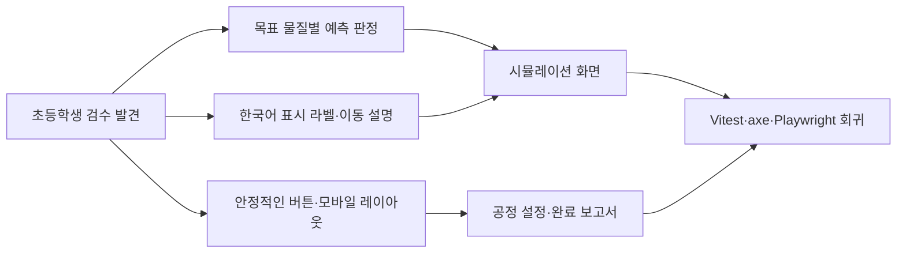

# Mixture Separation Process Lab Improvement Plan

> **For agentic workers:** REQUIRED SUB-SKILL: Use superpowers:subagent-driven-development (recommended) or superpowers:executing-plans to implement this plan task-by-task. Steps use checkbox (`- [ ]`) syntax for tracking.

**Goal:** 초등 5~6학년 학생이 버튼을 안정적으로 눌러 혼합물 분리 공정을 끝까지 설계하고, 자신이 고른 목표 물질만을 기준으로 예측·결과·피드백을 이해하며, 모바일에서도 내부 ID나 오해를 부르는 문장 없이 학습을 완료하도록 기존 앱의 학습 판정·표현·접근성·반응형 UI를 개선합니다.

**Architecture:** 결정적 토큰 시뮬레이션과 `schemaVersion: 1` 로컬 세션 계약은 유지하고, 화면에 보여 주는 이름·예측 판정·이동 설명을 각각 작은 순수 모듈로 분리합니다. React 화면은 이 모듈의 학습용 문구와 판정 결과만 소비하며, 공정 설정과 화면 전환에서는 명시적인 포커스·스크롤 상태를 관리합니다. CSS는 버튼의 레이아웃 상자를 움직이지 않는 아우라만 애니메이션하고, 모바일에서는 표를 카드형 행으로 재배치하여 가로 스크롤 없이 같은 정보를 제공합니다.

**Tech Stack:** Vite, React 19, TypeScript strict mode, Vitest 4, React Testing Library, `@testing-library/user-event`, `jest-axe`, Playwright Chromium, 기능별 CSS, 기존 npm lockfile. 새 런타임 의존성은 추가하지 않습니다.

**Spec:** `/Volumes/ External Drive 256G/Dev2/codex/mixture-separation-process-lab/2026-08-26-mixture-separation-process-lab-design.md`

**Review evidence:** `/Volumes/ External Drive 256G/Dev2/codex/mixture-separation-process-lab/.gstack/qa-reports/qa-report-elementary-learner-2026-08-28.md`

## Global Constraints

- 대상은 초등 5~6학년이며, 한 문장에 하나의 행동을 안내하고 `위층`, `아래층`, `통과`, `잔류` 같은 관찰 문장을 사용합니다.
- 4개 미션과 `크기·서로 섞이지 않음·용해·거름·가상 증발` 학습 목표, 단계별 입력·출력 추적, 회수·잔류·손실 토큰, 통합 미션의 최초·수정 공정 비교를 보존합니다.
- 학생 이름·로그인·서버·외부 AI·센서·카메라·네트워크 요청을 추가하지 않으며, 세션은 기존 `localStorage` fail-closed 계약과 `schemaVersion: 1`을 유지합니다.
- 실제 가열·온도·시간·질량·순도·수율을 지시하거나 보장하지 않고, 가상 모델 경계와 교사 안전 지도를 모든 관련 화면에서 유지합니다.
- 필수 학습 행동 하나만 `gi-pulse`로 강조하되 버튼의 bounding box를 바꾸지 않습니다. `prefers-reduced-motion: reduce`에서는 정적 테두리 아우라와 전·후 상태를 사용합니다.
- 마우스·키보드·375px 모바일·일반 스크린 리더 의미론을 검증합니다. VoiceOver 구현과 검증은 이 계획의 범위에 포함하지 않습니다.
- 교육용 핵심 버튼은 최소 44px 조작 영역, 명확한 한국어 accessible name, visible focus를 갖습니다. 작동하지 않는 정보 버튼은 버튼으로 렌더링하지 않습니다.
- 기능별 소스·테스트·스타일 파일은 각각 500줄 미만을 유지하고, 길어지면 책임별 파일로 분리한 뒤 전체 검증을 다시 수행합니다.
- `업데이트 내역` 버튼은 콘텐츠를 가리지 않는 문서 흐름의 푸터 영역에 두고, 2026-08-28 개선 기록을 날짜·범주·한 줄 요약으로 추가합니다.
- 이 계획에 적은 셸·npm·Git 명령은 구현 단계에서 실행할 항목이며, 계획 작성 단계에서는 실행하지 않습니다. 구현 중에도 `git push`, Pages 배포, HVC 등록은 별도 사용자 지시 없이는 실행하지 않습니다.

---

## 설계 요구사항과 개선 작업 추적

| 설계 문서 요구사항 | 개선 작업 | 합격 증거 |
|---|---|---|
| 물질 성질을 먼저 확인하고 방법을 선택 | Task 2, Task 4 | 성질 값은 학습용 한국어로 보이고, 미션 허용 행동만 표시되며 확인 전 선택은 막힘 |
| 단계별 남은 물질·복수 해법·수정 근거 | Task 1, Task 3, Task 6 | 목표 물질별 예측 판정, 이동별 설명, 통합 최초·수정 비교가 일치 |
| 토큰 기반 회수·잔류·손실과 실제 결과 경계 | Task 1, Task 3, Task 6 | 다중 출력에 `includes`로 잘못 승인하지 않고, 토큰 수·교육용 손실 문구가 유지 |
| 안전·개인정보·정적 결정 모델 | Task 1, Task 7 | 안전 문구·로컬 저장·외부 요청 0건 회귀 테스트 통과 |
| 375px·키보드·모션 감소·상태 알림 | Task 3, Task 4, Task 5, Task 7 | 모바일 가로 overflow 0, 포커스 이동, 정적 장면, 단일 강조 버튼 확인 |
| 업데이트 내역과 날짜 기록 | Task 6 | 푸터 버튼, 대화상자 포커스 복귀, 2026-08-28 항목 확인 |
| 완료 화면에서 배운 점과 다음 행동 | Task 6 | `이번에 배운 점`과 안전한 다음 학습 안내가 보고서에 표시 |

## 구성 시각화



## 예상 파일 구조와 책임

### 새 파일

- `src/domain/displayLabels.ts`: 물질 속성 값, 성질 근거, 출력 포트, 스트림 위치를 학생용 한국어로 변환합니다.
- `src/domain/displayLabels.test.ts`: 모든 저장용 enum 값이 내부 ID를 노출하지 않는지 검증합니다.
- `src/simulation/prediction.ts`: 입력 스트림의 목표 물질을 고르고, 이동 토큰의 최다 목적지로 예측을 판정합니다.
- `src/simulation/prediction.test.ts`: 위·아래층, 통과·잔류, 거른 액체·찌꺼기, 손실이 섞인 증발 결과를 검증합니다.
- `src/simulation/movementCopy.ts`: 이동 그룹·문장·단계 진행 상태를 생성합니다.
- `src/simulation/movementCopy.test.ts`: 한국어 조사, 목적지 문구, 이동별 설명을 검증합니다.
- `src/features/properties/PropertyTable.tsx`: 같은 표 데이터를 데스크톱 표와 375px 행 카드 레이아웃으로 렌더링합니다.
- `src/features/properties/PropertyTable.test.tsx`: 행별 `data-label`, 물질명, 내부 ID 비노출을 검증합니다.
- `src/components/PrimaryAction.test.tsx`: 강조 속성·accessible name·일반 버튼 상자 계약을 검증합니다.
- `e2e/improvement-regressions.spec.ts`: 마우스 클릭, 잘못된 층 예측, 내부 ID, 모바일 표, 업데이트 내역의 브라우저 회귀를 검증합니다.
- `public/favicon.svg`: 외부 요청 없이 사용할 정적 SVG 파비콘입니다.

### 수정 파일

- `src/simulation/contracts.ts`: 이동 단계 상태를 UI에서 사용할 때 필요한 타입을 추가할 경우에만 최소 변경합니다.
- `src/features/simulation/SimulationScreen.tsx`: 목표 물질·예측 판정·단계 진행 라이브 알림을 연결합니다.
- `src/features/simulation/PredictionPrompt.tsx`: 정답 힌트를 제거하고 목표 물질별 질문을 표시합니다.
- `src/features/simulation/MovementScene.tsx`: 이동 중/이동 완료 상태를 분리하고 모션 감소에서는 즉시 완료 상태를 표시합니다.
- `src/simulation/feedback.ts`, `src/features/quality/QualityScreen.tsx`: 선택 목표에 맞춘 유도 질문을 연결합니다.
- `src/components/TokenStatusTable.tsx`: 행마다 해당 이동의 교육용 설명을 표시합니다.
- `src/features/properties/PropertyLabScreen.tsx`: 표시 라벨, 미션 관련 행동만, 비작동 버튼 제거, 반응형 표를 연결합니다.
- `src/features/process-board/ProcessSlot.tsx`: 성질·출력 내부 ID를 학생용 문구로 변환합니다.
- `src/features/process-board/ProcessBoardScreen.tsx`: 설정 패널 포커스와 모바일 스크롤을 연결합니다.
- `src/App.tsx`: 선택 목표 ID를 실행 화면에 전달하고 단계 전환 포커스 계약을 유지합니다.
- `src/components/AppShell.tsx`: 단계 변경 시 본문 제목 영역으로 포커스를 이동하고 업데이트 버튼을 푸터로 이동합니다.
- `src/components/LiveRegion.tsx`: 단계 진행 상태를 중복 없이 전달할 수 있도록 message 계약을 유지·정리합니다.
- `src/components/PrimaryAction.tsx`, `src/styles/components.css`: 레이아웃을 움직이지 않는 `gi-pulse`와 모바일 카드·표·푸터 스타일을 추가합니다.
- `src/features/report/ReportScreen.tsx`: 완료 표시, 배운 점, 다음 학습 안내를 추가합니다.
- `src/content/updateHistory.ts`: 2026-08-28 개선 항목을 맨 앞에 기록합니다.
- `src/components/UpdateHistoryDialog.tsx`, `src/components/UpdateHistoryDialog.test.tsx`: 푸터 버튼과 대화상자 포커스 회귀를 검증합니다.
- `index.html`: `public/favicon.svg` 링크를 추가합니다.
- `src/features/properties/PropertyLabScreen.test.tsx`, `src/features/simulation/SimulationScreen.test.tsx`, `src/features/quality/QualityScreen.test.tsx`, `src/features/process-board/ProcessBoard.test.tsx`, `src/accessibility/App.a11y.test.tsx`, `src/App.test.tsx`: 변경된 문구·판정·포커스·표 계약을 반영합니다.
- `e2e/learner-flow.spec.ts`, `e2e/mobile-keyboard.spec.ts`, `e2e/reduced-motion.spec.ts`, `e2e/privacy-safety.spec.ts`: 새 accessible name과 목표별 질문에 맞춰 기존 흐름을 갱신합니다.
- `docs/manual-qa.md`: VoiceOver 행을 추가하지 않고, 마우스 안정성·목표별 예측·375px 표·푸터 업데이트 내역·일반 스크린 리더 상태표를 별도 검사 행으로 기록합니다.

## 고정 타입·인터페이스 계약

모든 작업은 아래 이름과 판별 값을 사용합니다. 기존 `ProcessOutcome`, `SimulationRun`, `MaterialToken`, `MaterialId`, `OutputPortId`, `ProcessStep`, `MissionDefinition`의 저장 형태를 바꾸지 않습니다.

```ts
// src/simulation/prediction.ts
export interface PredictionCheck {
  targetMaterialId: MaterialId;
  expectedPorts: readonly OutputPortId[];
  selectedPort: OutputPortId;
  matched: boolean;
}
export function getPredictionTargetMaterialId(
  run: SimulationRun,
  step: ProcessStep,
  selectedTargetIds: readonly MaterialId[],
): MaterialId | null;
export function getExpectedPredictionPorts(
  outcome: ProcessOutcome,
  targetMaterialId: MaterialId,
): readonly OutputPortId[];
export function evaluatePrediction(
  outcome: ProcessOutcome,
  targetMaterialId: MaterialId,
  selectedPort: OutputPortId,
): PredictionCheck;
export function predictionQuestion(targetMaterialId: MaterialId, actionId: ProcessStep['actionId']): string;

// src/simulation/movementCopy.ts
export type MovementPhase = 'moving' | 'complete';
export interface MovementGroup {
  materialId: MaterialId;
  fromStreamId: string;
  toStreamId: string | 'loss';
  reason: string;
  count: number;
}
export function groupMovements(outcome: ProcessOutcome): readonly MovementGroup[];
export function formatMovementAnnouncement(outcome: ProcessOutcome): string;
export function formatMovementGroupExplanation(group: MovementGroup): string;
export function formatMovementPhaseMessage(stepNumber: string, phase: MovementPhase): string;

// src/domain/displayLabels.ts
export type MaterialPropertyKey = keyof MaterialDefinition['properties'];
export function materialPropertyValueLabel(key: MaterialPropertyKey, value: string): string;
export function propertyEvidenceLabel(propertyId: PropertyId): string;
export function outputPortLabel(port: OutputPortId): string;
export function streamLocationLabel(location: string): string;
```

---

### Task 1: 목표 물질 기반 예측·피드백 판정

**Files:**
- Create: `src/simulation/prediction.ts`
- Test: `src/simulation/prediction.test.ts`
- Modify: `src/features/simulation/SimulationScreen.tsx`
- Modify: `src/features/simulation/PredictionPrompt.tsx`
- Modify: `src/simulation/feedback.ts`
- Modify: `src/features/quality/QualityScreen.tsx`
- Modify: `src/App.tsx`
- Test: `src/features/simulation/SimulationScreen.test.tsx`
- Test: `src/features/quality/QualityScreen.test.tsx`

**Interfaces:**
- Consumes: `SimulationRun`, `ProcessOutcome`, `ProcessStep`, `MissionDefinition`, `MaterialId`, `OutputPortId`.
- Produces: `getPredictionTargetMaterialId`, `getExpectedPredictionPorts`, `evaluatePrediction`, `predictionQuestion`, and `getGuidingQuestion(evaluation, run, targetIds)`.

- [ ] **Step 1: 실패 테스트를 먼저 작성합니다**

  `prediction.test.ts`에 다음을 고정합니다.

  1. `liquid-layers`에서 목표가 `oil`이고 층 분리 결과가 식용유 모형 9개 위층·1개 아래층이면 기대 포트는 `['upper']`이고 `lower` 선택은 `matched: false`입니다.
  2. `integrated-process`의 가상 증발에서 소금 9개가 `solid-residue`, 1개가 `loss`이면 소금의 기대 포트는 `['solid-residue']`입니다.
  3. 목표 물질 이동이 없는 no-basis 결과는 `['unchanged']`입니다.
  4. 질문에는 목표 물질명이 들어가고 `(자갈은 잔류)` 같은 정답 힌트가 들어가지 않습니다.
  5. `getGuidingQuestion`은 `targetIds: ['sand']`에 대해 소금을 언급하지 않습니다.

  `SimulationScreen.test.tsx`에는 물·식용유 모형 미션에서 `아래층`을 선택했을 때 결과 문장이 “일치했습니다”가 되지 않는 회귀를 추가하고, `PredictionPrompt`의 정답 힌트 문자열이 존재하지 않음을 고정합니다.

- [ ] **Step 2: 실패를 확인합니다**

  실행: `npm test -- src/simulation/prediction.test.ts src/features/simulation/SimulationScreen.test.tsx src/features/quality/QualityScreen.test.tsx`

  예상 결과: 새 모듈 import 실패 또는 기존 `actual.includes(prediction)` 판정과 소금 고정 질문 때문에 FAIL합니다.

- [ ] **Step 3: 최소 구현을 작성합니다**

  `getPredictionTargetMaterialId`는 현재 입력 스트림의 토큰을 읽고 `selectedTargetIds` 중 입력에 존재하는 첫 목표를 반환합니다. 선택 목표가 입력에 없으면 입력에 실제로 존재하는 첫 `MaterialId`를 반환하고, 입력도 없으면 `null`을 반환합니다. `getExpectedPredictionPorts`는 해당 물질의 movement를 세어 가장 많이 이동한 출력 포트만 반환하며, `loss`가 소수인 경우 손실을 정답 포트로 사용하지 않습니다. 동률은 정렬된 모든 포트를 반환합니다.

  `SimulationScreen`은 `selectedTargetIds`를 props로 받고 현재 단계 목표를 질문·판정에 사용합니다. 결과 문장은 `evaluatePrediction(...).matched`일 때만 “예측이 목표 물질의 실제 출력과 일치했습니다.”를 표시합니다. `PredictionPrompt`는 `targetMaterialId`를 받아 “{물질} 토큰은 어느 출력에 있을까요?” 형식으로 질문하고 모든 radio label의 내부 힌트를 제거합니다. `QualityScreen`은 목표 ID 목록을 `getGuidingQuestion`에 전달합니다.

- [ ] **Step 4: 테스트를 통과시킵니다**

  실행: `npm test -- src/simulation/prediction.test.ts src/features/simulation/SimulationScreen.test.tsx src/features/quality/QualityScreen.test.tsx`

  예상 결과: 목표별 최다 목적지 판정과 동적 피드백이 PASS하고, 기존 4개 품질 범주·회수 claim 계약도 PASS합니다.

- [ ] **Step 5: 독립 커밋합니다**

  ```bash
  git add src/simulation/prediction.ts src/simulation/prediction.test.ts src/features/simulation/SimulationScreen.tsx src/features/simulation/PredictionPrompt.tsx src/simulation/feedback.ts src/features/quality/QualityScreen.tsx src/App.tsx src/features/simulation/SimulationScreen.test.tsx src/features/quality/QualityScreen.test.tsx
  git commit -m "fix: evaluate predictions for the selected material"
  ```

  예상 결과: 목표 물질 기준 예측·피드백만 포함한 하나의 로컬 커밋이 생성됩니다.

### Task 2: 학생용 표시 라벨과 이동별 설명

**Files:**
- Create: `src/domain/displayLabels.ts`
- Test: `src/domain/displayLabels.test.ts`
- Create: `src/simulation/movementCopy.ts`
- Test: `src/simulation/movementCopy.test.ts`
- Modify: `src/features/properties/PropertyLabScreen.tsx`
- Modify: `src/features/process-board/ProcessSlot.tsx`
- Modify: `src/features/simulation/PredictionPrompt.tsx`
- Modify: `src/features/simulation/SimulationScreen.tsx`
- Modify: `src/components/TokenStatusTable.tsx`
- Test: `src/features/properties/PropertyLabScreen.test.tsx`
- Test: `src/features/process-board/ProcessBoard.test.tsx`

**Interfaces:**
- Consumes: `MaterialDefinition['properties']`, `PropertyId`, `OutputPortId`, `ProcessOutcome`, `MaterialToken`.
- Produces: `materialPropertyValueLabel`, `propertyEvidenceLabel`, `outputPortLabel`, `streamLocationLabel`, `groupMovements`, `formatMovementAnnouncement`, `formatMovementGroupExplanation`.

- [ ] **Step 1: 실패 테스트를 먼저 작성합니다**

  `displayLabels.test.ts`에서 `solid`, `large`, `fine`, `not-applicable`, `does-not-mix`, `dissolves`, `solid-remains`, `carrier-removed`, `particle-size`, `filter-residue`, `step-1:retained`가 각각 한국어 설명으로 변환되고 원본 ID가 반환되지 않음을 검증합니다.

  `movementCopy.test.ts`에서 `retained`는 “잔류로”, `filtrate`는 “거른 액체로”, `loss`는 “교육용 손실로”가 되어 `잔류으로`·`액체으로`가 발생하지 않음을 검증합니다. 한 결과의 그룹별 설명에 다른 물질의 설명이 반복되지 않는지 확인합니다.

  컴포넌트 테스트에서는 성질표·공정 슬롯·토큰 표에 `particle-size`, `solid`, `filter-behavior`가 화면 텍스트로 나타나지 않음을 고정합니다.

- [ ] **Step 2: 실패를 확인합니다**

  실행: `npm test -- src/domain/displayLabels.test.ts src/simulation/movementCopy.test.ts src/features/properties/PropertyLabScreen.test.tsx src/features/process-board/ProcessBoard.test.tsx`

  예상 결과: 새 모듈 import 실패와 기존 raw ID·`잔류으로`·동일 outcome 설명 반복으로 FAIL합니다.

- [ ] **Step 3: 최소 구현을 작성합니다**

  `displayLabels.ts`에 저장 계약별 완전한 whitelist map을 만들고, 알 수 없는 값은 내부 ID를 그대로 반환하지 않고 `교육용 정보`로 대체합니다. `streamLocationLabel`은 `step-N:port`를 “N단계의 {출력}”으로 변환합니다.

  `movementCopy.ts`는 `outcome.movements`를 물질·전 위치·후 위치·reason별로 그룹화하고 `formatMovementGroupExplanation`에서 해당 그룹의 첫 reason만 사용합니다. 화면 발표 문장은 `그리고`를 한 번만 사용하고 목적지 조사까지 포함합니다. `TokenStatusTable`은 각 행에 그룹 전용 설명을 연결합니다.

- [ ] **Step 4: 테스트를 통과시킵니다**

  실행: `npm test -- src/domain/displayLabels.test.ts src/simulation/movementCopy.test.ts src/features/properties/PropertyLabScreen.test.tsx src/features/process-board/ProcessBoard.test.tsx`

  예상 결과: 모든 저장용 ID가 학습용 문장으로만 표시되고 이동별 설명·조사가 PASS합니다.

- [ ] **Step 5: 독립 커밋합니다**

  ```bash
  git add src/domain/displayLabels.ts src/domain/displayLabels.test.ts src/simulation/movementCopy.ts src/simulation/movementCopy.test.ts src/features/properties/PropertyLabScreen.tsx src/features/process-board/ProcessSlot.tsx src/features/simulation/PredictionPrompt.tsx src/features/simulation/SimulationScreen.tsx src/components/TokenStatusTable.tsx src/features/properties/PropertyLabScreen.test.tsx src/features/process-board/ProcessBoard.test.tsx
  git commit -m "fix: show learner-friendly separation labels"
  ```

  예상 결과: 학생용 표시 계층과 이동 설명만 포함한 로컬 커밋이 생성됩니다.

### Task 3: 이동 완료 상태와 모션 감소 대체

**Files:**
- Modify: `src/features/simulation/MovementScene.tsx`
- Modify: `src/features/simulation/SimulationScreen.tsx`
- Modify: `src/components/LiveRegion.tsx`
- Modify: `src/styles/components.css`
- Test: `src/features/simulation/SimulationScreen.test.tsx`
- Test: `src/accessibility/App.a11y.test.tsx`

**Interfaces:**
- Consumes: `MovementPhase`, `formatMovementPhaseMessage`, `formatMovementAnnouncement`, `reducedMotion`.
- Produces: `MovementSceneProps.onPhaseChange?: (phase: MovementPhase) => void` and one 단계당 `moving`→`complete` 상태.

- [ ] **Step 1: 실패 테스트를 먼저 작성합니다**

  normal-motion 테스트에서 완료 결과가 처음에는 “토큰 이동 중”이고 700ms 후 “토큰 이동 완료”로 바뀌며, `aria-live` 문장이 완료 후 최종 이동 발표를 유지하는지 검증합니다. `reducedMotion=true` 테스트에서는 이동 중 문구와 moving test id가 없고 전·후 두 장면과 완료 문구가 즉시 보이는지 검증합니다. 화면에 3초 뒤에도 “토큰이 교육용 모형 칸으로 이동합니다.”가 남지 않음을 검증합니다.

- [ ] **Step 2: 실패를 확인합니다**

  실행: `npm test -- src/features/simulation/SimulationScreen.test.tsx src/accessibility/App.a11y.test.tsx`

  예상 결과: 기존 MovementScene의 고정 이동 문구와 단일 LiveRegion 때문에 FAIL합니다.

- [ ] **Step 3: 최소 구현을 작성합니다**

  `MovementScene`은 `useState<MovementPhase>`로 normal-motion의 `moving`을 시작하고 `window.setTimeout(..., 700)` 뒤 `complete`를 부모에 알립니다. no-basis 또는 reduced-motion은 첫 렌더에서 `complete`입니다. `SimulationScreen`은 단계 ID별 phase map을 가지고 LiveRegion에는 moving/complete 한 문장만 렌더링합니다. CSS는 이동 상태에만 `token-travel`을 적용하고 reduced-motion 규칙에서 애니메이션을 끕니다.

- [ ] **Step 4: 테스트를 통과시킵니다**

  실행: `npm test -- src/features/simulation/SimulationScreen.test.tsx src/accessibility/App.a11y.test.tsx`

  예상 결과: 타이머 전환·정적 장면·중복 라이브 알림 0건과 axe 위반 0건이 PASS합니다.

- [ ] **Step 5: 독립 커밋합니다**

  ```bash
  git add src/features/simulation/MovementScene.tsx src/features/simulation/SimulationScreen.tsx src/components/LiveRegion.tsx src/styles/components.css src/features/simulation/SimulationScreen.test.tsx src/accessibility/App.a11y.test.tsx
  git commit -m "fix: announce completed token movement"
  ```

### Task 4: 성질 분석실의 정보 밀도와 모바일 표 개선

**Files:**
- Create: `src/features/properties/PropertyTable.tsx`
- Test: `src/features/properties/PropertyTable.test.tsx`
- Modify: `src/features/properties/PropertyLabScreen.tsx`
- Modify: `src/styles/components.css`
- Test: `src/features/properties/PropertyLabScreen.test.tsx`
- Test: `src/accessibility/App.a11y.test.tsx`

**Interfaces:**
- Consumes: `MissionDefinition`, `MaterialId`, `MATERIALS`, `materialPropertyValueLabel`, `ActionDefinition`.
- Produces: `PropertyTable({ materialIds }: { materialIds: readonly MaterialId[] }): JSX.Element` and `.property-table`/`.property-table-row` responsive class contracts.

- [ ] **Step 1: 실패 테스트를 먼저 작성합니다**

  `PropertyTable.test.tsx`에서 각 물질 행의 상태·알갱이·물과의 관계 셀에 `data-label`이 있고 `고운 모래`, `물에 섞이지 않음` 같은 한국어가 보이는지 검증합니다. `PropertyLabScreen.test.tsx`에서 `size-sort`에는 `체로 분리` 카드만 존재하고 `거르기` 정보 버튼은 존재하지 않으며, 가능한 행동 카드가 실제 버튼처럼 눌리지 않는 대신 “공정 설계판에서 선택” 상태 문장을 제공하는지 검증합니다.

- [ ] **Step 2: 실패를 확인합니다**

  실행: `npm test -- src/features/properties/PropertyTable.test.tsx src/features/properties/PropertyLabScreen.test.tsx src/accessibility/App.a11y.test.tsx`

  예상 결과: PropertyTable import 실패, raw 값 표시, 모든 미션 행동 카드, no-op 버튼 때문에 FAIL합니다.

- [ ] **Step 3: 최소 구현을 작성합니다**

  `PropertyTable`은 하나의 semantic table을 유지하고 셀에 `data-label`을 넣습니다. 560px 이하 CSS에서는 header를 시각적으로 접고 각 행을 두 열 카드로 배치하여 `min-width: 36rem`을 제거합니다. `PropertyLabScreen`은 `mission.allowedActionIds` 순서로 관련 카드만 렌더링하고, disabled/no-op 버튼을 `<p className="action-card-status" role="status">공정 설계판에서 방법을 선택할 수 있어요.</p>`로 바꿉니다. `displayLabels`를 통해 상태·알갱이·물 관계를 표시합니다.

- [ ] **Step 4: 테스트를 통과시킵니다**

  실행: `npm test -- src/features/properties/PropertyTable.test.tsx src/features/properties/PropertyLabScreen.test.tsx src/accessibility/App.a11y.test.tsx`

  예상 결과: 모바일 표의 모든 열이 DOM 계약으로 존재하고, 미션 관련 카드만 보이며, no-op 버튼과 raw ID가 없고 axe 위반 0건입니다.

- [ ] **Step 5: 독립 커밋합니다**

  ```bash
  git add src/features/properties/PropertyTable.tsx src/features/properties/PropertyTable.test.tsx src/features/properties/PropertyLabScreen.tsx src/styles/components.css src/features/properties/PropertyLabScreen.test.tsx src/accessibility/App.a11y.test.tsx
  git commit -m "fix: simplify property lab on small screens"
  ```

### Task 5: 공정 설정 포커스·스크롤과 단계 전환 포커스

**Files:**
- Modify: `src/features/process-board/ProcessBoardScreen.tsx`
- Modify: `src/components/AppShell.tsx`
- Modify: `src/styles/components.css`
- Test: `src/features/process-board/ProcessBoard.test.tsx`
- Test: `src/App.test.tsx`
- Test: `src/accessibility/App.a11y.test.tsx`

**Interfaces:**
- Consumes: `ProcessBoardScreenProps.selected`, `ProcessBoardScreenProps.reducedMotion: boolean`, `LabStage`, existing `skip-link` and `main-content` contracts. `App.tsx` passes the existing `useReducedMotion()` value to both simulation and process-board screens.
- Produces: `step-config` section with focusable `config-title` heading and `main-content` focus after `stage` changes.

- [ ] **Step 1: 실패 테스트를 먼저 작성합니다**

  `ProcessBoard.test.tsx`에서 방법 선택 뒤 `config-title`이 `tabIndex="-1"`이고 focus를 받는지, `scrollIntoView`가 호출되는지 검증합니다. `App.test.tsx`에서 `AppShell`을 `intake`에서 `properties`로 rerender하면 `main-content`가 focus되는지 검증합니다.

- [ ] **Step 2: 실패를 확인합니다**

  실행: `npm test -- src/features/process-board/ProcessBoard.test.tsx src/App.test.tsx src/accessibility/App.a11y.test.tsx`

  예상 결과: 설정 패널과 main에 focus effect가 없어 FAIL합니다.

- [ ] **Step 3: 최소 구현을 작성합니다**

  `ProcessBoardScreen`은 `configRef`와 `configHeadingRef`를 만들고 `selected`가 바뀔 때 `scrollIntoView({ block: 'center', behavior: reducedMotion ? 'auto' : 'smooth' })`를 호출한 뒤 제목에 focus합니다. `AppShell`은 `mainRef`에 `tabIndex={-1}`을 유지하고 `stage` 변경 effect에서 main으로 focus합니다. scroll API가 없는 jsdom에서는 조건부 호출로 테스트 환경 오류를 막습니다.

- [ ] **Step 4: 테스트를 통과시킵니다**

  실행: `npm test -- src/features/process-board/ProcessBoard.test.tsx src/App.test.tsx src/accessibility/App.a11y.test.tsx`

  예상 결과: 방법 선택 직후 설정 제목으로 포커스가 이동하고, 단계가 바뀔 때 본문 시작점이 focus되며 axe 위반 0건입니다.

- [ ] **Step 5: 독립 커밋합니다**

  ```bash
  git add src/features/process-board/ProcessBoardScreen.tsx src/components/AppShell.tsx src/styles/components.css src/features/process-board/ProcessBoard.test.tsx src/App.test.tsx src/accessibility/App.a11y.test.tsx
  git commit -m "fix: focus the next process configuration"
  ```

### Task 6: 안정적인 gi-pulse, 업데이트 내역 푸터, 완료 학습 요약

**Files:**
- Modify: `src/components/PrimaryAction.tsx`
- Test: `src/components/PrimaryAction.test.tsx`
- Modify: `src/styles/components.css`
- Modify: `src/components/AppShell.tsx`
- Modify: `src/components/UpdateHistoryDialog.tsx`
- Modify: `src/components/UpdateHistoryDialog.test.tsx`
- Modify: `src/content/updateHistory.ts`
- Modify: `src/features/report/ReportScreen.tsx`
- Test: `src/features/report/ReportScreen.test.tsx`

**Interfaces:**
- Consumes: `PrimaryActionProps.attention`, `UpdateHistoryEntry`, `ReportScreenProps`.
- Produces: stable `.gi-pulse` pseudo-element aura, `.app-footer`, dated 2026-08-28 entry, `completion-summary` section.

- [ ] **Step 1: 실패 테스트를 먼저 작성합니다**

  `PrimaryAction.test.tsx`에서 attention 버튼만 `data-attention="true"`와 `gi-pulse`를 갖고 버튼 자식 pseudo-element용 class contract를 노출하는지 검증합니다. `UpdateHistoryDialog.test.tsx`에서 trigger가 `app-footer` 안에 있고 2026-08-28 항목이 보이며 닫은 뒤 trigger로 focus가 돌아오는지 검증합니다. `ReportScreen.test.tsx`에서 완료 보고서에 `이번에 배운 점`, `다음에는` 문장이 표시되는지 검증합니다.

- [ ] **Step 2: 실패를 확인합니다**

  실행: `npm test -- src/components/PrimaryAction.test.tsx src/components/UpdateHistoryDialog.test.tsx src/features/report/ReportScreen.test.tsx`

  예상 결과: fixed trigger·구 버전 history·완료 학습 요약 부재로 FAIL합니다. mouse click 안정성은 이후 브라우저 테스트에서 확인합니다.

- [ ] **Step 3: 최소 구현을 작성합니다**

  `.gi-pulse` 자체에는 `transform`과 레이아웃 변화를 주지 않고 `::after`의 `box-shadow`·`opacity`만 애니메이션합니다. reduced-motion에서는 pseudo-element가 정적 테두리를 표시합니다. `AppShell`은 main 다음에 `.app-footer`를 렌더링하고 `UpdateHistoryDialog` trigger를 그 안에 둡니다. dialog의 Escape·닫기 focus 복귀를 유지합니다. `ReportScreen`에는 회수 결과에서 배운 성질·토큰 추적을 한 문장으로 요약하고 교사 지도 아래 실제 활동으로 이어지는 다음 안내를 추가합니다. `UPDATE_HISTORY` 맨 앞에 `{ date: '2026-08-28', category: '개선', summary: '초등학생 검수에 맞춰 예측 판정·모바일 표·버튼 안정성 개선' }`을 추가합니다.

- [ ] **Step 4: 테스트를 통과시킵니다**

  실행: `npm test -- src/components/PrimaryAction.test.tsx src/components/UpdateHistoryDialog.test.tsx src/features/report/ReportScreen.test.tsx`

  예상 결과: 강조 버튼 DOM·푸터 dialog·날짜 기록·완료 학습 요약이 PASS합니다.

- [ ] **Step 5: 독립 커밋합니다**

  ```bash
  git add src/components/PrimaryAction.tsx src/components/PrimaryAction.test.tsx src/styles/components.css src/components/AppShell.tsx src/components/UpdateHistoryDialog.tsx src/components/UpdateHistoryDialog.test.tsx src/content/updateHistory.ts src/features/report/ReportScreen.tsx src/features/report/ReportScreen.test.tsx
  git commit -m "fix: stabilize primary actions and completion guidance"
  ```

### Task 7: 파비콘·브라우저 회귀·문서 검수표

**Files:**
- Create: `public/favicon.svg`
- Create: `e2e/improvement-regressions.spec.ts`
- Modify: `index.html`
- Modify: `e2e/learner-flow.spec.ts`
- Modify: `e2e/mobile-keyboard.spec.ts`
- Modify: `e2e/reduced-motion.spec.ts`
- Modify: `e2e/privacy-safety.spec.ts`
- Modify: `docs/manual-qa.md`
- Test: `src/accessibility/App.a11y.test.tsx`

**Interfaces:**
- Consumes: all UI contracts from Tasks 1–6 and local origin `http://127.0.0.1:4173`.
- Produces: browser-level proof for mouse activation, 375px layout, reduced motion, target-aware prediction, no raw IDs, no external request, favicon HTTP 200, and update-history placement.

- [ ] **Step 1: 실패 테스트를 먼저 작성합니다**

  `improvement-regressions.spec.ts`에 다음 시나리오를 작성합니다.

  1. 375px에서 미션 접수부터 성질 확인까지 마우스로 `성질 분석실로`를 클릭하고, 버튼 bounding box가 클릭 중 바뀌지 않으며 다음 화면이 열립니다.
  2. 물·식용유 모형에서 식용유 목표로 `아래층`을 고르고 실행한 뒤 “일치했습니다”가 보이지 않고 목표별 비교 문장이 보입니다.
  3. 성질 분석실·공정 설계·토큰 상태표에 `particle-size`, `solid`, `filter-behavior`, `잔류으로`가 보이지 않습니다.
  4. 375px에서 `document.documentElement.scrollWidth <= 375`, property table 모든 `data-label`이 존재하고 푸터의 업데이트 버튼이 safety notice와 겹치지 않습니다.
  5. `page.on('request')`로 preview origin 외 요청이 없고 `/favicon.svg` 응답이 200입니다.

  기존 learner-flow의 radio 이름은 새 목표별 질문에 맞추고, reduced-motion 테스트는 완료 상태 문구를 확인하도록 변경합니다. `docs/manual-qa.md`에는 같은 동작의 검사 순서·예상 결과·합격 기준·확인 날짜 칸을 추가합니다.

- [ ] **Step 2: 실패를 확인합니다**

  실행: `npm run build && npm run dev -- --host 127.0.0.1 --port 4173` 후 별도 셸에서 `npx playwright test e2e/improvement-regressions.spec.ts e2e/mobile-keyboard.spec.ts e2e/reduced-motion.spec.ts e2e/privacy-safety.spec.ts`

  예상 결과: 기존 pulse 클릭 불안정, favicon 404, raw label, 모바일 표 overflow, 새 문구 불일치로 FAIL합니다.

- [ ] **Step 3: 최소 구현을 작성합니다**

  16×16 또는 32×32 단색 SVG를 `public/favicon.svg`에 두고 `index.html`에 `<link rel="icon" type="image/svg+xml" href="./favicon.svg" />`를 추가합니다. E2E는 저장소 하위 경로를 고려해 `page.goto('./')`를 사용하고, 문서의 favicon href를 `new URL(href, page.url())`로 해석해 로컬과 Pages 하위 경로 모두에서 HTTP 200을 확인합니다. 모든 외부 URL 비교는 현재 preview origin과 비교합니다. 검수표에는 자동·수동 상태를 혼동하지 않도록 실제 실행한 날짜만 기록합니다.

- [ ] **Step 4: 테스트를 통과시킵니다**

  실행: `npm run test:a11y && npx playwright test e2e/improvement-regressions.spec.ts e2e/mobile-keyboard.spec.ts e2e/reduced-motion.spec.ts e2e/privacy-safety.spec.ts`

  예상 결과: axe 위반 0건, 375px 키보드 완료, mouse primary action click 통과, wrong prediction 미승인, 내부 ID 0건, 외부 요청 0건, favicon 200이 PASS합니다.

- [ ] **Step 5: 독립 커밋합니다**

  ```bash
  git add public/favicon.svg index.html e2e/improvement-regressions.spec.ts e2e/learner-flow.spec.ts e2e/mobile-keyboard.spec.ts e2e/reduced-motion.spec.ts e2e/privacy-safety.spec.ts docs/manual-qa.md src/accessibility/App.a11y.test.tsx
  git commit -m "test: cover elementary learner improvements"
  ```

## 최종 검증 순서와 예상 결과

아래 명령은 계획을 실행할 때 순서대로 사용합니다. 각 명령은 이전 단계가 통과한 뒤 실행합니다.

| 순서 | 명령 | 예상 결과 |
|---:|---|---|
| 1 | `npm ci` | lockfile 변경 없이 의존성 설치 완료 |
| 2 | `npm test` | 기존·개선 Vitest 전체 PASS |
| 3 | `npm run test:a11y` | intake, properties, design, simulation, quality, report, update-history axe 위반 0건 |
| 4 | `npm run build` | strict TypeScript와 Vite build 성공, `dist/index.html` 및 해시 자산 생성 |
| 5 | `npm run dev -- --host 127.0.0.1 --port 4173` | 로컬 preview 서버가 4173에서 기동 |
| 6 | `npx playwright test e2e/improvement-regressions.spec.ts` | mouse click 안정성·목표별 예측·raw ID·favicon·업데이트 위치 PASS |
| 7 | `npx playwright test e2e/mobile-keyboard.spec.ts e2e/reduced-motion.spec.ts` | 375px 키보드 완료와 모션 감소 정적 장면 PASS |
| 8 | `npx playwright test e2e/privacy-safety.spec.ts` | 외부 요청·개인정보 입력 0건, 안전 경계·reload 복원 PASS |
| 9 | `find src e2e -type f \( -name '*.ts' -o -name '*.tsx' -o -name '*.css' \) -print0 | xargs -0 wc -l | awk '$1 >= 500 { print }'` | 출력 없음 |
| 10 | `rg -n "particle-size|filter-behavior|잔류으로|자갈은 잔류|VoiceOver" src e2e docs/manual-qa.md` | 학생 화면·검수 문서에 금지된 내부 ID·오답 조사·정답 힌트·범위 밖 검증이 없으며, 테스트 fixture의 의도적인 ID는 표시 문자열 검사에서 제외 |

## 향후 커밋 단계

| 순서 | 커밋 메시지 | 독립 검토 가능한 결과 |
|---:|---|---|
| 1 | `fix: evaluate predictions for the selected material` | 목표 물질별 예측·품질 질문 |
| 2 | `fix: show learner-friendly separation labels` | 한국어 라벨·이동별 설명 |
| 3 | `fix: announce completed token movement` | 이동 완료·모션 감소 상태 |
| 4 | `fix: simplify property lab on small screens` | 미션 관련 카드·반응형 표 |
| 5 | `fix: focus the next process configuration` | 설정 패널·단계 전환 포커스 |
| 6 | `fix: stabilize primary actions and completion guidance` | gi-pulse·업데이트 푸터·완료 요약 |
| 7 | `test: cover elementary learner improvements` | 파비콘·브라우저·개인정보·수동 검수표 |

각 커밋은 현재 사용자가 만든 `.gstack/`, `.playwright-mcp/`, `output/` 검수 산출물을 삭제하거나 포함하지 않습니다. 원격 push·Pages 배포·HVC 등록은 별도 승인 후 별도 릴리스 단계로 진행합니다.

## 자체 검토 체크리스트

- [ ] 설계 문서 1~3절의 학습 목표·교육과정·차별성은 Task 1·2·4·6의 목표 물질 판정, 성질 라벨, 완료 요약에 연결했습니다.
- [ ] 설계 문서 5~10절의 흐름·4개 미션·토큰 모델·복수 해법·피드백은 Task 1~3과 기존 결정적 `runProcess` 계약에 연결했습니다.
- [ ] 설계 문서 11절의 색 외 이름·모양, 모바일 흐름, 단일 gi-pulse, reduced-motion, 상태표는 Task 3~6과 Task 7 브라우저 검증에 연결했습니다.
- [ ] 설계 문서 12~15절의 정적 SPA·로컬 저장·안전·MVP 범위·완료 기준은 Global Constraints와 Task 7 privacy/build 테스트에 연결했습니다.
- [ ] 설계 문서 16절의 날짜별 업데이트 내역은 2026-08-28 항목과 푸터 배치 테스트에 연결했습니다.
- [ ] 초등학생 검수에서 발견된 19개 개선점(클릭 불안정, 다중 출력 오판, 고정 소금 질문, raw ID, 반복 설명, 조사, stale 상태, 정답 힌트, no-op 버튼, 포커스·스크롤, 모바일 표·카드·history 겹침, 안전 밀도, 완료 요약, 단계 focus, favicon, 버튼 위계)은 Task 1~7에 각각 배치했습니다.
- [ ] 각 Task는 정확한 파일·인터페이스·실패 테스트·실패 확인 명령·최소 구현·통과 명령·커밋을 포함합니다.
- [ ] 계획 전체에서 구현 보류를 뜻하는 자리표시자나 다른 Task를 참조하는 생략 표현을 사용하지 않았습니다.
- [ ] 타입 이름 `PredictionCheck`, `MovementPhase`, `MovementGroup`, `PropertyTable`, `materialPropertyValueLabel`, `getGuidingQuestion(evaluation, run, targetIds)`가 정의·소비 위치에서 일관됩니다.
- [ ] 소스 파일 500줄 미만 검사, keyboard/mobile/일반 스크린 리더 의미론, reduced-motion, 개인정보·안전, no network 검증을 별도 단계로 남겼습니다.
- [ ] VoiceOver 구현·검증을 계획하지 않았습니다.
