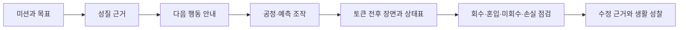

# Mixture Separation Process Lab Education Web App Redesign Plan

> 작업 모드: `full`
> 계획 작성일: 2026-08-29
> 대상: `/Volumes/ External Drive 256G/Dev2/codex/mixture-separation-process-lab`
> 계획 우선순위: 학습 계약과 안전·개인정보 계약을 보존한 채, 초등 5~6학년의 실제 학습 흐름을 더 쉽게 읽고 조작하도록 개선합니다.

## Goal

초등 5~6학년 학습자가 “혼합물을 이루는 물질의 성질을 이용하면 어떤 순서로 분리할 수 있을까요?”라는 질문을 화면 첫 시선에서 이해하고, 다음 행동을 놓치지 않으면서 네 미션을 끝까지 수행하게 합니다.

이번 리디자인은 이미 검증된 결정적 토큰 시뮬레이션과 결과 판정 모델을 바꾸지 않습니다. 대신 다음을 달성합니다.

- 미션 선택 → 성질 확인 → 예측 → 공정 구성 → 단계별 실행 → 품질 점검 → 수정·설명이라는 7단계가 항상 한눈에 보입니다.
- 각 화면에 학습상 가장 중요한 다음 버튼 하나만 시각적으로 강조하고, `gi-pulse`는 그 버튼에만 적용합니다.
- 긴 설명을 짧은 문장과 카드형 정보 묶음으로 재배치하여 어린 학습자가 “무엇을 읽고 무엇을 해야 하는지”를 바로 찾습니다.
- 375px 모바일에서 카드·표·공정 흐름이 가로로 잘리지 않고, 드래그 없이 키보드만으로 완료됩니다.
- `prefers-reduced-motion: reduce`에서는 이동·펄스가 정적인 전후 장면과 테두리 강조로 바뀝니다.
- 업데이트 내역 버튼은 유지하고 2026-08-29 리디자인 항목을 날짜와 한 줄 설명으로 추가합니다.
- 화면 문구와 컴포넌트 구조를 정리하되 로그인, 이름·이메일 수집, 네트워크 요청, 외부 폰트, 음성 기능, 위험 실험 안내는 추가하지 않습니다.

## Safe boundary and current baseline

- 프레임워크는 Vite + React + TypeScript SPA입니다. Next.js 라우팅을 새로 도입하지 않습니다.
- 보존 대상은 `src/domain/**`, `src/simulation/**`, `src/state/**`의 타입·순수 판정·localStorage 스키마·fail-closed 검증입니다. 리디자인에서 이 계약을 변경하지 않습니다.
- 현재 진입점은 `src/main.tsx`, 화면 선택은 `src/App.tsx`, 공통 셸은 `src/components/AppShell.tsx`입니다.
- 현재 `git status`의 기존 변경은 `.superpowers/sdd/2026-08-28-mixture-separation-process-lab-improvement-plan/task-1-report.md`, `.gstack/`, `.playwright-mcp/`, `output/`입니다. 이 네 경로는 계획·구현·검증·커밋에서 스테이징하거나 삭제하지 않습니다.
- 적용 가능한 프로젝트 규칙 파일을 확인한 결과 `AGENTS.md`, `EDUCATION_DESIGN.md`, `design-system/MASTER.md`는 현재 저장소에 없습니다. 내용을 추측하지 않고 본 계획과 새 `design-system/MASTER.md`에 리디자인 결정을 기록합니다.
- 현재 기준 검증은 `npm test`, `npm run test:a11y`, `npm run test:e2e`, `npm run build`가 통과한 상태입니다. 이 기준을 리디자인 전후 비교점으로 사용합니다.
- 현재 공개 Pages URL은 `https://wbmaker2.github.io/mixture-separation-process-lab/`이지만 이번 작업 중에는 배포하지 않습니다. 로컬 검증 결과와 공개 배포 결과를 섞어 보고하지 않습니다.
- `impeccable`의 제품 문맥 게이트를 위해 2026-08-30에 `PRODUCT.md`를 추가했습니다. 내용은 이 계획에서 이미 확인된 사용자·목적·플랫폼·안전 제약만 기록하며 새로운 시각 방향은 포함하지 않습니다.

## Architecture

### 학습 계층



### 코드 계층

1. `domain`과 `simulation`은 교육 콘텐츠와 결정적 규칙을 제공하며 리디자인에서 읽기 전용으로 취급합니다.
2. `state`는 현재 단계·선택·공정·실행 결과·수정 이유를 유지합니다. 새 UI 컴포넌트는 `LabAction`을 직접 만들지 않고 기존 `dispatch` 계약을 사용합니다.
3. `components`에는 셸, 진행 표시, 화면 제목, 안전 안내, 학습 힌트, 주요 버튼 같은 공통 표현을 둡니다.
4. `features/*` 화면은 각 단계의 콘텐츠와 기존 dispatch 연결만 담당하고, 반복 문구와 시각 규칙은 `content`와 공통 컴포넌트에서 가져옵니다.
5. `styles`는 라이트 모드 토큰, 공통 기초, 셸, 학습 카드, 공정·시뮬레이션·보고서 규칙으로 나눕니다. 모든 파일은 500줄 미만입니다.
6. 새 UI는 상태 모델을 직렬화하거나 URL·쿠키에 쓰지 않습니다. 기존 `useLabSession`과 `persistence`만 localStorage 경계를 담당합니다.

## Tech Stack

- Vite 8, React 19, TypeScript strict mode
- 기존 npm lockfile과 패키지만 사용하며 새 런타임 의존성을 설치하지 않습니다.
- Vitest + React Testing Library + `@testing-library/user-event` + `jest-axe`
- Playwright Chromium: learner flow, 375px 키보드, reduced motion, 개인정보·안전, 리디자인 회귀
- CSS 파일 기반 디자인 토큰. 외부 폰트·CDN·원격 이미지·분석 SDK는 사용하지 않습니다.

## Spec traceability

| 설계 요구 | 리디자인 연결 | 합격 증거 |
| --- | --- | --- |
| `[6과05-01]` 크기·서로 섞이지 않는 액체 | 미션 카드와 성질 분석 헤더에서 관찰 가능한 성질을 먼저 읽게 함 | 미션별 성질·방법 연결 테스트와 학습자 흐름 통과 |
| `[6과05-02]` 용해·증발 | 소금 회수선과 통합 공정에서 준비 행동·분리 방법을 구분하여 표시 | 공정 카드에 준비/방법 종류와 후속 입력이 함께 표시됨 |
| `[6과05-03]` 생활 속 분리·지속가능성 | 보고서의 학습 요약과 성찰 질문을 마지막 다음 행동으로 배치 | 보고서에 회수 결과·이용 성질·지속가능성 입력이 남음 |
| 기존 앱과의 차별성 | 정답 버튼 찾기가 아니라 성질 근거·스트림·토큰 흐름을 읽는 정보 위계 유지 | `domain`·`simulation` 변경 없음, 결과 기반 테스트 유지 |
| 7단계 학습 흐름 | `LearningProgress`와 화면별 `StageHeader`가 현재·완료·잠금 단계를 표시 | 셸 테스트에서 현재 단계·완료 수·다음 행동 라벨 검증 |
| 복수 해법·결과 기반 판정 | 화면 표현만 바꾸고 `runProcess`, `computeQuality`, `evaluateRun` 보존 | 기존 시뮬레이션·품질 테스트 전부 통과 |
| 추적 질문 우선 피드백 | 품질 화면의 질문·힌트를 가장 먼저 보이는 학습 콜아웃으로 유지 | 정답 순서 문자열이 없고 위치 질문이 먼저 노출됨 |
| 접근성·모바일 | 44px 조작 영역, 포커스 이동, 세로 공정, 표의 모바일 레이블, 라이브 영역 유지 | axe, 키보드 E2E, 375px overflow/reduced-motion 검증 |
| 개인정보·안전 | 공통 `SafetyNotice`, 실행·보고서 한계 문구, local-only 상태 유지 | 외부 요청·이름 필드·금지 절차 문자열 부재 검사 |
| MVP와 제외 범위 | 기존 4 미션·4 방법·2 준비 행동만 노출 | 콘텐츠 불변식·빌드·패키지 의존성 diff 검증 |
| 완료 기준 | 최종 화면에 최초/수정 공정, 토큰 범주, 학습 요약, 다음 행동 유지 | 통합 미션 E2E와 보고서 테스트 통과 |
| 업데이트 내역 | 날짜별 2026-08-29 개선 항목 추가 | 버튼·dialog 키보드 테스트와 내용 검증 |

## Design system direction

### Tone and hierarchy

- 페이지는 밝은 중성 배경, 흰색 표면, 짙은 남청 텍스트를 유지합니다. `prefers-color-scheme: dark` 분기는 추가하지 않습니다.
- 화면 상단은 `StageHeader`의 작은 단계명 → 한 문장 제목 → 한 문장 해야 할 일 순서입니다.
- 긴 안전·모델 한계 설명은 노란 `SafetyNotice` 한 곳에 묶고, 본문 히어로에서 같은 문장을 반복하지 않습니다. 실행 화면과 보고서에는 설계 문서가 요구한 한계 문장을 계속 보입니다.
- 카드의 제목, 행동 버튼, 설명, 상태 텍스트를 수직으로 분리해 스캔할 수 있게 합니다. 내부 ID(`step-1`, `unchanged`)는 학습자에게 렌더링하지 않습니다.
- 선택 카드에는 색만이 아니라 라디오·체크박스·이름·입자 패턴을 함께 사용합니다.

### Tokens

`design-system/MASTER.md`와 `src/styles/tokens.css`에 다음 토큰을 동일한 이름으로 정의합니다.

- 색: `--page`, `--surface`, `--surface-raised`, `--ink`, `--ink-soft`, `--muted`, `--accent`, `--accent-strong`, `--accent-soft`, `--border`, `--focus`, `--warning-surface`, `--warning-border`, `--danger`
- 간격: `--space-1`부터 `--space-7`까지 0.25rem 단위의 제한된 척도
- 반경: `--radius-sm`, `--radius-md`, `--radius-lg`, `--radius-pill`
- 표면: `--shadow-card`, `--shadow-dialog`
- 반응형 기준: 375px 필수, 560px 카드/표 전환, 768px 공정 2열, 1100px 넓은 셸
- 포커스: 3px `--focus` outline + 3px offset, 키보드 사용 시에만 `:focus-visible`

### Button policy

- 화면마다 주요 학습 CTA 하나만 `PrimaryAction`으로 렌더링하고 `data-attention="true"`와 `gi-pulse`를 함께 사용합니다.
- 보조 조작(단계 교체·위로·삭제·인쇄·닫기)은 중립 테두리 버튼이며 펄스를 사용하지 않습니다.
- `prefers-reduced-motion: reduce`에서는 `gi-pulse::after` 애니메이션을 제거하고 정적인 `--accent-soft` outline만 남깁니다.
- 모든 버튼, 라디오, 체크박스, select는 최소 44px 높이를 유지합니다.

## Global Constraints

- 초등 5~6학년 한국어 학습자가 이해할 수 있는 짧은 문장과 구체적인 동사를 사용합니다. 과학적 의미를 바꾸는 단순화는 하지 않습니다.
- `src/domain/**`, `src/simulation/**`, `src/state/**`의 계약·판정·토큰 이동·localStorage 스키마를 변경하지 않습니다.
- 정적 SPA, 4개 미션, 4개 분리 방법, 2개 준비 행동만 유지합니다.
- 실제 물질의 양·온도·시간, 실제 순도·수율, 위험한 가열·혼합 절차를 안내하지 않습니다.
- 서버, 로그인, 이름·이메일, 카메라·센서, 외부 AI API, 온라인 공유, 외부 폰트·이미지를 추가하지 않습니다.
- 학생 대상 TTS·내레이션·음성 재생·녹음을 추가하지 않습니다. 일반 스크린 리더 semantics와 `aria-live`만 검증합니다.
- 이미지가 학습 이해를 실제로 돕지 않는 현재 구조에서는 새 이미지를 삽입하지 않습니다. `public/favicon.svg`는 브랜드 식별 자산으로 보존하며 자동 생성·교체하지 않습니다.
- 계획·구현·검증 중 기존 미커밋 산출물을 스테이징하지 않습니다.
- 모든 `.ts`, `.tsx`, `.css` 파일은 500줄 미만이며, 새 기능은 파일 책임별로 나눕니다.
- 이번 작업에는 GitHub 커밋·푸시·릴리스·배포·HVC 등록을 포함하지 않습니다. 사용자가 별도로 요청할 때에만 후속 릴리스 절차를 시작합니다.

## Expected file structure and responsibility

```text
mixture-separation-process-lab/
├── PRODUCT.md                            # 확인된 제품 목적·사용자·플랫폼·제약
├── design-system/
│   └── MASTER.md                         # 리디자인 토큰·컴포넌트·반응형·접근성 기준
├── work/
│   ├── education-webapp-redesign-plan.md # 이 계획
│   ├── education-webapp-redesign-audit.md# 초기/최종 UX·안전 감사
│   ├── education-webapp-redesign-assets.md# 이미지 사용처와 교체 판정
│   └── education-webapp-redesign-report.md# 구현·검증·미해결 사항 보고
├── src/
│   ├── components/
│   │   ├── AppShell.tsx                  # 전역 포커스·페이지 프레임·진행 표시 조립
│   │   ├── LearningProgress.tsx          # 현재/완료/잠금 단계의 학습 진행
│   │   ├── StageHeader.tsx               # 단계명·제목·해야 할 일의 공통 위계
│   │   ├── LearningCallout.tsx           # 질문·힌트·완료 메시지의 공통 표면
│   │   ├── PrimaryAction.tsx              # 단일 주요 CTA와 gi-pulse 계약
│   │   ├── SafetyNotice.tsx               # 안전·가상 모델 한계
│   │   └── UpdateHistoryDialog.tsx        # 날짜별 업데이트 접근 가능한 dialog
│   ├── content/
│   │   ├── learningCopy.ts               # 단계별 아동 친화 안내·버튼 설명
│   │   ├── safety.ts                     # 안전 문장 원본
│   │   └── updateHistory.ts              # 날짜·구분·개선 내역
│   ├── features/*                        # 기존 화면, 공통 헤더·콜아웃·CTA 사용
│   ├── styles/
│   │   ├── tokens.css                    # 디자인 토큰만
│   │   ├── global.css                    # reset·기본 글꼴·포커스
│   │   ├── shell.css                     # 셸·진행·footer·skip link
│   │   ├── learning.css                  # 접수·성질 카드·안전·공통 카드
│   │   ├── process.css                   # 공정 설계판·슬롯·미리보기
│   │   ├── simulation.css                # 예측·이동 장면·상태표·품질
│   │   ├── report.css                    # 비교·성찰·완료 요약·인쇄 전 화면
│   │   └── print.css                     # 인쇄 전용 숨김·색상
│   └── ...                               # domain/simulation/state는 계약 보존
├── e2e/
│   ├── redesign-visual.spec.ts           # 위계·CTA·업데이트·overflow 회귀
│   ├── learner-flow.spec.ts              # 새 accessible name에 맞춘 전체 학습 흐름
│   ├── mobile-keyboard.spec.ts           # 375px 키보드 전용 전체 미션
│   └── reduced-motion.spec.ts            # 정적 이동·펄스 대체
└── package.json                          # 기존 스크립트만 사용
```

`src/styles/components.css`는 기능별 CSS 이동이 완료된 뒤 `src/main.tsx`에서 더 이상 import하지 않고 삭제하거나, 이동되지 않은 공통 규칙이 있을 때만 500줄 미만의 호환 파일로 남깁니다. 어느 경우에도 동일 selector의 중복 선언을 남기지 않습니다.

## Interfaces and content contracts

### `src/components/LearningProgress.tsx`

```ts
export interface LearningProgressProps {
  stage: LabStage;
}
```

현재 단계에는 `aria-current="step"`, 완료 단계에는 `data-state="complete"`, 잠금 단계에는 `data-state="locked"`를 사용합니다. 각 항목은 “n단계 · 이름”과 “완료/지금/아직 열리지 않음”을 텍스트로 제공합니다.

### `src/components/StageHeader.tsx`

```ts
export interface StageHeaderProps {
  eyebrow: string;
  title: string;
  description: string;
  children?: ReactNode;
}
```

`children`은 현재 미션명·짧은 상태 배지처럼 화면별로 꼭 필요한 보조 정보만 받습니다. 안전 문장은 이 컴포넌트의 description에 중복 삽입하지 않습니다.

### `src/components/LearningCallout.tsx`

```ts
export type LearningCalloutTone = 'question' | 'hint' | 'success' | 'warning';

export interface LearningCalloutProps {
  tone: LearningCalloutTone;
  title: string;
  children: ReactNode;
  role?: 'status' | 'note' | 'alert';
}
```

품질 검사 질문은 `role="status"`, 계획 오류는 `role="alert"`, 일반 힌트는 `role="note"`로 연결합니다. 정답 순서를 직접 노출하는 문자열은 추가하지 않습니다.

### `src/content/learningCopy.ts`

```ts
export interface StageCopy {
  eyebrow: string;
  title: string;
  description: string;
  nextAction: string;
}

export const STAGE_COPY: Readonly<Record<LabStage, StageCopy>>;
```

단계명·버튼명·설명은 이 계약으로 한 번만 정의하고, 기존 E2E가 사용하는 accessible name은 의미를 유지한 채 필요한 경우 테스트와 함께 갱신합니다.

## Work sequence

### 0. Baseline lock and initial audit

- [ ] `work/education-webapp-redesign-plan.md`를 먼저 저장하고 현재 branch/status, 스택, 기존 스크립트, 적용 문서 부재를 기록합니다.
- [ ] `work/education-webapp-redesign-audit.md`에 1440px·375px 초기 화면 캡처와 DOM/코드 근거를 기록합니다. 감사 항목은 첫 시선 위계, 다음 행동, 아동 문구, 모바일·키보드·포커스·스크롤, 반복 UI·색상·간격, 이미지 사용, 개인정보·안전입니다.
- [ ] 초기 P1 수용 기준을 다음 네 가지로 고정합니다: (1) 첫 화면에서 현재 단계와 선택 후 다음 행동이 즉시 보임, (2) 동일 안전 문장의 본문 중복 제거, (3) 모든 단계에서 정확히 하나의 `data-attention="true"`만 존재, (4) 375px `scrollWidth`가 viewport 이하.

**Files:** `work/education-webapp-redesign-plan.md`, `work/education-webapp-redesign-audit.md`
**Interfaces:** 없음(문서·읽기 전용)
**TDD 순서:** 감사 체크리스트를 먼저 실패 기준으로 작성 → 현재 DOM에서 실패 증거 캡처 → 구현 후 동일 측정이 통과하는지 확인합니다.
**향후 명령과 예상 결과:**

```text
git status --short --branch
# main 브랜치와 기존 네 개의 미커밋 경로만 표시
find . -maxdepth 4 -type f \( -name 'AGENTS.md' -o -name 'EDUCATION_DESIGN.md' -o -path '*/design-system/MASTER.md' \)
# 출력 없음: 저장소에 적용 문서가 없음
```

### 1. Design system and copy foundation

- [ ] `design-system/MASTER.md`에 위 토큰, 타입 스케일, 카드·버튼·상태·반응형·포커스·reduced-motion 규칙과 화면별 예외를 기록합니다.
- [ ] `src/styles/tokens.css`에서 중복된 `:root` 선언을 하나로 합치고 새 토큰 이름을 정의합니다. 기존 물질별 패턴 색은 대비를 확인한 뒤 보존합니다.
- [ ] `src/content/learningCopy.ts`와 `StageCopy` 타입을 추가해 7단계 설명·다음 행동을 중앙화합니다.
- [ ] `src/content/updateHistory.ts`에 `{ date: '2026-08-29', category: '개선', summary: '학습 단계 위계·모바일 조작·다음 행동 안내를 리디자인' }`를 추가합니다.

**Files:** `design-system/MASTER.md`, `src/styles/tokens.css`, `src/content/learningCopy.ts`, `src/content/updateHistory.ts`, `src/content/learningCopy.test.ts`
**Interfaces:** `StageCopy`, `STAGE_COPY`, `UpdateHistoryEntry`
**TDD 순서:** `learningCopy.test.ts`에서 7개 `LabStage` 키·빈 문자열 금지·기존 버튼 의미 보존을 먼저 실패시키고 → 타입/상수 구현 → 테스트 통과를 확인합니다.

### 2. Shared shell, stage progress, and focus contract

- [ ] `src/components/LearningProgress.tsx`를 추가하고 `AppShell`의 텍스트 span 나열을 현재/완료/잠금 상태 카드로 교체합니다.
- [ ] `src/components/StageHeader.tsx`와 `src/components/LearningCallout.tsx`를 추가하고 모든 화면의 반복 hero 구조를 교체합니다.
- [ ] `AppShell`은 단계 전환 때 `main`으로 포커스를 옮기는 기존 동작을 유지하고, 진행 표시 자체가 탭 순서를 차지하지 않도록 정적 목록 semantics를 사용합니다.
- [ ] 셸 상단에 현재 단계의 짧은 “지금 할 일” 문장을 표시하되, 잠긴 단계는 조작 가능한 링크로 만들지 않습니다.

**Files:** `src/components/LearningProgress.tsx`, `src/components/LearningProgress.test.tsx`, `src/components/StageHeader.tsx`, `src/components/LearningCallout.tsx`, `src/components/AppShell.tsx`, `src/App.test.tsx`, `src/styles/shell.css`, `src/styles/learning.css`, `src/main.tsx`
**Interfaces:** `LearningProgressProps`, `StageHeaderProps`, `LearningCalloutProps`
**TDD 순서:** 진행 표시의 현재/완료/잠금·`aria-current`·정확한 단계 수 테스트를 먼저 실패시키고 → 컴포넌트와 스타일 구현 → `AppShell` 포커스·axe 테스트를 통과시킵니다.

### 3. Intake and properties hierarchy

- [ ] `IntakeScreen`의 중복 안전 문장 세 줄을 제거하고 `StageHeader`의 한 문장 안내 + 한 번의 `SafetyNotice`로 정리합니다.
- [ ] 미션 카드는 제목, 혼합물, 이번에 이용할 성질을 순서대로 보여 주고 선택 상태를 이름·테두리·입력 상태로 동시에 드러냅니다.
- [ ] 목표 물질 선택 영역은 통합 미션의 “모두 확인”과 단일 목표 선택을 별도 설명 카드로 나눕니다.
- [ ] `PropertyLabScreen`의 성질 표와 체크 영역 사이에 “체크한 성질이 아래 행동 카드의 문을 엽니다”라는 짧은 학습 힌트를 넣고, 준비 행동과 분리 방법의 차이를 카드 제목에 표시합니다.
- [ ] `PrimaryAction`을 화면의 유일한 다음 단계 CTA로 사용하고 준비되지 않았을 때 이유를 바로 앞의 `LearningCallout`으로 제공합니다.

**Files:** `src/features/intake/IntakeScreen.tsx`, `src/features/intake/IntakeScreen.test.tsx`, `src/features/properties/PropertyLabScreen.tsx`, `src/features/properties/PropertyLabScreen.test.tsx`, `src/features/properties/PropertyTable.tsx`, `src/features/properties/PropertyTable.test.tsx`, `src/components/SafetyNotice.tsx`, `src/components/PrimaryAction.tsx`, `src/styles/learning.css`
**Interfaces:** 기존 `IntakeScreenProps`, `PropertyLabScreenProps`, `PrimaryActionProps` 유지
**TDD 순서:** 중복 안전 문장 수, 미션 선택 후 CTA disabled/attention, 성질 미확인 힌트, 준비/방법 라벨의 테스트를 먼저 실패시키고 → JSX/CSS를 최소 수정 → 기존 미션 단위 테스트와 axe 통과를 확인합니다.

### 4. Process board decision clarity

- [ ] `ProcessBoardScreen`의 상단에 현재 공정 길이·다음으로 넣을 단계·입력 물질함을 요약하는 `LearningCallout`을 배치합니다.
- [ ] 행동 카드에 `방법` 또는 `준비` 배지를 추가하되 `ACTIONS`의 kind를 그대로 사용합니다.
- [ ] 선택한 카드의 설정 영역을 카드 바로 다음에 배치하고 포커스·스크롤 이동을 유지합니다.
- [ ] 현재 공정 슬롯은 “단계 번호 → 이용 성질 → 입력 → 출력 → 보조 조작” 순서로 재배열하여 초등 학습자가 결과 연결을 읽기 쉽게 합니다.
- [ ] 공정 미리보기는 긴 내부 ID 대신 한국어 출력 포트명과 세로 연결 화살표만 표시합니다. 잘못된 입력 연결은 `alert` 힌트와 복구 버튼으로 남깁니다.
- [ ] 마지막 `가상 실행 준비`만 `gi-pulse`를 받고, 카드 선택·교체·삭제에는 펄스를 적용하지 않습니다.

**Files:** `src/features/process-board/ProcessBoardScreen.tsx`, `src/features/process-board/ProcessBoard.test.tsx`, `src/features/process-board/ActionCard.tsx`, `src/features/process-board/ProcessSlot.tsx`, `src/features/process-board/ProcessPreview.tsx`, `src/styles/process.css`, `src/styles/layout.css`
**Interfaces:** 기존 `ProcessBoardScreenProps`, `ActionCardProps`, `ProcessSlotProps`, `ProcessPreviewProps` 유지
**TDD 순서:** 행동 kind 배지·설정 포커스·broken reference 복구·정확히 하나의 attention CTA 테스트를 먼저 실패시키고 → 최소 JSX/CSS 구현 → ProcessBoard 테스트와 375px E2E를 통과시킵니다.

### 5. Simulation, quality, and report hierarchy

- [ ] `SimulationScreen`에서 “현재 단계의 질문 → 예측 선택 → 가상 실행”을 하나의 강조 카드로 묶고, 완료 장면과 토큰 상태표를 그 아래에 둡니다.
- [ ] `MovementScene`은 현재 전후 장면·화살표·텍스트 상태를 유지하며 reduced motion일 때 이동 레이어를 만들지 않습니다.
- [ ] `QualityScreen`은 정답 대신 추적 질문을 첫 요소로 보이고, 회수 주장 입력 → 네 품질 범주 표 → 문제 단계 → 수정/보고서 CTA 순서를 유지합니다.
- [ ] `ReportScreen`은 완료 제목·회수 목표·최초/수정 공정 비교·`이번에 배운 점`·지속가능성 성찰·다음 안전 행동을 묶고, 인쇄는 보조 조작으로 둡니다. 통합 미션의 두 공정 동시 표시는 보존합니다.
- [ ] 시뮬레이션·품질·보고서의 주요 CTA를 `PrimaryAction`으로 통일하고 단계별로 하나만 `data-attention="true"`를 렌더링합니다.

**Files:** `src/features/simulation/SimulationScreen.tsx`, `src/features/simulation/SimulationScreen.test.tsx`, `src/features/simulation/MovementScene.tsx`, `src/features/simulation/PredictionPrompt.tsx`, `src/features/quality/QualityScreen.tsx`, `src/features/quality/QualityScreen.test.tsx`, `src/features/quality/QualityLedger.tsx`, `src/features/quality/RecoveryClaimPanel.tsx`, `src/features/report/ReportScreen.tsx`, `src/features/report/ReportScreen.test.tsx`, `src/features/report/ProcessComparison.tsx`, `src/styles/simulation.css`, `src/styles/report.css`
**Interfaces:** 기존 화면 props와 simulation/state 타입 유지
**TDD 순서:** 추적 질문 선노출·예측 disabled·완료 요약·최초/수정 공정·one-attention·reduced-motion 장면 테스트를 먼저 실패시키고 → 화면 재배치와 공통 CTA 적용 → 단위/통합 테스트를 통과시킵니다.

### 6. Responsive, keyboard, and non-VoiceOver accessibility pass

- [ ] 375px에서 앱 셸·진행 표시·카드·표·공정 흐름·보고서 비교가 가로 스크롤 없이 세로로 흐르도록 CSS를 조정합니다.
- [ ] 560px 이하의 표는 기존 `data-label` 모바일 행 구조를 유지하고, select/textarea와 모든 버튼이 화면 폭 안에 들어오게 합니다.
- [ ] 키보드 순서를 미션 선택 → 목표 → 다음 CTA → 성질 체크 → 행동 카드 → 설정 → 공정 슬롯 → 실행 순서로 확인하고, 단계 전환 때 `main` 또는 설정 제목에 포커스가 놓이는지 검증합니다.
- [ ] `aria-live="polite"`는 시뮬레이션에 하나만 유지하고, 질문·오류·완료 상태는 중복 라이브 영역 없이 정적 텍스트와 역할로 제공합니다.
- [ ] reduced motion에서 `gi-pulse` 계산 스타일이 `animation-name: none`이고, 토큰 전후 장면·화살표·완료 문장이 즉시 보이는지 검증합니다.
- [ ] VoiceOver·음성 기능은 구현하거나 검증하지 않습니다. axe와 일반 키보드·DOM semantics 결과만 보고합니다.

**Files:** `src/styles/global.css`, `src/styles/shell.css`, `src/styles/learning.css`, `src/styles/process.css`, `src/styles/simulation.css`, `src/styles/report.css`, `e2e/redesign-visual.spec.ts`, `e2e/mobile-keyboard.spec.ts`, `e2e/reduced-motion.spec.ts`, `src/accessibility/App.a11y.test.tsx`
**Interfaces:** `useReducedMotion`, `LiveRegion`, `PrimaryAction` 기존 계약 유지
**TDD 순서:** viewport overflow·Tab/Enter/Space·one-live-region·reduced-motion 테스트를 먼저 실패시키고 → CSS/semantics를 구현 → Playwright와 axe 통과를 확인합니다.

### 7. Asset and safety audit

- [ ] `public`, `src/assets`, CSS `url()`, JSX `src`, `srcset`, preload와 테스트 fixture를 검색하여 현재 자산 목록을 `work/education-webapp-redesign-assets.md`에 기록합니다.
- [ ] 현재 화면에는 favicon 외 학습 이미지가 없고, 입자 모양은 CSS 패턴·텍스트 토큰으로 학습 정보를 직접 전달하므로 새 이미지를 추가하지 않습니다.
- [ ] `public/favicon.svg`는 브랜드 식별 자산이라 자동 생성·교체하지 않고 `human review required` 없이 보존으로 기록합니다.
- [ ] `SafetyNotice`, 실행 화면, 보고서의 가상 한계·교사 지도 문장을 다시 대조하고 실제 가열 온도·시간·기구 조작이나 이름 입력이 없는지 검색합니다.

**Files:** `work/education-webapp-redesign-assets.md`, `src/content/safety.ts`, `src/components/SafetyNotice.tsx`, `e2e/privacy-safety.spec.ts`
**Interfaces:** `SafetyCopy` 유지
**TDD 순서:** 금지 문자열·외부 요청·이름 입력·자산 참조 누락을 먼저 실패 기준으로 만들고 → 안전 문구/asset 기록을 정리 → privacy-safety와 build를 통과시킵니다.

### 8. Final audit, report, and handoff

- [ ] 초기 감사의 네 P1 기준과 모든 설계 요구 추적표를 다시 대조합니다.
- [ ] `work/education-webapp-redesign-audit.md`에 최종 상태, 해결 근거, 미해결 사항, 브라우저 캡처 경로를 추가합니다.
- [ ] `work/education-webapp-redesign-report.md`에 변경 파일, 자동 검증과 브라우저 검증을 분리해 기록합니다. 실제 보조공학 승인·VoiceOver·배포 결과를 만들어 내지 않습니다.
- [ ] 사용자에게 로컬 구현 완료와 미실행 작업(커밋·푸시·배포·HVC 등록)을 분리해 보고하고 다음 실행 승인 여부를 기다립니다.

**Files:** `work/education-webapp-redesign-audit.md`, `work/education-webapp-redesign-report.md`
**Interfaces:** 없음(문서)
**TDD 순서:** 최종 회귀 명령을 실행하기 전 실패 시나리오 목록을 확인 → 구현 후 전체 명령 실행 → 모든 합격 조건을 문서에 기록합니다.

## Verification commands to run later

아래 명령은 계획에 따른 구현이 끝난 뒤에만 실행합니다. 계획 작성 시점에는 실행하지 않습니다.

```text
npm ci
# package-lock.json과 일치하는 의존성을 설치하고 exit 0
npm run test -- --run
# 기존 단위·통합 테스트와 리디자인 테스트 전부 통과
npm run test:a11y
# App.a11y.test.tsx의 axe 검사 통과
npm run build
# dist/ 생성, TypeScript/Vite 빌드 exit 0
npm run test:e2e
# learner-flow, mobile-keyboard, privacy-safety, reduced-motion, redesign-visual 통과
git diff --check
# 공백 오류 출력 없음
```

브라우저 수동 확인은 로컬 Vite 서버에서 320px, 375px, 768px, 1280px, 1440px로 시작→완료 흐름을 한 번씩 따라가며 수행합니다. 확인 항목은 첫 CTA 위치, 포커스·스크롤, 가로 스크롤, 콘솔 오류, 안전 문구, 토큰 표, 통합 최초/수정 비교, 업데이트 dialog입니다. VoiceOver는 확인하지 않습니다. 이미지가 추가되지 않으므로 이미지 로딩 확인은 favicon과 CSS 패턴 참조로 한정합니다.

## Future commit stages (do not execute in this redesign turn)

사용자가 별도 승인한 뒤 다음 순서로 커밋합니다. 현재는 어느 단계도 실행하지 않습니다.

1. `docs: add education webapp redesign plan and audit` — 계획·초기 감사·자산 판정·디자인 시스템 문서만 포함
2. `refactor: establish learner-facing design system and shell` — 토큰, copy, 진행 표시, 공통 헤더·콜아웃·셸
3. `refactor: clarify mission and process interactions` — 접수·성질·공정 설계 화면과 관련 테스트
4. `refactor: clarify simulation quality and report flow` — 실행·품질·보고서 화면과 관련 테스트
5. `test: add responsive keyboard and reduced-motion redesign gates` — E2E·axe·privacy/safety 회귀
6. `docs: record redesign verification report` — 최종 감사·검증 보고서

각 커밋 전 `git diff --check`와 변경 파일 목록을 확인하고, 기존 미커밋 경로는 스테이징하지 않습니다. 커밋·푸시·배포·HVC 등록은 사용자의 별도 지시가 있을 때에만 진행합니다.

## Rollback

- UI 리디자인만 되돌릴 때는 위 커밋 단계 2~5를 역순으로 revert하고 `src/domain/**`, `src/simulation/**`, `src/state/**`는 복구 대상에서 제외합니다.
- 새 CSS 파일이나 공통 컴포넌트가 문제를 일으키면 `src/main.tsx`의 새 style import와 화면의 공통 컴포넌트 import를 이전 파일로 되돌린 뒤 기존 테스트를 다시 실행합니다.
- `localStorage` 키·스키마·판정 모델은 변경하지 않으므로 기존 저장 세션은 롤백 후에도 읽혀야 합니다.
- 이미지 자산은 추가하지 않으므로 asset rollback은 `public/favicon.svg`의 기존 참조를 유지하는 것으로 완료됩니다.

## Acceptance criteria

- [ ] 초기 감사 P1 네 항목이 최종 감사에서 해결 근거와 함께 `pass`입니다.
- [ ] 첫 화면과 각 단계에서 현재 위치·다음 행동·준비 조건을 아동 친화 문장으로 읽을 수 있습니다.
- [ ] 정확히 하나의 학습상 주요 CTA만 `data-attention="true"`이며 reduced motion에서는 애니메이션 없이 정적으로 강조됩니다.
- [ ] 375px에서 `document.documentElement.scrollWidth <= 375`이고 드래그 없는 키보드 전체 미션이 통과합니다.
- [ ] 시뮬레이션은 전후 장면·토큰 상태표·`aria-live` 텍스트를 유지하고, 품질 화면은 정답 순서를 직접 공개하지 않습니다.
- [ ] 통합 미션 보고서에 최초 공정과 수정 공정이 함께 보이고, 학습 요약·지속가능성 성찰·교사 지도 안전 문장이 있습니다.
- [ ] 이름·이메일·외부 요청·외부 폰트·위험 절차·음성 기능이 추가되지 않았습니다.
- [ ] `npm run test -- --run`, `npm run test:a11y`, `npm run build`, `npm run test:e2e`, `git diff --check`가 모두 exit 0입니다.
- [ ] 구현·검증 보고서에 커밋·푸시·배포·HVC가 실행되지 않았음을 명시합니다.
